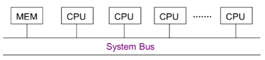
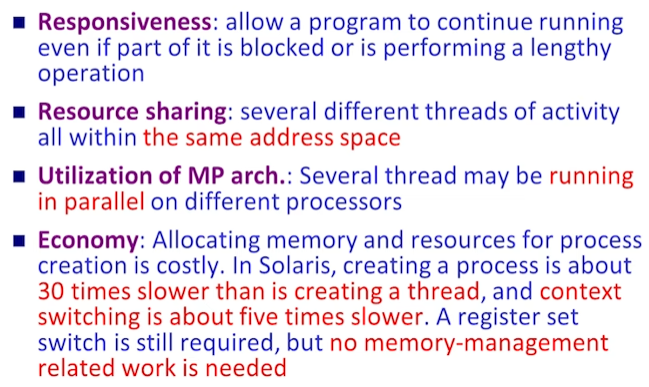
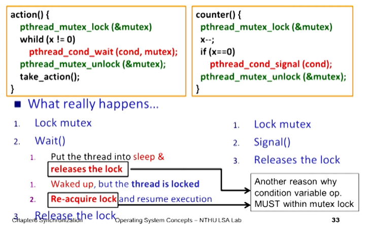
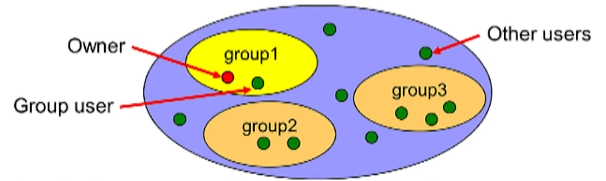
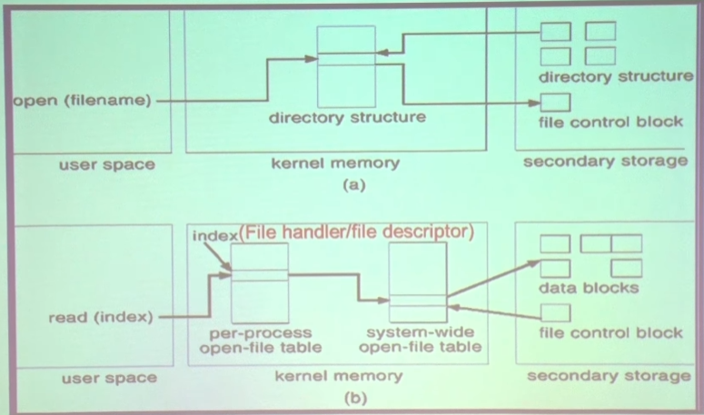

```Text
Author: Antony_Weng <weng851107@gmail.com>

This file is only used for the record of the learning process, only used by myself and the file has never been leaked out.
If there is related infringement or violation of related regulations, please contact me and the related files will be deleted immediately. Thank you!
```


- [Note](#0)
  - [內存管理單元（Memory Management Unit，MMU）](#0.1)
  - [記憶體碎片（Memory Fragmentation）](#0.2)
  - [Reentrant code（可重入代碼）](#0.3)
  - [Port（端口）、Bus（匯流排）和 Controller（控制器）](#0.4)
  - [中斷（Interrupt）](#0.5)
  - [鎖（Lock）, 信號量（Semaphore）和 條件變量（Condition Variables）](#0.6)
- [清大資工 周志遠 - 作業系統](#1)
  - [Term Explaination](#1.0)
  - [Chapter0: Historical Prospective](#1.1)
    - [Mainframe Systems](#1.1.1)
    - [Computer-system Architecture](#1.1.2)
    - [Special-purpose Systems](#1.1.3)
  - [Chapter1: Introduction](#1.2)
    - [What is an Operating System](#1.2.1)
    - [Computer-System Organization](#1.2.2)
    - [Hardware Protection](#1.2.3)
  - [Chapter2: OS Structure](#1.3)
    - [Nachos Explanation](#1.3.1)
    - [OS Service](#1.3.2)
    - [OS Application Interface](#1.3.3)
    - [OS System Structure](#1.3.4)
  - [Chapter3: Processes Concept](#1.4)
    - [Process Concept](#1.4.1)
    - [Process Scheduling](#1.4.2)
    - [Operations on Processes](#1.4.3)
    - [Interprocess Communication (IPC)](#1.4.4)
  - [Chapter8: Memory Management](#1.5)
    - [Background](#1.5.1)
    - [Address Binding](#1.5.2)
    - [Static/Dynamic Loading and Linking](#1.5.3)
    - [Swapping](#1.5.4)
    - [Contiguous Allocation](#1.5.5)
    - [Paging (Non-Contiguous Memory Allocation)](#1.5.6)
    - [Segmentation (Non-Contiguous Memory Allocation)](#1.5.7)
    - [Segmentation with Paging](#1.5.8)
  - [Chapter9: Virtual Memory Management](#1.6)
    - [Background](#1.6.1)
    - [Demand Paging](#1.6.2)
    - [Process Creation](#1.6.3)
    - [Page Replacement](#1.6.4)
    - [Allocation of Frames](#1.6.5)
    - [Thrashing](#1.6.6)
  - [Chapter4: Multithreaded Programming](#1.7)
    - [Thread Introduction](#1.7.1)
    - [Multithreading Models](#1.7.2)
    - [Threaded Case Study](#1.7.3)
    - [Threading Issue](#1.7.4)
  - [Chapter5: Process Scheduling](#1.8)
    - [Basic Concepts](#1.8.1)
    - [Scheduling Algorithms](#1.8.2)
    - [Special Scheduling Issues](#1.8.3)
    - [Scheduling Case Study](#1.8.4)
  - [Chapter6: Process Synchrinization](#1.9)
    - [Background](#1.9.1)
    - [Critical Section](#1.9.2)
    - [Critical Section Solution & Synchronization Tools](#1.9.3)
    - [Classical Problems of Synchronization](#1.9.4)
    - [Monitors](#1.9.6)
    - [Atomic Transactions](#1.9.7)
  - [Chapter7: Deadlock](#1.10)
    - [Deadlock Characterization](#1.10.1)
    - [System Model](#1.10.2)
    - [Deadlock Prevention](#1.10.3)
    - [Deadlock Avoidance](#1.10.4)
    - [Deadlock Detection](#1.10.5)
    - [Recovery from Deadlock](#1.10.6)
  - [Chapter10: File System Interface](#1.11)
    - [File Concept](#1.11.1)
    - [Access Methods](#1.11.2)
    - [Directory Structure](#1.11.3)
    - [File System Mounting](#1.11.4)
    - [File Sharing](#1.11.5)
    - [Pretection](#1.11.6)
  - [Chapter11: File System Implementation](#1.12)
    - [File System Structure](#1.12.1)
    - [File System Implementation](#1.12.2)
    - [Disk Allocation Methods](#1.12.3)
    - [Free Space Management](#1.12.4)
  - [Chapter12: Mass Storage System](#1.13)
    - [Disk Structure](#1.13.1)
    - [Disk Scheduling](#1.13.2)
    - [Disk & Swap-Space Management](#1.13.3)
    - [RAID](#1.13.4)
  - [Chapter13: I/O System](#1.14)
    - [Overview](#1.14.1)
    - [I/O Hardware](#1.14.2)
    - [I/O Methods](#1.14.3)
    - [Kernel I/O Subsystem](#1.14.4)
    - [Performance](#1.14.5)

<h1 id="0">Note</h1>

<h2 id="0.1">內存管理單元（Memory Management Unit，MMU）</h2>

實現虛擬地址到物理地址的轉換的方式：

- 內存管理單元（Memory Management Unit，MMU）是計算機系統中負責虛擬地址到物理地址轉換的硬件組件。MMU 通常使用以下兩種方法之一來實現虛擬地址到物理地址的轉換：分段（Segmentation）和分頁（Paging）。

  1. 分段（Segmentation）：
  在分段方法中，內存被劃分為大小可變的段。每個段都有一個基址和一個界限。基址是段在物理內存中的起始地址，界限則是段的大小。虛擬地址包含兩個部分：段標識符（Segment Identifier）和段內偏移（Offset within the Segment）。在地址轉換過程中，MMU 使用段標識符查找相應的基址，然後將段內偏移加到基址上以獲得物理地址。此外，MMU 還會檢查偏移是否超出了段的界限，以防止非法訪問。

  1. 分頁（Paging）：
  在分頁方法中，內存被劃分為固定大小的單位，稱為頁（Pages，虛擬內存中）和框（Frames，物理內存中）。每個頁和框的大小相同。虛擬地址被劃分為兩部分：頁號（Page Number）和頁內偏移（Offset within the Page）。MMU 使用頁號查找頁表（Page Table），頁表中包含頁對應的框號。MMU 將找到的框號與頁內偏移組合成物理地址。頁表用於存儲虛擬地址到物理地址的映射信息。

- 現代計算機系統通常使用分頁來實現虛擬地址到物理地址的轉換，因為分頁允許更靈活的內存管理，例如支持虛擬內存和需求分頁等。然而，有些系統可能會結合分段和分頁技術以實現更高效的內存管理。

頁表並不直接存在於 MMU（內存管理單元）

- 頁表並不直接存在於 MMU（內存管理單元）中。頁表是由操作系統維護的數據結構，通常存儲在主內存（RAM）中。MMU 是一個硬件組件，用於處理虛擬地址到物理地址的轉換。MMU 需要使用頁表來完成這個轉換過程。

- MMU 包含一個稱為快取緩存（Translation Lookaside Buffer，TLB）的特殊硬件緩存。TLB 是一個小型高速緩存，用於存儲最近使用過的虛擬地址到物理地址的映射信息。當 MMU 需要將虛擬地址轉換為物理地址時，它首先在 TLB 中查找對應的映射。如果找到了映射（TLB 命中），則 MMU 可以立即完成地址轉換。如果未找到映射（TLB 未命中），則 MMU 需要訪問存儲在主內存中的頁表以獲取映射信息，並將這些信息加載到 TLB 中以供後續使用。

- 因此，雖然頁表本身不直接存在於 MMU 中，但 MMU 通過 TLB 來快速訪問頁表中的映射信息，從而實現虛擬地址到物理地址的轉換。

每個程序的虛擬地址一般都是4GB大小，那在頁表上怎麼表示不同的程序

- 在具有分頁內存管理的系統中，每個程序都有自己的虛擬地址空間，通常最大為 4GB（對於32位系統）。為了區分不同程序的虛擬地址空間，操作系統會為每個程序創建一個獨立的頁表。
- 當程序運行時，操作系統會將該程序的頁表基址加載到 MMU（內存管理單元）的特殊寄存器中，該寄存器通常稱為頁表基址寄存器（Page Table Base Register，PTBR）。MMU 使用 PTBR 的值來訪問當前程序的頁表並完成虛擬地址到物理地址的轉換。
- 當操作系統需要切換到另一個程序（例如，在多任務環境下的上下文切換）時，它會將新程序的頁表基址加載到 PTBR。這樣，MMU 就能夠使用新程序的頁表進行地址轉換。通過這種方法，操作系統可以確保每個程序的虛擬地址空間在頁表上保持獨立並互不干擾。
- 在實際應用中，操作系統還可以使用多級頁表來更有效地管理內存。多級頁表允許操作系統按需分配內存，從而節省實際使用的物理內存。對於具有大量內存的64位系統，多級頁表的使用尤為重要，因為它們的虛擬地址空間遠大於 4GB。

MMU 怎麼分辨每個程序獨立頁表的不同

- 在分頁內存管理系統中，每個程序都有自己的獨立頁表，用於管理該程序的虛擬地址空間。MMU（內存管理單元）負責虛擬地址到物理地址的轉換。要讓 MMU 正確區分每個程序的獨立頁表，操作系統需要在進程切換時更新頁表基址。

- 以下是操作系統如何協助 MMU 分辨每個程序獨立頁表的不同的過程：

  1. 操作系統為每個程序創建一個獨立的頁表，並將其存儲在主內存中。

  2. 操作系統維護一個數據結構，例如進程控制塊（Process Control Block，PCB），用於存儲每個程序的相關信息，包括頁表基址。

  3. 當程序運行時，操作系統將該程序的頁表基址加載到 MMU 的特殊寄存器中，該寄存器通常稱為頁表基址寄存器（Page Table Base Register，PTBR）。MMU 使用 PTBR 的值來訪問當前程序的頁表並完成虛擬地址到物理地址的轉換。

  4. 在多任務環境中，操作系統可能需要在不同程序之間進行上下文切換。在上下文切換過程中，操作系統會保存當前程序的狀態（包括寄存器內容、程序計數器等），並加載要切換到的新程序的狀態。

  5. 作為上下文切換的一部分，操作系統會從新程序的 PCB 中獲取其頁表基址，並將其加載到 MMU 的 PTBR 寄存器中。這樣，MMU 就可以使用新程序的頁表進行地址轉換。

- 通過這種方法，操作系統協助 MMU 在不同程序之間區分獨立的頁表，從而實現正確的虛擬地址到物理地址轉換。

每個程序的頁表基址具有獨立性嗎

- 是的，每個程序的頁表基址具有獨立性。在分頁內存管理系統中，操作系統為每個程序創建一個獨立的頁表，以管理該程序的虛擬地址空間。這意味著每個程序都有自己的頁表基址，與其他程序的頁表基址無關。
- 由於頁表是獨立的，所以每個程序的虛擬地址空間也是互相隔離的。這有助於保護程序之間的數據安全，防止一個程序意外或惡意地訪問另一個程序的內存區域。
- 在上下文切換過程中，操作系統會更新 MMU（內存管理單元）的頁表基址寄存器（Page Table Base Register，PTBR），使其指向新程序的頁表基址。這樣，MMU 就能夠使用新程序的獨立頁表來進行虛擬地址到物理地址的轉換。
- 總之，每個程序的頁表基址具有獨立性，這有助於確保程序之間的內存區域互不干擾，並提高系統的穩定性和安全性。

<h2 id="0.2">記憶體碎片（Memory Fragmentation）</h2>

記憶體碎片（Memory Fragmentation）是指在計算機系統中可用記憶體被分成許多小塊，以至於無法連續分配足夠大的記憶體區域給某些需求。記憶體碎片主要有兩種類型：外部碎片（External Fragmentation）和內部碎片（Internal Fragmentation）。

1. 外部碎片（External Fragmentation）：
外部碎片是指在可用內存中存在多個空閒區域，它們的總和足夠滿足某一記憶體分配需求，但由於它們彼此分散在不連續的內存區域中，導致無法分配連續的記憶體區域。外部碎片主要出現在使用動態分配記憶體和使用分段內存管理的系統中。

   - 為了減少外部碎片，可以使用各種記憶體分配策略，例如最佳適應法（Best Fit）、最差適應法（Worst Fit）和首次適應法（First Fit）。此外，還可以定期進行記憶體整理（Memory Compaction）操作，將已分配的記憶體區域移動到連續的內存地址，從而將空閒區域連接起來。
   - 最佳適應法（Best Fit）：
   最佳適應法在所有可用空閒區域中尋找大小最接近所需分配大小的區域。該方法嘗試在所有可用的空閒區域中找到一個大小最合適的區域，以最小化因分配而產生的剩餘空間。然而，最佳適應法可能會導致外部碎片，因為它容易產生大量較小的空閒區域。
   - 最差適應法（Worst Fit）：
   最差適應法在所有可用空閒區域中尋找最大的區域。該方法的目的是保留較大的空閒區域，以便日後分配較大的記憶體塊。然而，最差適應法也可能導致外部碎片，特別是當分配較小的記憶體塊時。
   - 首次適應法（First Fit）：
   首次適應法從頭開始搜索可用的空閒區域，並分配第一個足夠大的區域。該方法的執行速度相對較快，因為它不需要搜索整個空閒區域列表。然而，首次適應法可能導致外部碎片，因為它有時會跳過更適合的空閒區域，而選擇不夠理想的區域。

2. 內部碎片（Internal Fragmentation）：
內部碎片是指已分配給某一程序或數據結構的記憶體空間中，部分空間未被使用，導致記憶體浪費。內部碎片主要出現在使用固定大小塊分配記憶體的系統中，例如分頁內存管理。由於每個分配單位的大小是固定的，因此當某一分配需求無法完全填充一個分配單位時，剩餘的空間就會形成內部碎片。

   - 減少內部碎片的一種方法是使用合適的分配單位大小，以平衡記憶體利用率和碎片產生的可能性。此外，可以使用補救措施，例如緩衝區池（Buffer Pool），將多個相似大小的需求合併在同一記憶體區域內，以減少內部碎片的產生。
   - 合適的分配單位大小：選擇合適的分配單位大小，以平衡記憶體利用率和碎片產生的可能性。例如，在分頁內存管理中，選擇較小的頁面大小可以減少內部碎片，但可能增加頁表的大小和管理開銷。
   - 緩衝區池：使用緩衝區池將多個相似大小的需求合併在同一記憶體區域內，以減少內部碎片的產生。
   - 動態分配策略：在可能的情況下，使用動態分配策略，根據程序的需求動態調整分配的內存大小，以減少內部碎片。

<h2 id="0.3">Reentrant code（可重入代碼）</h2>

"Reentrant code"（可重入代碼）是指一種可以被多個程序或線程同時調用並且能夠正確運行的程式碼。可重入代碼的特點是，它不會修改全局或靜態數據，也不依賴於一些非可重入的外部資源。這使得可重入代碼在同步或並行環境中能夠被安全地共享和執行，不會導致競爭條件或數據破壞。

為了使代碼可重入，開發者需要遵循以下原則：

1. 避免使用全局變量和靜態變量，因為它們在多個實例之間是共享的。
2. 避免對共享資源的讀寫操作，除非使用了適當的同步機制。
3. 使用局部變量，因為它們對於每個函數調用都是唯一的。
4. 使用不可變數據結構，這樣數據不會被多個實例共享。
5. 如果需要調用其他函數，確保這些函數也是可重入的。

可重入代碼在多線程程式設計中尤為重要，因為它有助於避免競爭條件和數據不一致問題，提高程序的可靠性。

<h2 id="0.4">Port（端口）、Bus（匯流排）和 Controller（控制器）</h2>

在計算機硬體中，Port（端口）、Bus（匯流排）和 Controller（控制器）是三個相關的概念，它們共同構成了設備之間的連接和通信機制。

1. Port（端口）：端口是一個用於連接和通信的物理或邏輯接口。它允許外部設備（如鍵盤、鼠標、顯示器等）或內部設備（如記憶體、硬碟等）與計算機系統建立連接。端口可以是物理的，例如 USB 端口、HDMI 端口等，也可以是邏輯的，例如網絡端口。
2. Bus（匯流排）：匯流排是計算機硬體中的一種通信系統，它允許多個設備共享一條數據通道。匯流排通常由一組平行的導線組成，用於傳輸數據、地址和控制信號。匯流排的主要目的是在設備和計算機系統之間傳輸數據，並降低連接和通信的複雜性。常見的匯流排有 PCI、PCI Express、AGP 等。
3. Controller（控制器）：控制器是一個專門的硬體元件，用於管理和協調連接到端口和匯流排的設備的通信。控制器通常是一個微處理器或微控制器，負責執行特定的通信協議和處理數據傳輸。控制器可以集成在主機板上，也可以作為獨立的擴展卡存在。

- Port、Bus 和 Controller 之間的關係可以簡單概括為：端口提供了設備之間連接的物理或邏輯接口，匯流排負責在設備之間傳輸數據，而控制器則協調和管理這些設備之間的通信。在計算機硬體中，這三者共同確保了各種設備能夠有效地連接和互動。

<h2 id="0.5">中斷（Interrupt）</h2>

在計算機系統中，中斷（Interrupt）是一種重要的通信機制，用於處理器（CPU）和外部設備或其他硬件組件之間的實時事件。當一個設備需要處理器的注意時，它會發出一個中斷信號。處理器在完成當前任務後會響應這個信號，暫停當前的執行流程，並轉向執行與中斷相關的代碼。這使得處理器能夠高效地響應和處理來自不同設備的事件。

以下是有關操作系統中斷的一些關鍵概念：

1. 中斷類型：

   - 硬件中斷：由外部設備或硬件組件產生的中斷，例如I/O設備完成數據傳輸或定時器到達預定時間。
   - 軟件中斷：由程序或操作系統產生的中斷，通常用於實現系統調用（system call）或處理異常。

2. 中斷處理：

   - 當處理器接收到中斷信號時，它會保存當前的執行上下文（如寄存器值和程序計數器），然後跳轉到一個特定的內存地址，稱為中斷向量表（Interrupt Vector Table, IVT）。該表包含與不同中斷類型關聯的處理程序地址。
   - 中斷處理程序（Interrupt Service Routine, ISR）是用於處理特定中斷的代碼。處理器在執行ISR後會恢復之前保存的上下文並返回到被中斷的程序。

3. 中斷屏蔽和優先級：

   - 為了防止中斷處理程序被其他中斷打斷，處理器可以暫時屏蔽中斷。這通常在處理關鍵任務或其他高優先級中斷時發生。
   - 當多個中斷同時發生時，處理器可以根據它們的優先級來確定哪個中斷應該首先處理。優先級可以根據硬件設計或操作系統配置進行設置。

4. 系統調用：

   - 系統調用是一種特殊的軟件中斷，用於用戶程序向操作系統請求服務，如文件操作、內存分配或進程管理。通過系統調用，操作系統可以在安全的環境中為用戶程序提供服務，防止用戶程序直接訪問關鍵系統資源。

- 中斷在操作系統中起著關鍵作用，使得處理器能夠高效地管理和協調不同設備和程序的需求。通過中斷機制，操作系統可以實現實時響應、任務調度和資源管理等核心功能。

ISR（中斷服務例程，Interrupt Service Routine）：

- ISR（中斷服務例程，Interrupt Service Routine）是指處理特定中斷的實際代碼。
- 當處理器收到一個中斷信號時，它會根據中斷向量表（Interrupt Vector Table, IVT）找到相應的ISR地址，並跳轉到該地址執行中斷處理程序。 ISR負責處理與該中斷相關的任務，例如讀取設備數據、清除設備錯誤或執行系統調用等操作。
- 一旦ISR完成中斷處理任務，處理器會恢復之前保存的執行上下文（如寄存器值和程序計數器），然後返回到被中斷的程序繼續執行。這樣，中斷機制使得處理器能夠及時響應外部設備或系統事件，同時保持對用戶程序的執行控制。

每個設備通常都有一個與之相關的ISR，這個ISR負責處理來自該設備的中斷。設備驅動程序開發者會為特定設備編寫對應的ISR。當設備需要處理器的注意時，它會發出中斷信號。處理器會根據中斷向量表找到與該設備中斷相關的ISR，然後執行相應的處理程序。

設備的ISR通常包含以下功能：

1. 識別中斷來源：ISR需要確定引發中斷的設備，以便正確處理中斷。
2. 讀取設備狀態和數據：ISR通常會讀取設備的狀態寄存器或數據緩衝區，以了解中斷的詳細信息或獲取設備傳輸的數據。
3. 處理中斷事件：ISR會根據中斷類型執行相應的操作，如清除設備錯誤、更新系統狀態或將數據傳遞給其他系統組件。
4. 清除中斷標誌：在完成中斷處理後，ISR需要清除設備的中斷標誌，以便設備可以發送新的中斷信號。
5. 結束中斷：最後，ISR會通知處理器中斷處理已完成，處理器可以恢復執行被中斷的程序。

- 通過設備特定的ISR，操作系統可以實現對各種設備的實時響應和管理，從而提高系統的性能和可靠性。

當處理器收到中斷信號後，它會根據中斷類型查找中斷向量表（Interrupt Vector Table, IVT）中的相應條目，以確定與該中斷相關的ISR（中斷服務例程）的地址。中斷向量表是一個預先定義的內存區域，其中包含不同類型中斷的ISR地址。

以下是處理器在收到中斷信號後如何轉跳到對應ISR的大致步驟：

1. 保存當前執行上下文：處理器首先保存當前執行上下文，包括程序計數器（PC）、寄存器值和其他相關狀態。這樣處理器在執行ISR完成後可以恢復被中斷的程序。
2. 確定中斷類型：處理器需要確定收到的中斷信號對應的中斷類型。這可以是硬件中斷（例如I/O設備完成數據傳輸）或軟件中斷（例如係統調用）。
3. 查找中斷向量表：處理器會根據中斷類型在中斷向量表中查找相應的條目。這個條目包含了與該中斷相關的ISR的地址。
4. 轉跳到ISR：處理器將程序計數器（PC）設置為在中斷向量表中找到的ISR地址，然後開始執行ISR。
5. 執行ISR：處理器執行與中斷相關的ISR，以處理中斷事件。這可能包括讀取設備數據、處理系統調用或執行其他與中斷相關的任務。
6. 恢復執行上下文：在ISR執行完成後，處理器會恢復之前保存的執行上下文（如寄存器值和程序計數器），然後返回到被中斷的程序繼續執行。

- 這種中斷處理機制使得處理器能夠實時響應和處理來自不同設備或系統事件的中斷，同時保持對用戶程序的執行控制。在大多數現代處理器和操作系統中，這個過程都是自動完成的，不需要程序員顯式地處理中斷信號和中斷向量表。然而，在開發設備驅動程序或操作系統內核時，程序員可能需要編寫和配置ISR以處理特定設備的中斷。

一個使用 Arduino 的簡單範例：使用外部中斷來檢測按鈕按下事件

- 展示了如何使用 MCU 的中斷處理機制來實現對按鈕按下事件的實時響應，而無需在主循環中不斷地檢查按鈕狀態

    ```cpp
    // 定義連接到按鈕的引腳
    const int buttonPin = 2;
    // 定義 LED 燈的引腳
    const int ledPin = 13;

    // 創建外部中斷的回調函數
    void buttonPressed_ISR() {
    // 翻轉 LED 燈的狀態
    digitalWrite(ledPin, !digitalRead(ledPin));
    }

    void setup() {
    // 設置按鈕引腳為輸入並啟用內部上拉電阻
    pinMode(buttonPin, INPUT_PULLUP);
    // 設置 LED 燈引腳為輸出
    pinMode(ledPin, OUTPUT);

    // 配置外部中斷，當按鈕按下（引腳從高變低）時觸發
    attachInterrupt(digitalPinToInterrupt(buttonPin), buttonPressed_ISR, FALLING);
    }

    void loop() {
    // 主循環不需要執行任何操作，因為按鈕按下事件將由外部中斷處理
    }
    ```

- 當按鈕按下時，引腳從高變低，觸發外部中斷。
- MCU 將執行名為 buttonPressed_ISR 的中斷服務程序，該函數會翻轉 LED 燈的狀態。
- 在 setup() 函數中，通過調用 attachInterrupt() 函數配置外部中斷，設置觸發條件為 FALLING（表示引腳從高變低）。
- loop() 函數為主循環，此範例中無需執行任何操作。

一個在 Keil C 環境下使用 STM32 微控制器的範例，此範例將展示如何使用 EXTI 外部中斷來檢測按鈕按下事件並切換 LED 狀態：

- 首先，確保已經安裝了 STM32 相關的庫文件和 Keil MDK。在本範例中，我們將使用 STM32F103C8T6 微控制器。

```C
#include "stm32f10x.h"                  // Device header
#include "stm32f10x_gpio.h"             // GPIO header
#include "stm32f10x_rcc.h"              // RCC header
#include "stm32f10x_exti.h"             // EXTI header
#include "misc.h"                       // NVIC header

// 中斷處理函數原型
void EXTI0_IRQHandler(void);

int main(void) {
  // 啟用 GPIOA 和 GPIOC 時鐘
  RCC_APB2PeriphClockCmd(RCC_APB2Periph_GPIOA | RCC_APB2Periph_GPIOC, ENABLE);
  
  // 初始化 GPIOC.13 作為 LED 輸出
  GPIO_InitTypeDef GPIO_InitStruct;
  GPIO_InitStruct.GPIO_Pin = GPIO_Pin_13;
  GPIO_InitStruct.GPIO_Mode = GPIO_Mode_Out_PP;
  GPIO_InitStruct.GPIO_Speed = GPIO_Speed_2MHz;
  GPIO_Init(GPIOC, &GPIO_InitStruct);
  
  // 初始化 GPIOA.0 作為按鈕輸入
  GPIO_InitStruct.GPIO_Pin = GPIO_Pin_0;
  GPIO_InitStruct.GPIO_Mode = GPIO_Mode_IPU; // 配置為輸入並啟用內部上拉電阻
  GPIO_Init(GPIOA, &GPIO_InitStruct);
  
  // 配置 EXTI 中斷
  EXTI_InitTypeDef EXTI_InitStruct;
  EXTI_InitStruct.EXTI_Line = EXTI_Line0;
  EXTI_InitStruct.EXTI_Mode = EXTI_Mode_Interrupt;
  EXTI_InitStruct.EXTI_Trigger = EXTI_Trigger_Falling;
  EXTI_InitStruct.EXTI_LineCmd = ENABLE;
  EXTI_Init(&EXTI_InitStruct);
  
  // 啟用 NVIC
  NVIC_InitTypeDef NVIC_InitStruct;
  NVIC_InitStruct.NVIC_IRQChannel = EXTI0_IRQn;
  NVIC_InitStruct.NVIC_IRQChannelPreemptionPriority = 0;
  NVIC_InitStruct.NVIC_IRQChannelSubPriority = 0;
  NVIC_InitStruct.NVIC_IRQChannelCmd = ENABLE;
  NVIC_Init(&NVIC_InitStruct);
  
  while (1) {
    // 主循環無需執行任何操作，因為按鈕事件將由 EXTI 中斷處理
  }
}

// EXTI0 中斷處理函數
void EXTI0_IRQHandler(void) {
  // 確保 EXTI0 中斷已觸發
  if (EXTI_GetITStatus(EXTI_Line0) != RESET) {
    // 翻轉 LED 狀態
    GPIOC->ODR ^= GPIO_Pin_13;
    
    // 清除 EXTI0 中斷標誌
    EXTI_ClearITPendingBit(EXTI_Line0);
  }
}
```

- 當按鈕按下時（GPIOA.0引腳從高變低），將觸發 EXTI0 外部中斷。
- MCU 將執行名為 EXTI0_IRQHandler 的中斷服務程序，該函數會翻轉 LED（GPIOC.13）的狀態。
- 在 main() 函數中，
  - 配置 GPIOA.0 作為按鈕輸入（並啟用內部上拉電阻）
  - 配置 GPIOC.13 作為 LED 輸出。
  - 配置 EXTI 中斷，設置觸發條件為 EXTI_Trigger_Falling（表示引腳從高變低）。
  - 使用 NVIC（巢狀向量中斷控制器）來配置中斷優先級。在這個範例中，我們將優先級設為 0（最高）。
  - 主循環（while(1)）中無需執行任何操作，因為按鈕按下事件將由 EXTI 中斷處理。
- 在 EXTI0_IRQHandler() 中斷處理函數中，我們首先確保 EXTI0 中斷已觸發。接著，翻轉 LED 狀態並清除 EXTI0 中斷標誌，以確保下一次中斷能夠正常觸發

在 STM32 微控制器中，中斷向量表（Interrupt Vector Table）是用來定義中斷處理函數的地址的。該表在啟動時由啟動代碼（startup code）設置，通常位於專門的 flash 記憶體區域。在 STM32 的標準庫（如 CMSIS 或 HAL）中，會為每個中斷源提供一個預設的中斷處理函數名稱。

對於 EXTI0 中斷來說，該預設的中斷處理函數名稱為 EXTI0_IRQHandler。當你在代碼中定義該函數時，底層庫會將其地址分配給對應的中斷向量。因此，當 EXTI0 中斷發生時，MCU 會自動跳轉到 EXTI0_IRQHandler 並執行該函數。

在一些情況下，你可能需要修改啟動代碼（如在 Keil 中的 startup_stm32f10x_xx.s 文件）以自定義中斷處理函數名稱。然而，在本範例中，我們使用的標準庫已經為我們處理了這些細節，因此只需定義具有正確名稱的函數即可。

以下是一個自定義中斷處理函數的範例，我們將在 STM32F103C8T6 微控制器上使用 Keil C 和 CMSIS 標準庫。這個範例將展示如何修改啟動代碼以使用自定義的中斷處理函數名稱。

1. 首先，在你的專案中找到 startup_stm32f10x_xx.s 文件（具體名稱可能因型號而異），並將其打開。找到 EXTI0 中斷處理函數的定義，如下所示：

    ```asm
    ; ...
    DCD     EXTI0_IRQHandler          ; EXTI Line0
    ; ...
    ```

2. 將其修改為自定義的中斷處理函數名稱，例如 My_EXTI0_IRQHandler：

    ```asm
    ; ...
    DCD     My_EXTI0_IRQHandler       ; EXTI Line0
    ; ...
    ```

3. 接下來，在你的 C 程式碼中，定義具有相同名稱的中斷處理函數，例如：

    ```C
    #include "stm32f10x.h"                  // Device header
    #include "stm32f10x_gpio.h"             // GPIO header
    #include "stm32f10x_rcc.h"              // RCC header
    #include "stm32f10x_exti.h"             // EXTI header
    #include "misc.h"                       // NVIC header

    // 自定義中斷處理函數原型
    void My_EXTI0_IRQHandler(void);

    int main(void) {
    // ...（與先前的範例相同）
    }

    // 自定義 EXTI0 中斷處理函數
    void My_EXTI0_IRQHandler(void) {
    // ...（與先前的範例相同）
    }
    ```

- 這樣一來，當 EXTI0 中斷觸發時，MCU 將執行名為 My_EXTI0_IRQHandler 的自定義中斷處理函數。這樣可以讓你根據需要為中斷處理函數取一個更具描述性或符合專案風格的名稱。然而，需要注意的是，修改啟動代碼可能會使未來的更新和維護變得更加困難，因此應謹慎使用。

<h2 id="0.6">鎖（Lock）, 信號量（Semaphore）和 條件變量（Condition Variables）</h2>

同步原語（Synchronization Primitives）指的是一組用於在多執行緒或多進程環境中實現協同作業的基本構建塊。同步原語可以用來確保對共享資源的訪問是有序且互斥的，以避免競爭條件（race conditions）和數據不一致的問題。

同步原語在不同的語境和領域中可能有不同的名稱，例如：

1. 同步機制（Synchronization Mechanisms）：這個詞語強調的是同步原語在實現協同作業方面的功能。
2. 同步對象（Synchronization Objects）：這個詞語強調的是同步原語作為一個對象，可以通過操作這些對象來實現執行緒間的同步。
3. 同步工具（Synchronization Tools）：這個詞語強調的是同步原語作為一個工具，可以幫助開發者解決多執行緒或多進程環境中的同步問題。

- 雖然這些詞語在不同的情境下可能有些許差異，但它們都指的是用於實現多執行緒或多進程間同步的基本構建塊。這些構建塊包括鎖（Locks）、信號量（Semaphores）、條件變量（Condition Variables）等。

鎖（Locks）、信號量（Semaphores）和條件變量（Condition Variables）是三種用於解決多執行緒或多進程環境中同步問題的同步原語。它們可以協助確保對共享資源的訪問是有序且互斥的，以避免競爭條件（race conditions）和數據不一致的問題。

1. 鎖（Locks）：鎖是一種簡單的同步原語，用於確保對共享資源的互斥訪問。它有兩種主要操作：加鎖（lock）和解鎖（unlock）。當一個執行緒獲得鎖時，其他執行緒需要等待，直到鎖被釋放。鎖的主要類型包括：

   - 互斥鎖（Mutex）：互斥鎖是最常用的鎖類型，它確保同一時間只有一個執行緒可以訪問共享資源。互斥鎖可以是可重入的（reentrant），這意味著同一個執行緒可以多次獲得同一個鎖，而不會導致死鎖。
   - 讀寫鎖（Read-Write Lock）：讀寫鎖允許多個執行線程同時讀取共享資源，但在寫入時需要互斥訪問。這樣可以在讀操作比寫操作更頻繁的場景下提高性能。

    ```C
    #include <stdio.h>
    #include <pthread.h>

    pthread_mutex_t lock;
    int counter = 0;

    void* increment(void* arg) {
        pthread_mutex_lock(&lock);
        counter++;
        printf("Counter: %d\n", counter);
        pthread_mutex_unlock(&lock);

        return NULL;
    }

    int main() {
        pthread_t thread1, thread2;

        pthread_mutex_init(&lock, NULL);

        pthread_create(&thread1, NULL, increment, NULL);
        pthread_create(&thread2, NULL, increment, NULL);

        pthread_join(thread1, NULL);
        pthread_join(thread2, NULL);

        pthread_mutex_destroy(&lock);

        return 0;
    }
    ```

2. 信號量（Semaphores）：信號量是一個整數值，用於控制對共享資源的訪問次數，以及在多個執行緒之間進行信號通知。信號量有兩個主要操作：等待（wait）和發送（post）。等待操作將信號量減一，如果信號量變為負數，則執行緒將被阻塞。發送操作將信號量加一，以允許其他被阻塞的執行緒繼續訪問共享資源。信號量主要有兩種類型：

   - 二元信號量（Binary Semaphore）：二元信號量的值只能為0或1，因此它可以用作簡單的鎖。當信號量的值為1時，表示資源可用；當信號量的值為0時，表示資源不可用。
   - 計數信號量（Counting Semaphore）：計數信號量的值可以是任意非負整數，表示可用資源的數量。計數信號量可以用於控制對共享資源的訪問次數，以及實現生產者-消費者模型等同步問題。

    ```C
    #include <stdio.h>
    #include <pthread.h>
    #include <semaphore.h>

    sem_t semaphore;
    int counter = 0;

    void* increment(void* arg) {
        sem_wait(&semaphore);
        counter++;
        printf("Counter: %d\n", counter);
        sem_post(&semaphore);

        return NULL;
    }

    int main() {
        pthread_t thread1, thread2;

        sem_init(&semaphore, 0, 1);

        pthread_create(&thread1, NULL, increment, NULL);
        pthread_create(&thread2, NULL, increment, NULL);

        pthread_join(thread1, NULL);
        pthread_join(thread2, NULL);

        sem_destroy(&semaphore);

        return 0;
    }
    ```

3. 條件變量（Condition Variables）：條件變量用於使執行緒在特定條件下進行等待。它們通常與互斥鎖（mutex）一起使用。條件變量的主要操作有：等待（wait）、通知單個執行緒（signal）和通知所有執行緒（broadcast）。

   - 等待（wait）：當執行緒等待某個條件時，它將自己阻塞在條件變量上，並釋放與條件變量關聯的互斥鎖。這使得其他執行緒可以獲得互斥鎖，並在適當時機改變共享資源的狀態。
   - 通知單個執行緒（signal）：當某個條件成立時，執行緒可以通過條件變量喚醒一個正在等待的執行緒。被喚醒的執行緒將再次獲得互斥鎖，並繼續執行。
   - 通知所有執行緒（broadcast）：與通知單個執行緒類似，但通知所有執行緒會喚醒所有正在等待條件變量的執行緒。這在某些情況下可能導致更高的性能，但也可能引入更多的競爭。
   - 條件變量主要用於實現生產者-消費者模型等同步問題。它們通常在以下情況下使用：
     - 當共享資源需要在不同執行緒之間進行協同操作時，例如，當一個執行緒需要在另一個執行緒完成某個操作之後才能繼續執行。
     - 當執行緒需要等待某個事件發生或某個條件成立時，例如，當消費者需要等待生產者生成新的資源時。

    ```C
    #include <stdio.h>
    #include <pthread.h>
    #include <unistd.h>

    pthread_mutex_t lock;
    pthread_cond_t cond;
    int ready = 0;

    void* producer(void* arg) {
        sleep(2);
        pthread_mutex_lock(&lock);
        ready = 1;
        printf("Producer: set 'ready' to 1\n");
        pthread_cond_signal(&cond);
        pthread_mutex_unlock(&lock);

        return NULL;
    }

    void* consumer(void* arg) {
        pthread_mutex_lock(&lock);
        while (!ready) {
            printf("Consumer: waiting for 'ready'\n");
            pthread_cond_wait(&cond, &lock);
        }
        printf("Consumer: 'ready' is now 1\n");
        pthread_mutex_unlock(&lock);

        return NULL;
    }

    int main() {
        pthread_t prod, cons;

        pthread_mutex_init(&lock, NULL);
        pthread_cond_init(&cond, NULL);

        pthread_create(&prod, NULL, producer, NULL);
        pthread_create(&cons, NULL, consumer, NULL);

        pthread_join(prod, NULL);
        pthread_join(cons, NULL);

        pthread_mutex_destroy(&lock);
        pthread_cond_destroy(&cond);

        return 0;
    }
    ```

- 這些同步原語提供了在多執行緒和多進程環境中解決同步問題的基本機制。根據應用場景和需求，開發者可以選擇合適的同步原語來確保對共享資源的訪問是有序且互斥的，以避免競爭條件和數據不一致的問題。選擇合適的同步原語並正確地實現它們是實現高效並發程式的關鍵。

在使用這些同步原語時，開發者需要注意避免一些常見的問題，如死鎖、活鎖和競爭條件。為了避免這些問題，開發者應該遵循以下幾點建議：

1. 慎重選擇同步原語：根據應用的需求和特點選擇合適的同步原語。例如，對於簡單的互斥訪問，可以使用互斥鎖；對於控制資源訪問次數，可以使用信號量；對於複雜的協同操作，可以使用條件變量。
2. 遵循一致的鎖定順序：在多個執行緒需要獲得多個鎖時，應該遵循一致的鎖定順序，以避免死鎖。例如，如果執行緒A需要先獲得鎖L1，然後獲得鎖L2，那麼執行緒B也應該先獲得鎖L1，然後獲得鎖L2。
3. 避免長時間持有鎖：在執行緒持有鎖的期間，其他需要該鎖的執行緒將被阻塞。因此，應該儘量減少持有鎖的時間，以提高並發性能。
4. 使用最小化同步區域：應該確保同步區域（需要保護的共享資源）盡可能小，以減少執行緒之間的競爭和阻塞。
5. 限制共享資源的數量和訪問：在可能的情況下，可以考慮將共享資源分為多個獨立部分，或者限制對共享資源的訪問，以減少競爭和同步問題。


<h1 id="1">清大資工 周志遠 - 作業系統</h1>

https://ocw.nthu.edu.tw/ocw/index.php?page=course&cid=141

<h2 id="1.0">Term Explaination</h2>

System Call

- OS interface, call to the OS service

Context Switch

- Switch between processes for execution

Microkernel OS：

- An OS structure that only keeps the minimum kernel functions in kernel space
- It uses message passing to communicate between the functions in user space

Time Sharing Systems

- Processes are forced to switch from CPU execution after a fixed time interval, so that the CPU can be shared more fairly among processes

Privilege instruction

- An instruction that can only be executed in kernel mode

Why memory address translation in modern computer first uses the segmentation and then uses the paging

- Because segmentation can capture program's memory usage structure and pattern, so it is more convenient for users and programming
- On the other hand, paging is fixed size, so it is easier for OS to manage the physical memory space and improve memory utilization by preventing interval or external fragmentations

TLB

- (a) What is TLB
  - TLB is the cache of page table
- (b) Why TLB can reduce memory access time
  - It can eliminate the memory access for page table lookup
- (c) Why TLB must be flushed after context switch?
  - TLB is shared among all processes. Since each process has its own page table context, TLB must be flushed after context switch to prevent from reading the wrong content from other processes.

Explain what is dynamic loading and why it can improve memory utilization

- Dynamic loading only loads a function into memory when it is called.
-  Since a program often contains many un-used functions for exception handling or other purposes, dynamic loading can reduce the memory usage of a program.

Explain what is dynamic linking and why it can improve memory utilization

- Dynamic linking is to share the library between processes at runtime.
- When a process calls a dynamic linking library, the OS will first check if the library is loaded into the memory by other processes. 
  - If the library has been loaded, the process will link to that library and re-use it. 
  - Otherwise, the library will be loaded into the memory.
- Dynamic linking can prevent duplicated library loaded into the memory, so it can reduce memory usage.

Memory-Mapped file

- (a) What is memory-mapped file?
  - It maps file into memory
  - File is associated by memory access (pointer) instead of file system call
- (b) Give at least 2 pros and 2 cons about this method comparing to the file system calls
  - Pros: faster data access, easier to share file content, easier for programming, etc.
  - Cons: less secure, no access control, data loss problem, etc.
- (c) Give an example use case that is suitable for using memory-mapped file
  - I/O device input and output, like screen display, printer, etc.

Why OS needs to break a one-level page table into multiple smaller page tables?

- Because it is difficult to find contagious space on the physical memory to fit in large page table

Choose the most suitable page table structure (inverted, hash, hierarchical page table) for each of the systems below

- (a) System with scattered user memory space usage pattern
  - Hash page table, because it can effectively reduce the page table size.
- (b) System requiring fast memory access time
  - One-level page table, because it only causes 1 additional memory access time for page table lookup.
- (c) System running large number of processes, but without page sharing
  - Inverted page table, because all the processes can share the same page table, and the page sharing doesn't need to be supported.

What is Belady's anomaly?

- Page fault increases when more resources(memory frames) are given

Why it is NOT a desired property for OS design?

- It makes system administrator or OS harder to design the proper management mechanism or algorithm to utilize system resource properly.

Briefly explain why LRU does not have Belady's anomaly

- LRU is a stack algorithm which means at any time the same set of pages will always in memory if we increase the number of frames.
- By definition, LRU keeps the most recently used pages in memory.
- Therefore, if the number of frames increases, it will definitely keep the original pages, and further include the next recently used page that was not included.

<h2 id="1.1">Chapter0: Historical Prospective</h2>


Nachos MP: 教育使用的模擬OS軟體

- C++
- Linux
- Code tracing

練習作業四個題目：

- system call
- memory manager
- process scheduler
- file system

課程內容: 


- PART ONE: OVERVIEW
  - Chapter1    Introduction
  - Chapter2    System Structures
- PART TWO: PROCESS MANAGEMENT
  - Chapter3    Process Concept
  - Chapter4    Multithreaded Programming
  - Chapter5    Process Scheduling
- PART THREE: PROCESS COORDINATION
  - Chapter6    Synchronization
  - Chapter7    Deadlocks
- PART FOUR: MEMORY MANAGEMENT
  - Chapter8    Memory-Management Strategies
  - Chapter9    Virtual-Memory Management
- PART FIVE: STORAGE MANAGEMENT
  - Chapter10   File System
  - Chapter11   Implementing File Systems
  - Chapter12   Mass Storage Structure
  - Chapter13   I/O Systems

Computer Systems


<h3 id="1.1.1">Mainframe Systems</h3>

> Batch
> Multi-programming
> Time-sharing

One of the earliest computers

Evolution:

- Batch -> Multi-programming -> Time-sharing

Still exists in today's world

- For *critical application* with better **reliability** & **security**
- Bulk data processing
- Widely used in hospital, banks....

**Mainframe - Batch Systems**

- 透過一堆打洞的卡片程序，插入系統中來執行程式
- 一次只能執行一個程序
- Memory layout只分為 operating system 與 user program area

    

- Drawbacks:
  - *One job at a time*
  - *No interaction* between users and jobs
  - *CPU is often idle*
    - I/O speed << CPU speed (at least 1:1000)

- OS doesn't need to make any decision

**Mainframe - Multi-programming System**

- *Overlaps the I/O and computation of jobs*
  - Keeps both CPU and I/O devices working at higher rates
- *Spooling* (Simultaneous Peripheral Operation On-Line)
  - *I/O is done with no CPU intervention*
  - CPU just needs to *notified* when I/O is done
- 可透過 interrupt 的機制達成Spooling

    

- OS task：
  - *Memory management* - the system must allocate the memory to several jobs
  - *CPU scheduling* - the system must choose among several jobs ready to run
  - *I/O system* - I/O routine supplied by the system, allocation of devices

**Mainframe - Time-sharing System**

- An *interactive* system provides direct communication between the users and the system
  - CPU switches among jobs so frequently that users may interact with programs
  - Users can see results immediately (response time < 1s)
  - Usually, keyboard/screen are used
- *Multiple users* can share the computer simultaneously
- Switch job when
  - finish
  - waiting I/O
  - *a short period of time*

- OS task：
  - *Virtual Memory*(簡單說把disk當作memory來用) - jobs swap in and out of memory to obtain reasonable response time
  - *File System* and *Disk Management* - manage files and disk storage for user data
  - *Process synchronization* and *deadlock* - support concurrent execution of programs


<h3 id="1.1.2">Computer-system Architecture</h3>
 
> Desktop Systems: single processor
> Parallel Systems: tightly coupled
> Distributed Systems: loosely coupled

**Desktop Systems - Personal Computers**

- Personal Computers(PC) - computer system dedicated to a *single user*
- User *convenuence* and *responsiveness* - GUI
- I/O devices - keyboards, *mice*, screens, printers
- Several different tupes of operating systems
  - Windows, MacOS, Unix, Linux
- Lack of file and OS protection from users
  - Worm, Virus

**Parallel Systems**

- a.k.a. *Multiprocessor* or *tightly coupled system*
  - More than one CPU/core in close communication
  - Usually communicate through *shared memory*
- Purposes：
  - Throughpu, Economical, Reliability

    

Symmetric Multiprocessor System (SMP)

- Each processor runs the same OS
- Most popular multiple-processor architecture
- Require *extensive synchronization* to protect data integrity

Asymmetric Multiprocessor System (AMP)

- Each processor is assigned a specific task
- One Master CPU & multiple slave CPUs
- More common in extremely large systems

Multi-Core Processor


Many-Core Processor


Memory Access Architecture


**Distributed Systems**

- A.K.A. *loosely coupled system*
  - Each processor has its own local memory
  - Processors communicate with one another thrrough various communication lines (I/O bus or network)
  - Easy to *scale to large number of nodes* (hundreds of thousands, e.g. Internet)

- Purpose
  - Resource sharing
  - Load sharing
  - Reliabilit

- Architecture: 
  - *client-server*： FTP......

    

  - *peer-to-peer*

    

Clustered Systems

- Definition: 
  - Cluster computers *share storage* and are closely *linked via a local area network(LAN)* or a *faster interconnect*, such as InfiniBand(up to 300Gb/s)
- *Asymmetric clustering*: one server runs the application while other servers standby
- *Symmetric clustering*: two or more hosts are running application and are monitoring each other

---

System Architecture Summary


<h3 id="1.1.3">Special-purpose Systems</h3>

> Real-Time Systems
> Multimedia Systems
> Handheld Sysytems

**Real-Time Operation Systems (RTOS)**

- Well-defined *fixed-time constraints*
  - `Real-time` doesn't mean speed, but *keeping deadline*
- Guaranteed response and reaction times
- Often used as a control device in a dedicated application:
  - Scientific experiments, medical imaging systems, industrial control systems, weapon systems, etc
- Real-time requirement: *hard* or *soft*

    

**Multimedia Systems**

- A wide range of applications including audio and video files(e.g. ppstream, online TV)
- Issues:
  - *Timing constraints*: 24~30 frames per second
  - *On-demand/live streaming*: media file is only played but not stored
  - *Compression*: due to the size and rate of multimedia systems

**Handheld/Embedded Systems**

- Personal Digital Assistants (PDAs)
- Cellular telephones
- *HW specialized OS*
- Issues:
  - Limited memory
  - Slow processors
  - Battery consumption
  - Small display screens

<h2 id="1.2">Chapter1: Introduction</h2>

<h3 id="1.2.1">What is an Operating System</h3>

Four components in Computer System： Hardware, OS, Application, User


What is an Operating System?

- An operating system is the `"permanent"` software that *controls/abstracts hardware resources* for user application

    

Multi-tasking Operating Systems

- Manages resources and processes to support different user applications
- Provides Applications Programming Interface (API) for user applications

    

General-Purpose Operating Systems


Definition of an Operating System

- **Resource allocator** - *manages* and *allocates resources* to insure efficiency and fairness
- **Control program** - *controls* the execution of *user programs* and operations of *I/O devices* to prevent errors and improper use of computer
- **Kernel**(會作為作業系統的別名，核心) - the one program running at all times (all else being system/application programs)

Goals of an Operating System

- **Convenience**
  - make computer system easy to use and compute
  - In particular for small PC
- **Efficiency**
  - use computer hardware in an efficient manner
  - Especially for large, shared, multiuser systems

    --> Two goals are sometimes *contradictory*
    --> In the past, efficiency is more important

Importance of an Operating System

- System API are the *only* interface between user application and hardware
  - API are designed for general-purpose, not performance driven
- OS code cannot allow any bug
  - Any break (e.g. invalid access) cause reboot
- The owner of OS technology *controls* the software & hardware industry
- Operating systems and computer architecture influence each other

Modern Operating Systems


<h3 id="1.2.2">Computer-System Organization</h3>

- One or more CPUs, device controllers connect through *common bus* providing access to *shared memory*

- Goal： *Concurrent* execution of CPUs and devices competing for memory cycles

    

Computer-System Operations

- Each device controller is in charge of a particular device type
- Each device controller has a local buffer. 
    --> I/O device 運作相對於CPU太慢，若沒有buffer，CPU會一直在idle
    --> Status reg: 設置相關設定
    --> Data reg: 先儲存資料，再放入buffer
- *I/O is from the device to controller's local buffer*
- *CPU moves data* from/to *memory* to/from *local buffers* in device controllers
- Device 與 Memory 之間會有一個 Device Controller 作為傳輸的橋樑，Device Controller的好壞會影響到I/O的速度，CPU會下指令操作Device Controller的register，進而操作到Device

    

---

Busy/wait output

- Simplest way to program device
  - Use instruction to test when device is ready
  - 每次寫入都去 `peek` 寫入字元動作是否已完成再繼續寫下一個字元
  - 此方式來讀寫I/O device會造成一直霸佔CPU，無法實現 "Overlaps the I/O and computation of jobs"，因此要使用 `interrupt I/O` 的方式

    

Interrupt I/O

- Busy/wait is very inefficient
  - CPU can't do other work while testing device
  - Hard to do simultaneous I/O
- *Interrupts* allow a device to *change the flow of control in the CPU*
  - Causes subroutine call to handle device

Interrupt I/O Timeline

- Interrupt time line for I/O on a single process
  - `CPU = high`：CPU原本在處理目前的 user process executing
  - `I/O device = high`：idle
  - I/O device拉low，傳遞資料到buffer中，完成後會拉high，進而對CPU產生中斷

    

Interrupt-Driven I/O

- 初始化I/O後，當Controller準備好時會發出interrupt，CPU才需處理相關事務，處理完後CPU會再返回目前行程
- 軟體的interrupt通常為主動產生，而硬體的interrupt為被動產生 

    

Interrupt

- *Modern OS are interrupt driven*
- The occurrence of an event is signaled by an interrupt from either hardwrae or software
  - *Hardware* may trigger an interrupt at any time by sending a *signal* to CPU
    - signal是專門用於硬體中斷使用的詞語
  - *Software* may trigger an interrupt either by 
    - an *error*(division by zero or invalid memory access) --> 非預期(被動?)
    - or by a user request for an *operating system service* (*system call*) --> 預期的(主動?)
    - Software interrupt also called *trap*

HW Interrupt

- CPU原先在執行 user program，但hardware device被觸發產生一個interrupt signal(CPU被動被中斷)
- 接著CPU會去 `interrupt vector` 中搜索該signal相對應(硬體設計出來的，某個硬體插到某個Port，會有對應的signal number(由硬體設計固定的))的function pointer
- function pointer會引導到所要執行的function code去作處理
- 執行對應siganl的function code又稱為 `Service Routine`
- OS執行完後會返回CPU原先執行的 user program

    

SW Interrupt

- CPU原先在執行某一個program，主動產生一個 `system call` 來中斷CPU
- 由於SW Interrupt的數量是unbounded的，不採用和HW Interrupt一個由interrup vector來處理，而是使用 `switch case` 的方式來設計，流程上與HW Interrup是相似的，只是實現方式不同

    

Common Functions of Interrupts

- Interrupt transfers control to the interrupt service routine generally, through the *interrupt vector*, which contains the *addresses* (function pointer) of all the *service (i.e. interrupt handler) routunes*
- Interrupt architecture must save the *address* of the *interrupted instruction*
- Incoming interrupts are *disabled* while another interrupt is being processed to prevent a lost interrupt 
    --> 確保OS為低延遲
    --> 有時候中斷沒有反應是因為發生中斷時卡在某個service routine中，所以其它中斷會被disable

---

Storage-Device Hierarchy

- Storage systems organized in hierarchy
  - *Speed*, Cost, Volatility
  - 越上層速度越快，但容量較低
- Main memory - only large storage media that the CPU can access directly
  - RAM: Random Access Memory
- Secondary storage - extension of main memory that provides `large nonvolatile storage` capacity
  - Magnetic disk

    

RAM: Random-Access Memory --> Access speed (訪問速度) 每次都保持一致

- DRAM(Dynamic RAM)：
  - Need only *one transistor*
  - Consume *less power*
  - Values must be periodically *refreshed*
  - Access Speed: *>= 30ns*
- SRAM(Static RAM)：
  - Need only *six transistor*
  - Consume *more power*
  - Access Speed: *10ns ~ 30ns*
  - Usage: *cache memory*

Disk Mechanism

- Speed of magnetic disk
  - $Transfer time = data size / transfer rate$
  - Positioning time = seek time(cylinder) + rotational latency(sector)  
  -->  random access time，訪問時間是隨機的，因為是由機構來完成的
  -->  當今天是連續讀取的時候時，HDD不一定會輸給SSD

Performance of Various Levels of Storage


Caching

- Information in use *copied* from *slower* to *faster* storage temporarily
- Faster storage (cache) checked first to determine if information is there
  - If it is, <u>information used directly from the cache (fast)</u>
  - If not, <u>data copied to cache and used there</u>

    

- 並不是總是需要cache，當今天讀取的資料過多，讀取一次就佔滿，就沒有讀取到cache的意義了
- cache只是複製常用數據，避免過度重memory取得，用來加速

Coherency(連貫性) and Consistency(一致性) Issue 

- The same data may appear in different levels
  - Issue: <u>Change the *copy in register* make it inconsistent with other copies</u>
  - 有時候register或cache的值已經修改了，但Ram或是disk上尚未更新
- Single task accessing:
  - No problem, always use the *Highest level* cpoy
  - 由於單一程序且CPU總是存取最高等級的記憶體，所以不影響
- Muti-task accessing:
  - Need to obtain the most recent value
  - 當多個程序有共享記憶體時，沒有即時更新到時，會有錯誤的數據

    

- Distributed system:
  - Difficult because copies are on different computers
  - Ex. Google雲端系統如此龐大，為何還是可以使用 --> 放棄Coherency，對不同使用者看到的網頁有可能都不完全一致，但對使用上沒有影響

<h3 id="1.2.3">Hardware Protection</h3>

- 非指 Security
- 一個作業系統有很多層，共用某資源但卻不會影響到對方，如某程序死掉，並不會造成其他程序死掉
- 不能不透過作業系統就訪問其他程序正在執行程序的記憶體
- CPU只是吃指令去執行，如何分辨誰是OS誰是User Program
  - 但程式在執行時，利用interrupt來進行區分，達到 Dual-Mode Operation

> *Dual-Mode Operation*
> I/O Protection
> Memory Protection
> CPU Protection

**Dual-Mode Operation**

- What to protect?
  - Sharing system resources requires OS to ensoure that an incorrect program cannot cause *other programs* to execute incorrectly.
- Provide <font color='red'>hardware support</font> to differentiate between at least two modes of operations
  1. <font color='red'>User mode</font> - execution done on behalf pf a user
  2. <font color='red'>Monitor mode</font> (also <font color='red'>kernel mode</font> or <font color='red'>system mode</font>) - execution done on behalf of <font color='red'>operation system</font>
- <font color='red'>*Mode bit*</font> added to computer hardware to indicate the current mode
  - kernel mode = 0
  - user mode = 1
- When an <font color='red'>interrupt/trap</font> or <font color='red'>fault</font> occurs, hardware switches to monitor mode

    

- <font color='red'>Privileged instructions</font> 
  - Executed only in <font color='red'>monitor mode</font> 
  - Requested by users (system calls)
  - 電腦上運作做任何事情時，都必須透過給CPU instruction
  - 在設計CPU的指令集時已經寫死了
  - 根據是否會危害到電腦運作來區分是否為Privileged instructions

**I/O Protection**

- <font color='red'>All I/O instructions are privileged instructions</font> 
  - any I/O device is shared between users
- Must ensure that a user program could never gain control of the computer in monitor mode (i.e. a user program that, as part of its execution, stores a new address(a new user code) in the interrupt vector)
  - 駭客無法繞過OS，因此只能鑽記憶體的漏洞

    

**Memory Protection**

- Protect
  - Interrupt vector and the interrupt service routines
  - <u>Data access and over-write from other programs</u>
- HW support: two registers for legal address determination
  - <font color='red'>Base register</font> - holds the smallest legal physical memory address
  - <font color='red'>Limit register</font> - contains the size of the range
  - 修改指令為 privileged instruction

    

- Memory outside the defined range is protected

    

**CPU Protection**

- Prevent user program from not returning control
  - getting stuck in an infinite loop
  - not calling system services
- HW support: <font color='red'>Timer</font> - interrupts computer after specified period
  - Timer is decremented every clock tick
  - When timer reaches the value 0, an interrupt occurs
  - CPU的scheduler會決定CPU的schedule
- Timer commonly used to implement <font color='red'>time sharing</font>
- <font color='red'>Load-timer</font> is a privileged instruction

<h2 id="1.3">Chapter2: OS Structure</h2>

<h3 id="1.3.1">Nachos Explanation</h3>

https://homes.cs.washington.edu/~tom/nachos/

[[作業系統] Nachos 安裝](https://jeffprogrammer.wordpress.com/2016/10/31/%E4%BD%9C%E6%A5%AD%E7%B3%BB%E7%B5%B1-nachos-%E7%B0%A1%E4%BB%8B/)

Introduction

- understand how to work on Linux machine
- understand how system call are done by OS
- understand the difference of user space and kernel space memory

NachOS

- a process runs on top of another OS
- a kernel(OS) and MIPS code machine simulator

    

- Virtual Machine的作用就是instruction的轉換

Nacho Directory Structure

- `lib/`
  - Utilities used by the rest of the Nachos code
- `machine/`
  - The <font color='red'>machine simulation</font>
  - 修改Hardware相關設定，如增加一個signal
- `threads/`
  - Nachos is a multi-threaded program. Thread support is found here.
  - This directory also contains the main() routine of the nachos program, in `main.cc`
- `test/`
  - <font color='red'>User test programs</font> to run on the simulated machine.
  - As indicated earlier, these are separate from the source for the Nachos operating system and workstation simulation.
  - This directory contains its own Makefile.
  - The test programs are very simple and are written in C rather than C++
- `userprog/`
  - <font color='red'>Nachos operating system code</font> to support the creation of address spaces, loading of user (test) programs, and execution of test programs on the simulated machine. The exception handling code is here, in `exception.cc`
- `network/`
  - Nachos operating system support for networking, which implements a simple "post office" facility.
  - Several independent simulated Nachos machines can talk to each other through a simulated network.
  - Unix sockets are used to <font color='red'>simulate network connections among the machines</font>
- `filesys/`
  - Two different file system implementations are here.
  - <font color='red'>The "real" file system</font> uses the simulated workstation's simulated disk to hold files.
  - <font color='red'>A "stub" file system</font> translates Nachos file system calls into UNIX file system calls makefile.

Installation of Nachos

- Install

    ```bash
    #download NachOS-4.0_MP1

    $ cd NachOS-4.0_MP1/code/build.linux

    $ make clean

    $ make
    ```

- Rebuild
  - You should <font color='red'>rebuild NachOS</font> every time after you modify anything in NachOS, otherwise you won't change the execution results.

    ```bash
    $ cd NachOS-4.0_MP1/code/build.linux

    $ make clean

    $ make
    ```

- Test your nachos
  - 須透過 `nachos -e` 來執行 user program

    ```bash
    $ cd NachOS-4.0_MP1/code/test

    $ make clean

    $ make halt

    $ ../build.linux/nachos -e halt
    ```

    

- Test nachos with test cases

    ```bash
    # this will generate the binary of all test cases
    $ make

    # generate test case
    $ make consoleIO_test1

    # run nachos with test case
    $ ../build.linux/nachos -e consoleIO_test1
    ```

MP - System call

- Part1: console I/O system call
  - Implement `PrintInt(int number)` system call

    

    

    

- Part2: File I/O system call
  - 新增 `Open(), Close()`

    

    

    

    

    

<h3 id="1.3.2">OS Service</h3>

User program 透過OS使用system call

interrupt routine = service routine


**User Interface**

- CLI (Command Line Interface)
  - Fetches a command from user and executes it
  - <font color='red'>Shell: Command-line interpreter</font> (CSHELL, BASH, ...)
    - Adjusted according to user behavior and preference
    - 使用者透過Shell這個程序下指令給OS
- GUI (Graphic User Interface)
  - Usually mouse, keyboard, and monitor
  - Icons represent files, programs, actions, etc
  - Various mouse buttons over objects in the interface cause various actions
- Most systems have both <font color='red'>CLI</font> and <font color='red'>GUI</font>

**Communication Models**

- Communication may take place using either <font color='red'>message passing</font>(with systemcall(OS) because "Protect") or <font color='red'>share memory</font>(with systemcall(OS) to create memory because "Protect").

    

- Multi-thread programming時，會OS會有預設創建共同擁有的記憶體空間

<h3 id="1.3.3">OS Application Interface</h3>

> System calls
> API

- System calls 與 API 的差別

**System Calls**

- Request OS services
  - <font color='red'>Process control</font> - abort, create, terminate process and allocate/free memory
  - <font color='red'>File management</font> - create, delete, open, close file
  - <font color='red'>Device management</font> - read, write, reposition device
  - <font color='red'>Information maintenance</font> - get time or date
  - <font color='red'>Communications</font> - send receive message

**System Calls & API**


- System calls
  - The <font color='red'>OS interface</font> to a running program
  - An explicit request to the <font color='red'>kernel</font> made via a <font color='red'>software interrupt</font>
  - Generally available as <font color='red'>assembly-language</font> instructions

- API: Application Program Interface
  - <font color='red'>Users mostly program against API instead of system call</font>
  - 為了方便撰寫程式所建立的一層，而不會直接接觸到System call
  - Commonly implemented by language libraries, e.g. <font color='red'>C Library</font>
  - An API call could involve <font color='red'>zero or multiple system call</font>
    - Both `malloc()` and `free()` use system call `brk()`
    - Math CPI function, such as `abs()`, don't need to incolve system call

Interface vs. Library

- User program:

    ```C
    printf("%d", exp2(int x, int y));
    ```

- Interface:

    ```C
    int exp2(int x, int y);
    ```
    i.e. return the value of $X*2^{y}$

- Library:

  - imp1

    ```C
    int exp2(int x, int y)
    {
        for (int i = 0;i < y;i++) {
            x = x*2;
        }
        return x;
    }
    ```

  - imp2

    ```C
    int exp2(int x, int y)
    {
        x = x<<y;
        return x;
    }
    ```

  - imp3: hardware device 支援的 instruction

    ```C
    int exp2(int x, int y)
    {
        return HW_EXP(x, y);
    }
    ```

API: Application Program Interface

- Three most common APIs:
  - <font color='red'>Win32</font> API for <font color='red'>Windows</font>
  - <font color='red'>POSIX API</font> for POSIX-based systems (including virtually all versions of UNIX, Linux, and Mac OS X)
    - POSIX -> "Portable Operating System Interface for Unix"
    - Ex. pthread: 前面的p表示由POSIX建立的API
  - <font color='red'>Java API</font> for the Java virtual machine
    - 需要從vitual machine轉換code到x86 machine

API - System Call - OS Relationship

- user program 在執行時會先呼叫API，會根據API內需不需要OS的幫助來看是否呼叫System Call，才會進入OS進行其他操作

    

Standard C Library Example


Why use API?

- Simplicity
  - API is designed for applications
- Portability
  - API is an unified defined interface
- Efficiency
  - Not all functions require OS services or involve kernel

System Calls: Passing Parameters

- Three general methods are used to pass parameters between a running program and the operating system
  - Pass parameters in <font color='red'>registers</font> --> 直接存放到暫存器，CPU就可以讀取到 
  - Store the parameters in a <font color='red'>table in memory</font>, and the table address is passed as a parameter in a register --> 利用 pointer
  - Push(store) the parameters onto the <font color='red'>stack</font> by the program, and pop off the stack by operating system --> 每個process都會有stack空間可以存放

<h3 id="1.3.4">OS System Structure</h3>

> Simple OS Architecture
> Layer OS Architecture
> Microkernel OS
> Modular OS Structure
> Virtual Machine
> Java Virtual Machine

User goals and System goals

- User goals - operating system should be <font color='red'>easy to use</font> and <font color='red'>learn</font>, as well as <font color='red'>reliable</font>, <font color='red'>safe</font>, and <font color='red'>fast</font>

- System goals - operating system should be <font color='red'>easy to design, implement</font> and <font color='red'>maintain</font>, as well as <font color='red'>reliable</font>, <font color='red'>error-free</font>, and <font color='red'>efficient</font>

**Simple OS Architecture**


**Layered OS Architecture**


**Microkernel OS**

- Kernel module負責為各個sub-system作溝通 --> 有module的概念
- 將非必須module的實現於user space
- 效率更慢，溝通(message passing)都需要經過kernel


**Modular OS Structure**

- 當今使用的OS，如Linux

- sub-system以module的形式存在，且都在kernel space中

- 可以insert/remove module


- https://courses.linuxchix.org/kernel-hacking-2002.html
- https://en.wikibooks.org/wiki/The_Linux_Kernel/Modules

**Virtual Machine**


- virtual machine中的kernel是建立在原先OS上的user space，因此virtual machine中的kernel若執行privileged instructions(產生interrupt)，會跳出一個exception，回到原先OS，原先OS再幫virtual machine執行一次privileged instructions

    

- CPU若有hardware support，則除了可以分辨是kernel space或是user space之外，還能分辨是否為virtual machine spcae

- critical instruction: 在user space與kernel space都可以執行，但在不同的space執行的結果不一樣
  - 因此如果沒有hardware支持virtual machine的話，在virtual machine中的user space或是kernel space執行的critical instruction對原先OS來說都是在user space執行的，因次結果可能會錯誤

Usage of Virtual Machine

- Provides complete protection of system resources
- A means to solve system compatibility problems，如某軟體只能執行於Ubuntu14.04...
- A perfect vehicle for operatin-systems reseach and development
- A mean to increase resources utilization in <font color='red'>cloud computing</font>
  - cloud computing 也有其他實現方式

Vmware (Full Virtualization)

- Guest Operation System 完全不需要修改
- 且不需要靠到Hardware的幫忙

    

Parallel-virtualization: Xen


**Java Virtual Machine**

- 注重於code translation
- 使用的記憶體於Java Virtual Machine中，並不會影響到Host System


<h2 id="1.4">Chapter3: Processes Concept</h2>

<h3 id="1.4.1">Process Concept</h3>

An operating system concurrently executes a variety of programs(e.g Web browser, text editor, etc)
- *Program* - passive entity:<font color='red'>binary stored in disk</font>
- *Process* - active entity: <font color='red'>a program in execution in memory</font>

A process includes：

- <font color='red'>Code</font> segment(text section)
- <font color='red'>Data section</font> - global variables
- <font color='red'>Stack</font> - temporary local variables and functions
- <font color='red'>Heap</font> - dynamic allocated variables or classes
- Current activity(<font color='red'>program counter</font>, register contents)
- A set of associated <font color='red'>resources</font>(e.g. open file handlers)

Process in Memory


Threads

- a.k.a <font color='red'>lightweight process</font>
  - basic unit of CPU utilization
- All threads <font color='red'>belonging to the same process</font> share
  - <font color='red'>code</font>  section, <font color='red'>data</font>  section and <font color='red'>OS resources</font>  (e.g. open files and signals)
- But each thread has its own
  - <font color='red'>thread ID</font>, <font color='red'>program counter</font>, <font color='red'>register set</font>, and a <font color='red'>stack</font>
- 不同的threads可以利用全域變數來進行溝通

  

- 在同一個進程（process）下，不同的執行緒（threads）會共用一些特定的內存區域，這有助於提高資源利用率和實現高效的協同工作。以下是執行緒共用的主要段：

  - 代碼段（Code Segment）：也稱為文本段，它包含程序的執行代碼。所有執行緒都會共用同一個代碼段，因為它們都在運行相同的程序。

  - 數據段（Data Segment）：包含程序的全局變量和靜態變量。這些變量在所有執行緒間共享，因此執行緒可以訪問和修改相同的數據。

  - 堆（Heap）：堆是動態分配內存的區域，用於存儲程序運行期間動態創建的對象。在同一個進程中的所有執行緒都可以訪問和操作堆內存。不過，由於多個執行緒可能同時訪問和修改堆內存，因此需要使用同步機制（例如鎖或其他同步原語）來確保數據的一致性和完整性。

- 與此不同，每個執行緒都有自己獨立的棧（Stack）區域，用於存儲局部變量和函數調用信息。棧內存在不同執行緒之間是隔離的，這有助於確保每個執行緒的狀態和數據安全。


Process(Thread) State：

- 以Linux來說，OS並沒有Process的概念，把大家都當作Thread，只是區分哪些Threads有共用的Memory

- States：
  - <font color='red'>New</font>: the precess is being created --> 載入到Memory中
  - <font color='red'>Ready</font>: the process is in the memory waiting to be assigned to a processor --> process在等待競爭CPU core的資源，排程
  - <font color='red'>Runnung</font>: instructions are being executed by CPU --> 可以送instruction給CPU進行運算
  - <font color='red'>Waiting</font>: the process is waiting for events to occur --> 等待I/O處理完事件
  - <font color='red'>Terminated</font>: the process has finished execution --> 把佔用的資源釋放掉

Diagram of Process State

- Only one process is <font color='red'>running</font> on any processor at any instant
- However, many process may be <font color='red'>ready</font> or <font color='red'>waiting</font>

    

Process Control Block (PBC)

- 當一個Process被創建時，會建立其PCB
- Information associated with each process --> 存於OS的Memory裡面，其Kernel的Memory
  - <font color='red'>Process state</font>
  - <font color='red'>Program counter</font>
  - <font color='red'>CPU registers</font>
  - CPU scheduling information (e.g. priority)
  - Memory-management information (e.g. base/limit register)
  - Accounting information

  

**Context Switch**: 

- 將原本在CPU上執行的Process轉換成另一個時的專有名詞
- 系統倚靠這個行為來共享CPU的資源
- <font color='red'>Context Switch</font>: Kernel saves the state of the old process and loads the saved state for the new process
- Context-switch time is purely <font color='red'>overhead</font>
- Switch time (about 1~1000ms) depends on
  - memory speed
  - number of registers
  - existence of special instructions
    - a single intruction to save/load all registers
  - hardware support
    - <font color='red'>multiple sets of register</font> (Sun UltraSPARC - a context switch means changing register file pointer)

  

<h3 id="1.4.2">Process Scheduling</h3>

Process Scheduling

- 多程序設計（Multiprogramming）和分時系統（Time-sharing）是兩種用於提高計算機資源利用率和執行效率的技術。它們有相似之處，但也有顯著區別。
- *多程序設計 (Multiprogramming)*： CPU runs process at all times to <font color='red'>maximize CPU utilization</font>
  - 多程序設計是一種允許多個程序在同一台計算機上共享和使用硬件資源（如 CPU、內存、磁盤等）的技術。多程序設計的目標是最大化計算機資源的使用，從而提高計算機的吞吐量。在多程序設計環境中，操作系統會在內存中同時加載多個程序，並在需要時將控制權傳遞給它們。當一個程序等待 I/O 操作完成時，操作系統可以將 CPU 資源分配給另一個已經就緒的程序，從而達到資源的充分利用。
- *分時系統 (Time-sharing)*： switch CPU frequently such that <font color='red'>users</font> can <font color='red'>interact</font> with each program while it is running
  - 分時系統是一種允許多個用戶同時使用計算機資源的技術。分時系統的主要目標是在眾多用戶之間實現公平和有效的資源共享，從而使每個用戶都能夠感受到他們獨占計算機的錯覺。在分時系統中，操作系統會為每個用戶分配一小段時間（稱為時間片），在這段時間內，用戶可以執行其程序。當時間片用完後，操作系統會將控制權轉移給另一個用戶。這種快速切換使得每個用戶都能獲得一定程度的交互性和響應性。
- Processes will have to wait until the CPU is free and can be re-shceduled
- 總之，多程序設計主要關注提高計算機資源利用率，通過在不同程序之間分配硬件資源來提高計算機的吞吐量。而分時系統則專注於實現多個用戶的公平共享和交互性，通過為每個用戶分配固定的時間片來實現資源的共享。分時系統實際上是多程序設計的一種擴展，它們經常一起使用，以實現更高的系統效率和用戶滿意度。

Process Scheduling Queues

- Processes migrate between the various queues (i.e. switch among states)
- *Job queue* (New State) - set of <font color='red'>all processes</font> in the system
- *Ready queue* (Ready State) - set of all processes residing in main memory, <font color='red'>ready and waiting to execute</font>
- *Device queue* (Wait State) - set of processes <font color='red'>waiting for an I/O device</font>

  

Process Scheduling Diagram


Schedulers


- *Short-term* scheduler (<font color='red'>CPU scheduler</font>) - selects which process should be executed and <font color='red'>allocated CPU (Ready state -> Run state)</font>
- *Long-term* scheduler (<font color='red'>Job scheduler</font>) - selects which processes should be <font color='red'>loaded into memory</font> and brought into the ready queue <font color='red'>(New state -> Ready state)</font>
- *Medium-term* scheduler - selects which processes should be <font color='red'>swapped in/out memory (Ready state -> Wait state)</font>
  - 與virtual memory相似，因為memory有限，所以將部分disk作為memory來使用
  - 一個process的base/limit register可以很大，但並不是立即使用到，因此可以將部分未使用到的轉換到disk建構的memory

Long-Term Scheduler

- Control <font color='red'>degree of multiprogramming</font> --> 即控制目前有多少個程序在記憶體中
- Execute less frequently (e.g. invoked only when a process leaves the system or <font color='red'>once several minutes</font>) -> 造成CPU idle
- Select a <font color='red'>good mix of CPU-bound & I/O-bound </font>processes to increase system overall performance -> CPU 和 I/O device 有被平衡地使用，不會造成誰被idle
- UNIX/NT: no long-term scheduler
  - 記憶體足夠大，Process會直接放至記憶體，搭配medium-term scheduler
  - Created process placed in memory for short-term scheduler
  - Multiprogramming degree is bounded by hardware limitation (e.g., # of terminals) or on the self-adjusting nature of users

Short-Term Scheduler

- Execute quite frequently (e.g. <font color='red'>once per 100ms</font>)
- Must be efficient:
  - if 10ms for picking a job, 100ms for such a pick,
    -> $overhead = 10/110 = 9%$，表示CPU有9%的時間是沒有在做事的，re-schedule的時間

  

Medium-Term Scheduler

- <font color='red'>swap out</font>: *removing processes from memory* to reduce the degree of multiprogramming
- <font color='red'>swap in</font>: reintroducing swap-out processes into memory
- Purpose: <u>improve process mix, free up memory</u>
- Most modern OS doesn't have medium-term scheduler because having sufficient physical memory or using virtual memory

    

<h3 id="1.4.3">Operations on Processes</h3>

Tree of Processes

- Each process is identified by a <font color='red'>unique</font> processor identifier (<font color='red'>pid</font>)
  - 有parent-child的關係

  

Process Creation

- Resource sharing
  - Parent and child processes share <font color='red'>all</font> resources
  - Child process shares <font color='red'>subset</font> of parent's resources
  - Parent and child share <font color='red'>no</font> resources

- Two possibilities of execution
  - Parent and children <font color='red'>execute concurrently</font>
  - Parent <font color='red'>waits until children terminate</font>

- Two possibilities of address space
  - <font color='red'>Child duplicate of parent</font>, communication via sharing variables
  - <font color='red'>Child has a program loaded into it</font>, communication via message passing

UNIX/Linux Process Creation

- <font color='red'>fork</font> system call
  - Create a new (child) process
  - The new process <font color='red'>duplicates the address space</font> of its parent
  - Child & Parent <font color='red'>execute concurrently</font> after fork
  - Child: return value of fork is 0
  - Parent: return value of fork is PID of the child process
- <font color='red'>execlp</font> system call
  - <font color='red'>Load a new binary file</font> (即另一個程式的程式碼) into memory - <font color='red'>destorying the old code</font>
- <font color='red'>wait</font> system call
  - The parent waits for <font color='red'>one of its child processes</font> to complete

- Memory space of fork()：
  - Old implementation: A's child is an <font color='red'>exact copy</font> of parent
  - Current implementation: use <font color='red'>copy-on-write</font> technique to store <font color='red'>differences in A's child address space</font>

  

UNIX/Linux Example


Process Termination

- Terminate when the last statement is executed or <font color='red'>exit()</font> is called
  - All resources of the process, including physical & virtual memory, open files, I/O buffers, are <font color='red'>deallocated by the OS</font>
- Parent may terminate execution of children processes by specifying its PID (<font color='red'>abort</font>)
  - Child has exceeded allocated resources
  - Task assigned to child is no longer required
- Cascading termination:
  - killing (exiting) parent -> killing (exiting) all its children

<h3 id="1.4.4">Interprocess Communication (IPC)</h3>

Interprocess Communication

- <font color='red'>IPC</font>：a set of methods for the exchange of data among multiple threads in one or more processes
- <font color='red'>Independent process</font>：cannot affect or be affected by other processes
- <font color='red'>Cooperating process</font>：otherwise
- Purposes
  - information sharing
  - computation speedup (not always true ...)
  - convenience (performs several tasks at one time)
  - modularity

Communication Methods

- *Shared memory*：
  - Require more careful <font color='red'>user synchronization</font>
  - Implemented by memory access：faster speed
  - <font color='red'>Use memory address to access data</font>, (使用pointer的方式)
  - 通常用於人數少時
- *Message passing*：
  - No conflict：<font color='red'>more efficient for small data</font>
  - <font color='red'>Use send/recv message</font>
  - Implemented by <font color='red'>system call</font>：slower speed
  - 通常用於人數多時，如網路

  

- Sockets：
  - A network connection identified by <font color='red'>IP & Port</font>, (Port就是Process，不同的Port代表不同的Process)
  - Exchange <font color='red'>unstructured stream of bytes</font>

  

- Remote Procedure Calls：
  - Cause a <font color='red'>procedure</font> to execute in another address space
  - Pareameters and return values are passed by message
  - 即可以呼叫別個process的function code

  

Shared Memory

- Processes are responsible for ...
  - Establishing a region of shared memory
    - Typically, a shared-memory region resides in the address space of the process creating the shared-memory segment
    - Participating processes <font color='red'>must agree to remove memory access constraint</font> from OS
  - Deteninating the form of the data and the location (OS只幫忙創建此區塊，裡面內容要什麼是由user program來決定)
  - Ensuring data are not written simutaneously by processes

Consumer & Producer Problem

- <font color='red'>Producer</font> process produces information that is consumed by a <font color='red'>Consumer</font> process

- Buffer as a circular array with size B
  - next free: <font color='red'>in</font>
  - first available: <font color='red'>out</font>
  - empty: <font color='red'>in = out</font>
  - full: <font color='red'>(in+1)%B = out</font> --> 事先停住，會有一個儲存空間被浪費掉，否則不知道 $in = out$ 時，是什麼情況

  

  

 - Consumer & Producer 在compiler與linker時也是被使用的，如source code直接被編譯成execution file時，即compiler編譯後就給linker

Message-Passing System

- Mechanism for processes to <font color='red'>communicate</font> and <font color='red'>synchronize</font> their actions --> 不必再額外對同步作其他處理，本身就是一種同步的溝通
- IPC facility provide two operations：
  - <font color='red'>Send</font>(message) - message size fixed or vaiable
  - <font color='red'>Receive</font>(message)
- Message system - processes communicate <font color='red'>without resorting to shared variables</font> --> 無須共享變數(記憶體)
- To communicate, processes need to
  - Establish a <font color='red'>communication link</font>
  - Exchange a message via <font color='red'>send/receive</font>
- Implementation of communication link
  - physical (e.g. shared memory, HW bus, or network)
  - logical (e.g. <font color='red'>logical properties</font>)
    - <font color='red'>Direct or indirect communication</font>
    - Symmetric or asymmetric communication
    - <font color='red'>Blocking or non-blocking</font>
    - Automatic or expicit buffering
    - Send by copy or send by reference
    - Fixed-sized or variable-sized messages

Direct communication (如打電話?)

- Processes must <font color='red'>name each other explicitly</font>
  - *Send(P, message)* - send a message to process P
  - *Receive(Q, message)* - receive a message from process Q
- Properties of communication link
  - Links are <font color='red'>established automatically</font>
  - <font color='red'>One-to-One</font> relationship between links and processes
  - The link may be unidirectional, but is usually bi-directional

  

  - <font color='red'>limited modularity</font>：if the <font color='red'>name</font> of a process is <font color='red'>changed</font>, all old names should be found

Indirect communication (如寄信?)

- Messages are directed and received from <font color='red'>mailboxes</font> (also referred to as ports)
  - <font color='red'>Each mailbox has a unique ID</font>
  - Processes can communicate if they share a mailbox
  - *Send(A, message)* - send a message to mailbox A
  - *Receive(A, message)* - receive a message from mailbox A
- Properties of communication link
  - Link established only <font color='red'>if processes share a common mailbox</font>
  - <font color='red'>Many-to-Many</font> relationship between links and processes
  - Link may be unidirectional or bi-directional
  - Mailbox can be owned either by OS or processes
- Mailbox sharing

    

- Solutions
  - Allow a link to be associated with at most two --> 即direct communication
  - Allow only one process at a time to execute a receive operation --> 透過locking來解決
  - <font color='red'>Allow the system to select arbitrarily a single receiver. Sender is notified who the receiver was</font>

Synchronization

- Message passing may be either <font color='red'>blocking</font>(synchronous) or <font color='red'>non-blocking</font>(asynchronous)
  - *Blocking send*: sender is blocked until the message is receive by receiver or by the mailbox
  - *Nonblocking send*: sender sends the message and resumes operation
  - *Blocking receive*: receiver is blocked until the message is available
  - *Nonblocking receive*: receiver receives a valid message or a null
- Buffer implementation
  - <font color='red'>Zero</font> capacity: blocking send/receive
  - <font color='red'>Bounded</font> capacity: if full, sender will be blocked
  - <font color='red'>Unbounded</font> capacity: sender never blocks

  

Sockets

- connect後，會創建新的thread，多個連線即多個thread在執行，因此不互相影響

  

  

Remote Procedure Calls


<h2 id="1.5">Chapter8: Memory Management</h2>

<h3 id="1.5.1">Background</h3>

- Main memory and registers are the only storage CPU can access directly
- Collection of <font color='red'>processes</font> are waiting on disk to be <font color='red'>brought into memory and be executed</font>
- <font color='red'>Multiple programs are brought into memory</font> to improve resource utilization and response time to users
- A process may be <font color='red'>moved between disk and memory</font> during its execution

Outline

- How to refer memory in a program?
    > address binding 
- How to load a program into memory?
    > static/dynamic loading and linking
- How to move a program between memory and disk?
    > swap
- How to allocate memory?
    > paging, segment

<h3 id="1.5.2">Address Binding</h3>

Multistep Processing of a User Program


Address Binding in Compile Time

- Program is written as symbolic code
- Compiler translates symbolic code into <font color='red'>*absolute code*</font>
- 在Compile Time時，即決定Process中variables的address
- If starting location changes -> <font color='red'>recompile</font>
- 在多人使用時，很不方便，容易衝突要重新編譯，無法達成Virtual Memory想達成的事
- Example: MS-DOS .COM format binary

    

Address Binding in Load Time

- Compiler translates symbolic code into <font color='red'>*relocatable code*</font>
- <font color='red'>Relocatable code</font>：
  - Machine language that can be run from any memory location
- 在Compile時，Base register還是變數，等到Load Time時根據記憶體哪邊有空間而設置於哪
- If starting location changes -> <font color='red'>reload the code</font>

    

Address Binding in Execution(Run) Time

- To virtual memory and dynamic usage.
- Compiler translates symbolic code into <font color='red'>*logical-address(i.e. virtual-address) code*</font>
- Special <font color='red'>hardware(i.e. MMU, Memory Management Unit)</font> is needed for this scheme
- Most general-purpose OS use this method
- 在Compile Time時，一樣只有設置limit register的數值; Load Time將Process載入Memory時，仍然只有limit register，並沒有將base register與實際載入記憶體的address一樣，等到Run Time時才會確定 --> 即CPU是使用Virtual Address去記憶體讀取，中間會被Hardware(MMU)轉換成physical address來讀取，此時才確定Process的Base register
- 可以在run time修改程序記憶體位置，不像load time必須重新載入程序才能修改記憶體位置

    

Memory-Management Unit (MMU)

- Hardware device that <font color='red'>maps virtual to physical address</font>
- The value in the <font color='red'>relocation register is added to every address</font> generated by a user process at the time it is sent to memory

    

Logical vs. Physical Address

- <font color='red'>Logical address</font> - generated by *CPU*
  - a.k.a. virtual address
- <font color='red'>Physical address</font> - seen by the *memory module*
- compile-imte & load-time address binding
  - logical address = physical address
- Execution-time address binding
  - <font color='red'>logical address != physical address</font>
- <font color='red'>The user program deals with logical address; it never sees the real physical address</font>
  - 即每個Process只需關注自己的address即可，不必在意其他Processes

<h3 id="1.5.3">Static/Dynamic Loading and Linking</h3>

Dynamic Loading

- The entire program must be in memory for it to execute? --> Static Loading
- No, we can use <font color='red'>dynamic-loading</font>
  - *A routine(function code) is loaded into memory when it is called*
- <font color='red'>Better memory-space utilization</font>
  - unused routine(function code) is never loaded
  - Particularly useful when large amounts of code are infrequently used (e.g., *error handling code*)
- <font color='red'>No special support from OS</font> is required implemented through program (library, API calls)

Dynamic Loading Example in C

- `dlopen()`: opens a library and prepares it for use
- `desym()`: looks up the value of a symbol in a given (opened) library
- `dlclose()`: closes a DL library
- 當printf()中實際呼叫到 `cosine` 時才會dynamic load到記憶體中

    

    

Static Linking

- *Static linking*: libraries are combined by the <font color='red'>loader</font> into the program in-memory image
  - Waste memory: <font color='red'>duplicated code</font>
  - Faaster during execution time
- <font color='red'>Static limking + Dynamic loading</font>
    > Still can't prevent duplicated code

  

  

Dynamic Linking

- *Dynamic linking*：Linking postponed <font color='red'>until execution time</font>
  - <font color='red'>Only one code copy</font> in memory and <font color='red'>shared by everyone</font>
  - A stub is included in the program in-memory image for each lib reference
  - Stub call -> check if the referred lib is in memory -> if not, load the lib -> execute the lib
  - .dll (Dynamic link library) on Windows
  - .so (dynamically linked shared object libraries，簡稱為shared objects) on Linux
  - 執行時，需要stub去尋找lib，因此run time時間較static linking長，但節省記憶體空間

  

<h3 id="1.5.4">Swapping</h3>

Swapping

- A process can be swapped out of memory to a <font color='red'>backing store</font>(swap space), and later brought back into memory for continuous execution
  - Also used by <font color='red'>midterm scheduling</font>, different from context switch
- <font color='red'>Backing store</font> - a chunk of **disk**, *separated from file system*, to provide direct access to these memory images
- Why Swap a process:
  - *Free up memory*
  - *Roll out, roll in*: swap lower-priority process with a higher one
- Swap back memory location
  - If binding is done at compile/load time
    > swap back memory address must be the <font color='red'>same</font>
  - If binding is done at execution time
    > swap back memory address can be <font color='red'>different</font>
- A process to be swapped == <font color='red'>must be idle</font> --> CPU和I/O都必須閒置時才可
  - Imagine a process that is waiting for I/O is swapped
  - Solution:
    - Never swap a process with pending I/O
    - I/O operations are done through OS buffers(i.e. a memory space not belongs tp any user processes)

Process Swapping to Backing Store

- Major part of swap time is transfer time; <font color='red'>total transfer time is directly proportional to the amount of memory swapped</font>

    

<h3 id="1.5.5">Contiguous Allocation</h3>

Memory Allocation

- <font color='red'>Fixed-size partition allocation</font>：
  - Each process loads into one partition of fixed-size
  - *Degree of multi-programming* is bounded by the number of partitions --> 有幾個partition代表有幾個processes
- <font color='red'>Variable-size partition allocation</font>：
  - Hole: block of contiguous free memory
  - Holes of various size are scattered in memory

Multiple Partition (Variable-Size) Method

- When a process arrive, it is allocated a hole large enough to accommodate it
- The OS maintains information on each <font color='red'>in-use</font> and <font color='red'>free hole</font>
- A freed hole can be merged with another hole to form a large hole

    

Dynamic Storage Allocation Problem

- How to satisfy a request of size n from a list of free holes
  - *First-fit* - allocate the 1st hole that fits
  - *Best-fit* - allocate the smallest hole that fits
  - *Worst-fit* - allocate the largest hole
- First-fit and best-fit better than worst-fit in terms of speed and storage utilization

Fragmentation (碎片化)

- *External fragmentation*
  - Total free memory space is big enough to satisfy a request, but is not contiguous
  - Occur in <font color='red'>variable-size allocation</font>
- *Internal fragmentation*
  - Memory that is internal to a partition but is not being used
  - Occur in <font color='red'>fixed-partition allocation</font>
- Solution: *compaction*
  - Shuffle the memory contents to place all free memory together in one large block <font color='red'>at execution time</font>
  - Only if binding is done at execution time

  

<h3 id="1.5.6">Paging (Non-Contiguous Memory Allocation)</h3>

- Non-Contiguous Memory Allocation with Fixed-partition allocation

Paging Concept

- Method：
  - Divide *physical memory* into fixed-sized blocks called <font color='red'>frames</font>
  - Divide *logical address space* into blocks of the same size called <font color='red'>pages</font>
  - To run a program of *n* pages, need to find *n* free frames and load the program
  - <font color='red'>keep track of free frames</font>
  - Set up a <font color='red'>page table</font> to translate logical to physical addresses
- Benefit：
  - Allow the *physical-address space* of a process to be <font color='red'>noncontiguous</font>
  - Avoid external fragmentation
  - Limited internal fragmentation
  - Provide <font color='red'>shared memory/pages</font> --> 將page所存的logical address指向相同的physical address即可共用dynamically linked shared object libraries

Paging Example

- Page table：
  - Each entry maps to the <font color='red'>base address of a page</font> in physical memory
  - A structure maintained by OS <font color='red'>for each process</font>
    - Page table includes only pages owned by a process
    - A process cannot access memory outside its space

  

Address Translation Scheme

- Logical address is divided into two parts：
  - <font color='red'>Page number (p)</font>
    - used as an *index into a page table* which contains *base address of each page* in physical memory
    - N ibts means <font color='red'>a process</font> can allocate <font color='red'>at most $2^{N}$ pages -> $2^{N}*(page size)$ memory size</font>
  - <font color='red'>Page offset (d)</font>
    - combined with base address to define the physical memory address that is sent to the memory unit
    - N bits means the <font color='red'>page size is $2^{N}$</font>
- $Address_{Physical}  = Address_{PageBase} + Offset_{page}$

Address Translation Architecture

- If Page size is 1KB($2^{10}$) & Page2 maps to frame5
- Given 13 bits logical address:(p=2, d=20), what is physical address?
  - $5*(1KB)+20=1,0100,0000,0000 + 00,0001,0100 \\ = 1,0100,0001,0100$

    

Address Translation

- Total number of pages does not need to be the same as the total number of frames
  - Toatl #page determines the logical memory size of a process
  - Total #frames depending on the size of physical memory
- e.g. Given 32 bits logical address, 36 bits physical address and 4KB page size, what does it mean?
  - #bit of logical address 沒有一定要和 #bit of physical address 一樣多，每個程序有自己的logical address，但physical address是大家一起用的
  - Page table size: $2^{32}/2^{12} = 2^{20}$ entries
  - Max program memory: $2^{32} = 4GB$
  - Total physical memory size: $2^{36} = 64GB$
  - Number of bits for page number: $2^{20}$ pages -> 20bits
  - Number of bits for frame number: $2^{24}$ frames -> 24bits

Free Frames

- 一個free-frame list由OS來管理，當今天有一個process要放入記憶體執行，OS將會透過free-frame list來分配空間給process
- 一個process要釋放資源時，也是將空間歸還給free-frame list

    

Page / Frame Size

- Page size is the <font color='red'>same</font> with frame size
- The page (frame) size is defined by hardware
  - <font color='red'>Typically a power of 2</font>
  - Ranging from 512 bytes to 16MB every page
  - <font color='red'>4KB</font> and 8KB page is commonly used
- Larger page size -> More space waste -> Internal fragmentation
- But <font color='red'>page size have grown over time</font>
  - memory, process. data sets have become larger
  - better I/O performance (during page fault)
  - <font color='red'>page table is smaller</font>

Implementation of Page Table

- Page table is kept <font color='red'>in memory</font>
- <font color='red'>Page-table base register (PTBR)</font>
  - 為了將page-table載入MMU的暫存器，才能達成在硬體上的轉換
  - The <font color='red'>physical memory address</font> of the page table
  - The PTBR value is store in <font color='red'>PCB</font>(Process Control Block)
  - *Changing the value of PTBR during* <font color='red'>Context-switch</font>
- With PTBR, each memory reference results in <font color='red'>2 memory reads</font>
  - One for the page table and another for the real address
- The 2-access problem can be solved by
  - <font color='red'>Translation Look-aside Buffers (TLB)</font> (HW) which is implemented by <font color='red'>Associative memory</font> (HW)(即cache)

Associative Memory

- All memory entries can be accessed at the same time
  - parallel search (rather than random search) -> 時間複雜度O(1)
  - Each entry corresponds to an associative register
- But number of <font color='red'>entries are limited</font>
  - Typical number of entries: 64 ~ 1024

  

Translation Look-aside Buffer (TLB)

- TLB為MMU的cache
- <font color='red'>A cache for page table shared by all processes</font>
- TLB must <font color='red'>be flushed</font> after a context switch
  - Otherwise, TLB entry must has a PID field (address-space identifiers (ASIDs)) -> 但浪費昂貴的cache空間

    

Effective Memory-Access Time

- 20ns for TLB search
- 100ns for memory accesss
- Effective Memory-Access Time (EMAT)
  - 70% TLB hit-ratio:

    $
    EMAT = 0.70*(20+100)+(1-0.7)*(20+100+100) \\ = 150ns
    $

  - 98% TLB hit-ratio

    $
    EMAT = 0.98*(20+100)+(1-0.98)*(20+100+100) \\ = 122ns
    $

Memory Protection

- Each page is associated with a set of <font color='red'>protection bit</font> in the page table
  - e.g. a bit to define read/write/execution permission
- Common use: <font color='red'>valid-invalid bit</font>
  - Valid: the page/frame is <font color='red'>in the process' logical address space</font>, and is thus a legal page
  - Invalid: the page/frame is not in the process' logical address space

Valid-Invalid Bit Example

- Potential issues：
  - Un-used page entry cause memory waste -> use <font color='red'>page table length register (PTLR)</font>
    - 不必在page table中創建尚未使用的page，若訪問的地址長度大於此暫存器所存的長度值即是invalid
    - 但仍然需要Valid-Invalid Bit，如作Swap時，會變invalid bit
  - Process memory may NOT be on the boundary of a page -> memory limit register is still needed

  

Shared Pages

- Paging allows processes *share common code*, which must be *reentrant*(可重入性)
- <font color='red'>Reentrant code</font> (pure code)
  - It never change during execution
  - text editors, compilers, web servers, etc
- <font color='red'>Only one copy</font> of the shared code needs to be kept in physical memory
- <font color='red'>Two (several) virtual addresses</font> are mapped to one physical address
- Process keeps a copy of its own private data and code

Shared Pages by Page Table

- Shared code must appear in the same location in the logical address space of all processes

    

Page Table Memory Structure

- Page table could be huge and difficult to be loaded
  - 4GB ($2^{32}$) logical address space with 4KB ($2^{12}$) page
    - 1 million ($2^{20}$) page table entry
  - Assume each entry need 4 bytes (32bits)
    - Total size = <font color='red'>4MB</font> --> MMU 要存 4MB 連續的記憶體
  - <font color='red'>Need to break it into several smaller page tables, better within a single page size (i.e. 4KB)</font>
  - <font color='red'>Or reduce the total size of page table</font>
- Solutions：
  - Hierarchical Paging
  - Hash Page Tables
  - Inverted Page Table

Hierarchical Paging

- Break up the *logical address space* into <font color='red'>multiple page tables</font>
  - Paged the page table
  - i.e. n-level page table
- Two-level paging (32-bit address with 4KB ($2^{12}$) page size) --> 降低單一page所需Fixed-size partition allocation的大小，不過會增加entries的數量
  - 12-bit offset (d) -> <font color='red'>4KB ($2^{12}$) page size</font>
  - 10-bit outer(第一層) page number -> <font color='red'>1K ($2^{10}$) page table entries</font>
  - 10-bit inner(第二層) page number -> <font color='red'>1K ($2^{10}$) page table entries</font>
  - <font color='red'>3 memory accesses</font> -> 訪問的時間更長了，因此TLB的功用又更重要了

  

Two-Level Page Table Example


Two-Level Address Translation


64-bit Address

- How about 64-bit address? (assume each entry needs 4 Bytes)
  - 42(p1) + 10(p2) + 12(offset)
    - outer table requires <font color='red'>$2^{42}*4Byte=16TB$ contiguous memory!!</font> 
  - 12(p1) + 10(p2) + 10(p3) + 10(p4) + 10(p5) + 12(offset)
    - outer table requires $2^{12}*4Byte=16KB$ contiguous memory
    - <font color='red'>6 memory accesses</font> 
- Examples:
  - SPARC(32-bit) and Linux use 3-level paging
  - Motorola 68030 (32-bit) use 4-level paging

Hashed Page Table

- Commonly-used for address > 32 bits
- Virtual page number is hashed into a *hash table*
- The size of the hash table varies -> 不必像Hierarchical Paging要將可以用的空間都建立起來，而可以只建立有使用到的page，存在自行設定的buckets
  - Large hash table -> smaller chains in each entry
- Each entry in the hashed table contains
  - (Virtual Page Number, Frame Number, Next Pointer)
  - Pointers waste memory
  - Traverse linked list waste time & cause additional memory references

  

Hashed Page Table Address Translation


Improved Hashed Page Table Implementation

- 避免chain的linklist是非連續記憶體，比對時會浪費太多時間，可將其用成連續的記憶體，可以一次比對，不必一直找尋

    

Inverted Page Table

- *Maintains number of page table* for each process
- Maintains a <font color='red'>frame table</font> for the whole memory
  - One entry for each real frame of memory
  - 固定的大小，硬體記憶體大小
- Each entry in the frame table has
  - <font color='red'>(PID, Page Number)</font>
- Eliminate the memory needed for page tables but increase memory access time
  - Each access needs to search the whole frame table
  - Solution: use <font color='red'>hashing</font> for the frame table
- Hard to support <font color='red'>shared page/memory</font>

Inverted Page Table Address Translation

- 可以有效節省空間，但share page/memory會難以支援，因此不常使用

    

<h3 id="1.5.7">Segmentation (Non-Contiguous Memory Allocation)</h3>

- <font color='red'>Non-Contiguous Memory Allocation</font> with <font color='red'>Variable-partition allocation</font>
- Memory-management scheme that supports <font color='red'>user view of memory</font>
- A program is a collection of segments. A segment is a logical unit such as:
  - main program
  - function, object
  - local/global variables,
  - stack, symbol table
  - arrays, etc...

- 真實在寫program時是透過segmentation

  

Logical View of Segmentation

- External fragmentation

    

Segmentation Table

- Logical address：(seg#, offset)
  - Offset has the SAME length as physical address
- <font color='red'>Segmentation table</font> - maps two-dimensional physical addresses; each table entry has：
  - *Base(4 bytes)*: the start physical address
  - *Limit(4 bytes)*: the length of the segment
- Segment-table base register (STBR)：
  - the <font color='red'>physical address</font> of the segmentation table
- Segment-table length register (STLR)：
  - the # of segments

Segmentation Hardware

- Limit register is used to check offset length
- MMU allocate memory by assigning an appropriate <font color='red'>base address for each segment</font>
  - Physical address cannot overlap between segments
  - share memory時，會設置某個segment給多個process使用，但不同的segments是不能重疊的

  

Address Translation Comparison

- Segment
  - Table entry: (segment base address, limit)
  - Segment base address can be arbitrary
  - The length of "offset" is the same as the physical memory size
- Page
  - Table entry: (frame base address)
  - Frame base address = frame number * page size
  - The length of "offset" is the same as page size

Example of Segmentation


Sharing of Segments


Protection & Sharing

- *Protection bits* associated with segments
  - Read-only segment (code)
  - Read-write segments (data, heap, stack)
- Code sharing occurs at <font color='red'>segment level</font>
  - <font color='red'>Shared memory communication</font>
  - <font color='red'>Shared library</font>
- Share segment by having same base in two segment tables

<h3 id="1.5.8">Segmentation with Paging</h3>

Basic Concept

- Apply <font color='red'>segmentation</font> in <font color='red'>logical</font> address space
- Apply <font color='red'>paging</font> in <font color='red'>physical</font> address space

    

Address Translation

- CPU generates logical address
  - Given to <font color='red'>segmentation unit</font>
    -> produces <font color='red'>linear addresses</font>
  - Linear address given to <font color='red'>paging unit</font>
    -> generates <font color='red'>physical address</font> in main memory
- <font color='red'>Segmentation and paging units</font> form equivalent of <font color='red'>MMU</font>

    

Example: The Intel Pentium

1.Segmentation

- <font color='red'>Logical-address space</font> is divided into 2 partitions：
  - 1st: 8K ($2^{13}$) segments (private), local descriptor table (LDT)
  - 2nd: 8K ($2^{13}$) segments (shared), global descriptor table (GDT)
- Logical address：
  - max # of segments per process = $2^{14}=16K$
  - size of a segment <= $2^{32}=4GB$

  

- Segment descriptor
  - Segment base address and length
  - Access right and privileged level

  

2.Paging (Two-Level)

- Page size can be either 4KB or 4Mb
  - Each page directory entry has a flag for indication

  

Example Question


<h2 id="1.6">Chapter9: Virtual Memory Management</h2>

<h3 id="1.6.1">Background</h3>

Why we don't want to run a program that is entirely in memory

- Many code for handling unusual errors or conditions
- Certain program routines or features are rarely used
- The same library code used by many programs
- Array, lists and tables allocated but not used

    > <font color='red'>We want better memory utilization</font>

**Virtual Memory** - Separation of user logical memory from physical memory

- To run a extremely <font color='red'>large process</font>
  - Logical address space can be much larger than physical address space
- To increase <font color='red'>CPU/resources utilization</font>
  - higher degree of multiprogramming degree
- To <font color='red'>simplify programming</font> tasks
  - Free programmer from memory limitation
- To run programs <font color='red'>faster</font>
  - less I/O would be needed to load or swap

- Virtual memory can be implemented via
  - Demand paging
  - Demand segmentation: more complicated due to variable sizes
  - page 對硬體上比較好管理，而segmentation對使用者上寫program比較友善

Virtual Memory vs. Physical Memory


Example


<h3 id="1.6.2">Demand Paging</h3>

A page rather than the whole process is brought into memory only when it is needed

- Less I/O needed --> Faster response
- Less memory needed --> More users

Page is needed when there is a reference to the page

- Invalid reference --> abort
- Not-in-memory --> bring to memory via paging

Pure demand paging

- Start a process with no page
- Never bring a page into memory until it is required

A <font color='red'>swapper</font> (midterm scheduler) manipulates the entire process, whereas a <font color='red'>pager</font> is concerned with the individual pages of a process

Hardware support

- <font color='red'>Page Table</font>： *a valid-invalid bit*
  - 1 --> page in memory
  - 0 --> page not in memory
  - Initially, all such bits are set to 0
- Secondary memory (swap space, backing store): Usually, a high-speed disk (swap device) is use

Example

- 載入process後，一開始memory是沒有被載入數據，等到訪問到Page Table後會產生abort，接著會把數據放進memory

    

Page Fault Handling Steps

- First reference to a page will trap to OS
  - <font color='red'>page-fault trap</font>

1. OS looks at the internal table (in PCB) to decide
   - Invalid reference -> abort
   - Just not in memory -> continue
2. Get an empty frame
3. Swap the page from disk (swap space) into the frame
4. Reset page tavle, valid-invalid bit = 1
5. <font color='red'>Restart CPU instruction</font>

    

Page Replacement

- If there is no free frame when a page fault occurs
  - Swap a frame to backing store
  - Swap a page from backing store into the frame
  - Different page *replacement algorithms* pick different frames for replacement

Demand Paging Performance

- Effective Access Time (EAT)：<font color='red'>$(1-p)*ma+p*pft$</font>
  - p:<font color='red'>page fault rate</font>, ma:mem. access time, pft:page fault time
- Example: ma = 200ns, pft = 8ms
  - EAT = 200ns + 7999800ns * p
- <font color='red'>Access time is proportional to the page fault rate</font>
  - If one access out of 1000 causes a page fault, then EAT = 8.2ms --> <font color='red'>slowdown by a factor of 40</font>
  - For degradation less then 10%: $220 > 200+7999800*p$, <font color='red'>p < 0.0000025</font> -> one access out of 399990 to page fault.
- 如上面來看，電腦有了virtual memory應該會造成訪問速度的降低，但實際上卻沒有，原因與TLB相似，如下所示
- Programs tend to have <font color='red'>locality</font> of reference
- Locality means program often accesses memory addresses that are close together
  - <font color='red'>A single page fault can bring in 4KB memory content</font>
  - Greatly reduce the occurrence of page fault
- Major component of page fault time (about 8ms)
  1. serve the page-fault interrupt
  2. <font color='red'>read in the page from disk (most expensive)</font>
  3. restart the process
  - The 1st and 3rd can be reduced to several hundred instructions
  - The page switch time is close to 8ms

<h3 id="1.6.3">Process Creation</h3>

Process & Virtual Memory

- <font color='red'>Demand Paging</font>：only bring in the page containing the first instruction
- <font color='red'>Copy-on-Write</font>：parent and the child process share the same frames initially, and frame-copy when a page is written --> fork()
- <font color='red'>Memory-Mapped File</font>：map a file into the virtual address space to bypass file system calls (e.g. read(), write())

Copy-on-Write

- Allow both the *parent* and the *child* process to <font color='red'>share the same frames</font> in memory
- If either process modifies a frame, only then a <font color='red'>frame is copied</font>
- COW allow efficient process creation (e.g. fork())
- Free frames are allocated from a pool of *zeroed-out frames* (security reson)
  - The content of a frame is erased to 0

When a child process is forked


After a page is modified


---

Memory-Mapped Files

- Approach：
  - MMF *allows file I/O* to be treated as *routine memory access* by *mapping a disk block to a memory frame*
  - A file is initially read using demand paging. Subsequent reads/writes to /from the file are treated as ordinary memory accesses
- Benefit：
  - <font color='red'>Faster file access</font> by using memory access rather than **read()** and **write()** system calls
  - Allows several processes to map the SAME file allowing the pages in memory to be *SHARED*
- Concerns：
  - Security(access control), data lost, more programming efforts

Memory-Mapped File Example


- I/O read/write
  - open後，會在user memory中創建一個buffer來存取數據，會先存取到kernel file cache，等到close後才會同步到file中

    

- MMF
  - 創建記憶體對應的file後，對記憶體進行操作，直到munmap後才會同步到file

    

<h3 id="1.6.4">Page Replacement</h3>

Page Replacement Concept

- When a page fault occurs with no free frame
  - <font color='red'>swap out a process</font>, freeing all its frames, or
  - <font color='red'>page replacement</font>: find one not currently used and free it
    - Use **<font color='red'>dirty bit</font>** to reduce overhead of page transfers - <font color='red'>only modified pages are written to disk</font>
- Solve two major problems for demand paging
  - **<font color='red'>frame-allocation algorithm</font>**:
    - Determine <font color='red'>how many frames</font> to be allocated to a process
  - **<font color='red'>page-replacement algorithm</font>**:
    - select <font color='red'>which frame</font> to be replaced

Page Replacement (Page Fault) Steps

1. Find the location of the desired page on disk
2. Find a free frame
   - If there is a free frame, use i 
   - If there is no free frame, use a page replacement algorithm to select a victim frame
3. Read the desired page into the (newly) free frame. Update the page & frame tables
4. Restart the process

    

Page Replacement Algorithms

> FIFO algorithm
> Optimal algorithm
> LRU algorithm
> Counting algorithm
> - LFU
> - MFU 

- Goal: <font color='red'>lowest page-fault rate</font>
- Evaluation: running against a string of memory references (reference string) and computing the number of page faults
- Reference string: 1, 2, 3, 4, 1, 2, 5, 1, 2, 3, 4, 5

---

First-In-First-Out (FIFO) Algorithm

- The oldest page in a FIFO queue is replaced
- Reference string: 1, 2, 3, 4, 1, 2, 5, 1, 2, 3, 4, 5
- 3 frames (available memory frames = 3) -> 上面範例有9個 page faults

    

FIFO Illustrating Belady's Anomaly

- Does more allocated frames guarantee less page fault?
  - Reference string: 1, 2, 3, 4, 1, 2, 5, 1, 2, 3, 4, 5
  - 4 frames (available memory frames = 4) -> 上面範例有10個page faults
- Belady's anomaly
  - Greater allocated frames -> 有可能會more page fault，而非較少個page fault

    

    

---

Optimal (Belady) Algorithm

- Replace the page that will not be used for the *longest period of time*
  - need future knowledge
- 4 frames: 1, 2, 3, 4, 1, 2, 5, 1, 2, 3, 4, 5  -> 6 page faults
- In practice, we don't have future knowledge
  - Only used for reference & comparison

  

---

LRU Algorithm (Least Recently Used)

- An *approximation* of optimal algorithm:
  - <font color='red'>looking backward</font>, rather than <font color='red'>forward</font>
- It replaces the page that has <font color='red'>not been used for the longest period of time</font>
- It is often used, and is considered as <font color='red'>quite good</font>

LRU Algorithm Implementations

- **<font color='red'>Counter implementation</font>**
  - page referenced: <font color='red'>time stamp</font> is copied into the counter
  - replacement: remove the one with oldest counter
    - <font color='red'>linear search is required...</font>
- **<font color='red'>Stack implementation</font>** -> Hash table + double-linked list
  - page reference: move to top of the double-linked list
  - replacement: remove the page at the bottom
  - 4 frames: 1, 2, 3, 4, 1, 2, 5, 1, 2, 3, 4, 5

  

Stack Algorithm

- A <font color='red'>property</font> of algorithms
- **<font color='red'>Stack algorithm</font>**: the set of pages in memory for <font color='red'>n frames</font> is always <font color='red'>a subset</font> of the set of pages that would be in memory with <font color='red'>n+1 frames</font>
- <font color='red'>Stack algorithms do not suffers from Belady's anomaly</font>
- Both <font color='red'>optimal</font> algorithm and <font color='red'>LRU</font> algorithm are stack algorithm

Counting Algorithms

- LFU Algorithm (least frequently used)
  - keep a counter for each page
  - idea: An actively used page should have a large reference count
- MFU Algorithm (most frequently used)
  - idea: The page with the smallest count was probably just brought in and has yet to be used
- Both counting algorithm are not common
  - <font color='red'>implementation is expensive</font>
  - do not approximate OPT algorithm very well

<h3 id="1.6.5">Allocation of Frames</h3>

Introduction

- Each process needs <font color='red'>minimum</font> number of frames


Frame Allocation

- **<font color='red'>Fixed allocation</font>**
  - <font color='red'>Equal allocation</font> - 100 frames, 5 processes -> 20 frames/process
  - <font color='red'>Proportional allocation</font> - Allocate according to the size of the process
- **<font color='red'>Priority allocation</font>**
  - using <font color='red'>proportional allocation based on priority</font>, instead of size
  - if process P generates a page fault
    - select for replacement one of its frames
    - select for replacement <font color='red'>from a process with lower priority</font>

- **<font color='red'>Local allocation</font>**：each process <font color='red'>select from its own</font> set of <font color='red'>allocated frames</font>
- **<font color='red'>Global allocation</font>**：process <font color='red'>selects</font> a replacement frame <font color='red'>from the set of all frames</font>
  - <font color='red'>one process can take away a frame of another process</font>
  - e.g. allow a high-priority process to take frames from a low-priority process
  - good system performance and thus is <font color='red'>common used</font>
  - A minimum number of frames must be maintained for each process to prevent <font color='red'>trashing</font>

- 一般都是使用 "Global allocation" + Priority"

<h3 id="1.6.6">Thrashing</h3>

Definition of Thrashing

- If a process does not have "enough" <font color='red'>frames</font>
  - the process does not have # frames it needs to support pages in active use
    --> Very <font color='red'>high paging activity</font>
  - CPU在等I/O處理完，處於Idle
- A process is **thrashing** if it is <font color='red'>spending more time paging than executing</font>

    

Thrashing

- Performance problem aused by thrashing (Assume global replacement is used)
  - processes <font color='red'>queued for I/O</font> to swap(page fault)
    -> <font color='red'>low CPU utilization</font>
    -> <font color='red'>OS increases the degree of multiprogramming</font>
    -> new processes take frames from old processes
    -> more page faults and thus more I/O
    -> CPU utilization drops even further
- To prevent thrashing, must provide enough frames for each process:
  - **Working-set model**, **Page-fault frequency**

Working-Set Model

- **Locality**：<u>a set of pages</u> that are <font color='red'>actively used together</font>
- Locality model：as a process executes, it <font color='red'>moves from locality to locality</font>
  - program structure (subroutine, loop, stack)
  - data structure (array, table)
- <font color='red'>Working-set model</font> (based on locality model)
  - working-set <font color='red'>window</font>: a paremeter △(delta)
  - working set: set of pages in most recent △ page references <font color='red'>(an approximation locality)</font>

- Prevent thrashing using the working-set size
  - $WSS_{i}$：working-set size for process i
  - $D=\sum WSS_{i}$ (total demand frames)
  - <font color='red'>If D > m (available frames) -> thrashing</font>
  - The <font color='red'>OS monitors the $WSS_{i}$</font> of each process and <font color='red'>allocates to the process enough frames</font>
    - if D << m, increase degree of Multiprogramming
    - if D > m, <font color='red'>suspend a process</font>

- 優點：
  1. prevent thrashing while keeping the degree of multiprogramming as high as possible
  2. optimize CPU utilization

- 缺點：<font color='red'>too expensive for tracking</font>

Working-Set Example

- Working-Set Size(t1) = 5
- Working-Set Size(t2) = 2

    

Page Fault Frequency Scheme

- **Page fault frequency** directly <font color='red'>measures and controls the page-fault rate</font> to prevent thrashing
  - Establish <font color='red'>upper and lower bounds</font> on the desired page-fault rate of a process
  - If page fault rate exceeds the upper limit
    - <font color='red'>allocate another frame to the process</font>
  - If page fault rate falls below the lower limit
    - <font color='red'>remove a frame from the process</font>

  

Working Sets and Page Fault Rates


<h2 id="1.7">Chapter4: Multithreaded Programming</h2>

<h3 id="1.7.1">Thread Introduction</h3>

Threads

- a.k.a <font color='red'>lightweight process</font>：basic unit of CPU utilization
- All threads <font color='red'>belonging to the same process</font> share
  - <font color='red'>code</font> section, <font color='red'>data</font> section, <font color='red'>heap</font> , and <font color='red'>OS resources</font> (e.g. open file and signals)
- But each thread has its own (thread control block)
  - <font color='red'>thread ID</font>, <font color='red'>program counter</font>, <font color='red'>register set</font>, and a <font color='red'>stack</font>

  

Motivation


Benefits of Mltithreading



Why Thread?


Multithcore Programming

- **Multithreaded programming** provides a mechanism for <font color='red'>more efficient use of multiple cores</font> and <font color='red'>improved concurrency</font> (threads can run in parallel)
- **Multicore system** putting pressure on <font color='red'>system designers</font> and <font color='red'>application programmers</font>
  - OS designers: scheduling algorithms use cores to allow the parallel execution

  

Challenges in Multicore Programming


<h3 id="1.7.2">Multithreading Models</h3>

User vs. Kernel Threads

- **User thread** - thread management donw by <font color='red'>user-level threads library</font>
  - PSIX Pthreads
  - Win32 threads
  - Java threads
- **Kernel threads** - supported by the <font color='red'>kernel (OS)</font> directly
  - Windows 2000 (NT)
  - Solaris
  - Linux
  - Tru64 UNIX

**User threads**

- <font color='red'>Thread library</font> provides support for thread creation, scheduling, and deletion
- Generally <font color='red'>fast</font> to create and manage
- <font color='red'>If the kernel is single-threaded, a user-thread blocks -> entire process blocks</font> even if other threads are ready to run

**Kernel threads**

- The <font color='red'>kernel</font> performs thread creation, scheduling, etc.
- Generally <font color='red'>slower</font> to create and manage
- If a thread is blocked, the kernel can schedule another thread for execution

User Threads 與 Kernel Threads 的對應關係


Many-to-One

- Many user-level threads mapped to single kernel thread
- Used on systems that do not support kernel
- threads
- <font color='red'>Thread management is done in user space, so it is efficient</font>
- 缺點：
  - The entire process will block if a thread makes a blocking system call
  - Only one thread can access the kernel at a time, <font color='red'>multiple threads are unable to run in parallel on multiprocessors</font>

One-to-One

- Each user-level thread maps to a kernel thread
  - There could be a <font color='red'>limit on number of kernel threads</font>
- 優點：<font color='red'>More concurrency</font>
- 缺點：Overhead -> <font color='red'>Creating a thread requires creating the corresponding kernel thread</font>
- Examples
  - Windows XP/NT/2000
  - Linux
  - Solaris 9 and later

Many-to-Many

- <font color='red'>Multiplexes</font>many user-level threads to a smaller or equal number kernel threads
- <font color='red'>Allows the developer to create as many user threads as wished</font>
- 優點：
  - The corresponding kernel threads can run in parallel on a multiprocessor
  - <font color='red'>When a thread performs a blocking call, the kernel can schedule another thread for execution</font>
- 缺點：系統較為複雜，且花費時間較長

<h3 id="1.7.3">Threaded Case Study</h3>

Case Study

- Thread libraries
  - Pthreads
  - Java threads
- OS examples
  - WinXP
  - Linux

Shared-Memory Programming

- Definition：Processes communicate or work together with each other <font color='red'>through a shared memory space</font> which can be accessed by all processes
  - <font color='red'>Faster & more efficient than message passing</font>
- Many issues as well：
  - <font color='red'>Synchronization</font>
  - <font color='red'>Deadlock</font>
  - <font color='red'>Cache coherence</font>
- Programming techniques：
  - Parallelizing compiler
  - Unix processes
  - Threads (<font color='red'>Pthread</font>, Java)

  

What is Pthread?

- Historically, hardware vendors have implemented their own proprietary versions of threads
- **POSIX** (Potable Operating System Interface) standard is <font color='red'>specified for portability across Unix-like systems</font>
  - Similar concept as MPI for message passing libraries
- **Pthread** is the <font color='red'>implementation of POSIX standard for thread</font>

Pthread Creation


- Example

    

Pthread Joining & Detaching


Java Threads

- Thread is created by
  - Extending Thread class
  - Implementing the Runnable interface
- Java threads are implemented using a thread library on the host system
  - Win32 threads on Windows
  - Pthreads on UNIX-like system
- Thread mapping depends on implementation of the JVM
  - Windows 98/NT: one-on-one model
  - Solaris 2: many-to-many model

Linux Threads

- Linux does **not** support multithreading
- Vrious <font color='red'>Pthreads</font> implementation are available for <font color='red'>use-level</font>
- The <font color='red'>fork</font> system call - create a new process and a copy of the associated data of the parent process
- The <font color='red'>clone</font> system call - create a new process and a <font color='red'>link</font> that points to the associated data of the parent process
- A set of flags is used in the *clone* call for indication of the level of the sharing
  - None of the flags is set -> clone = fork
  - All flag are set -> parent and child share everything 
  - 用來設置一個process是不是share的

  

<h3 id="1.7.4">Threading Issue</h3>

Semantics of fork() and exec()

- Does <font color='red'>fork()</font>   duplicate only the calling thread or all threads?
  - Some UNIX system support two versions of fork()
- <font color='red'>execlp()</font> works the same; <font color='red'>replace the entire process</font>
  - If exec() is called immediately after forking, then duplicating all threads is unnecessary

  

Thread Cancellation

- What happen if a thread determinates before it has completed?
  - E.g. terminate web page loading
- Target thread: a thread that to be cancelled
- Two general approaches:
  - <font color='red'>Asynchronous cancellation</font>
    - One thread terminates the target thread immediately
  - <font color='red'>Deferred cancellation (default option)</font>
    - The target thread periodically checks whether it should be terminated, allowing it an opportunutiy to terminate itself in an orderly fashion (canceled safety)
    - Check at Cancellation points

Signal Handling

- Signal (synchronous or asynchronous) are used in UNIX systems to notify a process that an event has occurred
  - Synchronous: illegal memory access
  - Asynchronous: "control + c"
- A <font color='red'>signal handler</font> is used to process signals
  1. Signal is generated by particular event
  2. Signal is delivered to a process
  3. Signal is handled
- Options
  - Deliver the signal to the thread to which the signal applis
  - Deliver the signal to every thread in the process
  - Deliver the signal to certain threads in the process
  - Assign a specific thread to receive all signals for the process

Thread Pools

- Create a number of threads in a pool where they await work
- Advantages
  - Usually slightly <font color='red'>faster to service a request</font> with an existing thread <font color='red'>than create a new thread</font>
  - Allows the number of threads in the application(s) to be <font color='red'>bound to the size of the pool</font>
- <font color='red'>\# of threads</font>: # of CPUs, expected # of requests, amount of physical memory

<h2 id="1.8">Chapter5: Process Scheduling</h2>

<h3 id="1.8.1">Basic Concepts</h3>

- The idea of multiprogramming：
  - Keep several processes in memory. Every time one process has to wait, another process takes over the use of the CPU
- <font color='red'>CPU-I/O burst cycle</font>：Process execution consists of a cycle of CPU execution and I/O wait (i.e. <font color='red'>CPU burst</font> and <font color='red'>I/O burst</font>)
  - <font color='red'>Generally, there is a large number of short CPU bursts, and a small number of long CPU bursts</font>
  - A <font color='red'>I/O-bound program</font> would typically has many very short CPU bursts
  - A <font color='red'>CPU-bound program</font> might have a few long CPU bursts

  

Histogram of CPU-Burst Times


CPU Scheduler

- Selects from read queue to execute (i.e. allocates a CPU for the selected process)

    

Preemptive vs. Non-preemptive

- CPU scheduling decisions may take place when a process：
  1. Switches from running to waiting state --> 正在作I/O
  2. Switches from running to ready state --> timer時間到了，time sharing
  3. Switches from waiting to ready --> I/O完成
  4. Terminates
- <font color='red'>Non-preemptive scheduling</font>：
  - Scheduling under 1 and 4 (no choice in term of scheduling)
  - The process keeps the CPU until it is <font color='red'>terminated</font> or <font color='red'>switched to the waiting state</font>
- <font color='red'>Preemptive scheduling</font>：
  - Scheduling under all cases

Preemptive Issues

- Inconsistent state of shared data
  - Require <font color='red'>process synchronization</font>
  - incurs a cost associated with access to shared data
- Affect the design of OS kernel
  - the process is preempted in the middke of critical changes (for instance, I/O queues) and the kernel (or the device driver) needs to read or modify the same structure?
  - UNix solution：<font color='red'>waiting</font> either for a system call to complete or for an I/O block to take place before doing a context switch (<font color='red'>disable timer interrupt</font>) 
    --> 變成non-preemptive，且不需要考慮preemptive要處理的process synchronization問題
    --> 因此kernel program要盡量簡潔，才不會拖累CPU效能

Dispatcher

- <font color='red'>Dispatcher</font> module gives control of the CPU to the process selected by scheduler
  - <font color='red'>switching context</font>
  - <font color='red'>jumping to the proper location in the selected program</font>

- <font color='red'>Dispatch latency</font> - time it take for the dispatcher to stop one process and start another running
  - Scheduling time
  - Interrupt re-enabling time
  - Context switch time

<h3 id="1.8.2">Scheduling Algorithms</h3>

Scheduling Criteria

- CPU utilization
  - theoretically: 0%~100%
  - real system: 40%(light)~90%(heavy)
- Throughput(系統角度)
  - number of completed processes per time unit
- Turnaround time(使用者角度，一個任務)
  - submission ~ completion
- Waiting time(使用者角度，一個任務)
  - total waiting time in the ready queue
- Response time(使用者角度，一個任務)
  - submission ~ the first response is produced

Algorithm


First-Come, First Served (FCFS) scheduling


Shortese-Job-First (SJF) scheduling: 

$Time_{wait(Preemptive)}<= Time_{wait(Non-Preemptive)}$


- Non-Preemptive SJF Example

    

- Preemptive SJF Example

    

Approximate Shortest-Job-First (SJF)

- SJF difficulty: <font color='red'>no way to know length of the next CPU burst</font>
- Approximate SJF: the next burst can be predicted as an exponential average of the measured length of previous CPU bursts

  - 越早的影響力越低

    

Exponential predication of next CPU burst


Priority Scheduling

- A priority number is associated with each process
- The CPU is allocated to the highest priority process
  - Preemptive
  - Non-preemptive
- SJF is a priority scheduling where priority is the predicted next CPU burst time
- Problem: starvation (low priority processes never execute)
- Solution: aging (as time progresses increase the priority of processes)

Round-Robin (RR) Scheduling

- Each process gets a small unit of CPU time (<font color='red'>time quantum</font>), usually 10 ~ 100 ms
- After TQ elapsed, process is <font color='red'>preempted</font> and <font color='red'>added to the end of the ready queue</font>
- Performance
- TQ large -> FIFO
- TQ small -> (context switch) overhead increase

    

Multilevel Queue Scheduling

- Ready queue is partitioned into separate queues
- Each queue has its own scheduling algorithm
- <font color='red'>Scheduling must be done between queues</font>
  - Fixed priority scheduling: possibility of starvation
  - Time slice - each queue gets a certain amount of CPU

  

Multilevel Feedback Queue Scheduling

- A **process** can <font color='red'>move between the various queues</font>; <font color='red'>aging</font> can be implemented
- Idea：separate processes according to the characteristic of their CPU burst
  - I/O-bound and interactive processes in higher priority queue -> short CPU burst
  - CPU-bound processes in lower priority queue long CPU burst
- 最上層的queue才會被執行

<h3 id="1.8.3">Special Scheduling Issues</h3>

Multi-Processor Scheduling

-** Asymmetric multiprocessing(AMP)**：
  - <font color='red'>all system activities are handled by a processor</font> (alleviating the need for data sharing)
  - the other only execute user code (allocated by the master)
  - far simple than SMP
- **Symmetric multiprocessing(SMP)**：
  - each processor is <font color='red'>self-scheduling</font>
  - all processes in common ready queue, or each has its own private queue of ready processes
  - need <font color='red'>synchronization mechanism</font>

Processor affinity

- a process has an affinity for the processor on which it is currently running
  - A process populates its recent used data in cache memory of its running processor
  - Cache invalidation and repopulation has high cost
- Solution
  - soft affinity: possible to migrate between processors
  - hard affinity: not to migrate to other processor

  

Non-Uniform Memory Access (NUMA) and CPU Scheduling


Load-balancing


Multi-core Processor Scheduling


Real-Time Scheduling


Real-Time Scheduling Algorithm


<h3 id="1.8.4">Scheduling Case Study</h3>

Solaris Scheduler

- Priority-based multilevel feedback queue scheduling
- Six classes of scheduling:
  - real-time
  - system
  - time sharing
  - interactive
  - fair share
  - fixed priority
- Each class has its own prioritis and scheduling algorithm
- The scheduler converts the class-specific priorities into global priorities


Windows XP Scheduler


Linux Scheduler


<h2 id="1.9">Chapter6: Process Synchrinization</h2>

<h3 id="1.9.1">Background</h3>

<font color='red'>Concurrent</font> access to shared data may result in <font color='red'>data inconsistency</font>

Maintaining data consistency requires mechanism to <font color='red'>ensure the orderly execution</font> of cooperating processes

Consumer & Producer Problem


- Concurrent Operations on *counter*

    

    

- Instruction Interleaving --> Preemptive

    

Race Condition

- the situation where several processes <font color='red'>access and manipulate shared data concurrently</font>. The final value of the shared data <font color='red'>depends upon which process finishes last</font>
- To prevent race condition, concurrent processes must be synchronized
  - On a single-processor machine, we could <font color='red'>disable interrupt</font> or use <font color='red'>non-preemptive CPU scheduling</font>
- Commonly described as critical section problem

<h3 id="1.9.2">Critical Section</h3>

The Critical-Section Problem

- Purpose: <font color='red'>a protocol</font> for processes to cooperate
- Problem description:
  - <font color='red'>N processes</font> are competing to use some <font color='red'>shared data</font>
  - Each process has a <font color='red'>code segment</font>, called **critical section**, in which the shared data is accessed
  - Ensure that when one process is executing in its critical section, <font color='red'>no other process is allowed to execute in its critical section</font> -> **mutually exclusive**

  

Critical Section Requirements

1. Mutual Exclusion
2. Progress
3. Bounded Waitin


<h3 id="1.9.3">Critical Section Solution & Synchronization Tools</h3>

How to ensure atomic wait & signal operations?

- Single-Processor: disable interrupts
- Multi-Processor:
  - HW support: e.g. Test-And-Set, Swap
  - SW solution (Peterson'solution, Bakery algorithm)

#### Software Solution

Algorithm for Two Processes


Peterson's Solution for Two Processes


Producer/Consumer Problem -> Critical Section不能隨便定義，否則會造成deadlock


Bakery Algorithm (n processes) --> 排隊抽號碼牌


Pthread Lock/Mutex Routines


Condition Variable (CV)




#### Synchronization Hardware

Hardware Support

- The CS problem occurs because the modification of a shared variable may be <font color='red'>interrupted
</font>
- *If disable interrupts when in CS...*
  - not feasible in multiprocessor machine
  - clock interrupts cannot fire in any machine
- HW support solution: <font color='red'>atomic instructions
</font>
  - atomic: <font color='red'>as one uninterruptible unit
</font>
  - examples: TestAndSet(var), Swap(a, b)

Atomic TestAndSet()


Atomic Swap()


#### Semaphores

A tool to ggeneralize the synchronication problem -> <font color='red'>Easier to solve, but no guarantee for correctness</font>

More specifically ...

- A record of how many units of a particular resource are available
  - If #record = 1 -> <font color='red'>binary semaphore, mutex lock</font>
  - If #record > 1 -> <font color='red'>counting semaphore</font>
- accessed only through 2 atomic operations: <font color='red'>wait</font> & <font color='red'>signal</font>

Spinlock(busy waiting) implementation


POSIX Semaphore


n-Process Critical Section Problem


Non-busy waiting Implementation


- 若等待時間很短，會採用busy waiting，因為non-busy waiting會呼叫system call，很花時間(相對於CPU instruction時間)，若等待時間很長就會用non-busy waiting

Cooperation Synchronization -> 按照想執行的順序去執行


#### Monitors

參考 [1.9.5](#1.9.5)

<h3 id="1.9.4">Classical Problems of Synchronization</h3>

- Bounded-Buffer (Producer-Consumer) Problem
- Reader-Writers Problem
- Dining-Philosopher Problem

Bounded-Buffer (Producer-Consumer) Problem


Reader-Writers Problem


- First Reader-Writer Problem

    

Dining-Philosopher Problem


<h3 id="1.9.5">Monitors</h3>

Although semaphores provide a convenient and effective synchronization mechanism, its correctness is depending on the programmer

- <font color='red'>All processes access a shared data object must execute wait() and signal() in the right order and right place</font>
- This may not be ture because honest programming error or uncooperative programmer

Monitor --- <font color='red'>A high-level language construct</font>

- The representation of a **monitor type** consists of 
  - Declarations of <font color='red'>variables</font> whose values define the state of an instance of the type
  - <font color='red'>Procedures/functions</font> that implement operations on th type
- The monitor type is similar to a <font color='red'>class in Objected-Oriented Language</font>
  - A procedure within a monitor can access only <font color='red'>local variables</font> and the formal <font color='red'>parameters</font>
  - The local variables of a monitor can be used only by the local procedures
- But, the monitor ensures that <font color='red'>only one process at a time can be **active** within the monitor</font>


Monitor Condition Variables


- enqueue 和 dequeue 的概念 from waiting queue
- Monitor可以同時有很多個thread，但一次只能有一個是active

Dining Philosophers Example


<h3 id="1.9.6">Atomic Transactions</h3>

System Model

- **Transaction**: <font color='red'>a collection of instructions</font> (or instructions) that performs a <font color='red'>single logic function</font>
- **Atomic Transaction**: operations happen as a single logical unit of work, <font color='red'>in its entirely, or not at all</font>
- Atomic transaction is particular a concern for <font color='red'>database system</font>
  - Strong interest to use DB techniques in OS

File I/O Example

- Transaction is a series of **read** and **write** operations
- Terminated by **commit** (transaction successful) or **abort** (transaction failed) operation
- Aborted transaction must be **rolled back** to undo any changes it performed
  - It is part of the responsibility of the system to ensure this property

Checkpoints 系統還原點


<h2 id="1.10">Chapter7: Deadlock</h2>

<h3 id="1.10.1">Deadlock Characterization</h3>

Deadlock Problem

- A set of blocked processes each <font color='red'>holding</font> some resources and <font color='red'>waiting</font> to acquire a resource held by another process in the set
- Ex1: 2 processes and 2 tape drivers
  - Each process holds a tape drive
  - Each process requests another tape drive
- Ex2: 2 processes, and semaphores A & B
  - P1 (hold B, wait A): <font color='red'>wait(A), signal(B)</font>
  - P2 (hold A, wait B): <font color='red'>wait(B), signal(A)</font>

Necessary Conditions

- **Mutual exclusion**:
  - only 1 process at a time can use a resource
- **Hold & Wait**:
  - a process holding some resources and is waiting for another resource
- **No preemption**
  - a resource can be only released by a process voluntarily
- **Circular wait**
  - there exists a set {$P_0, P_1, ..., P_n$} of waiting processes such that $P_0 -> P_1 -> P_2 -> ... -> P_n -> P_0$

<h3 id="1.10.2">System Model</h3>

System Model

- Resources types $R_1, R_2, ..., R_m$
  - E.g. CPU, memory pages, I/O devices
- Each resource type $R_i$ has $W_i$ instances
  - E.g. a computer has 2 CPUs
- Each process utilizes a resource as follows:
  - <font color='red'>Request -> use -> release</font>

  

  

  

Deadlock Detection

- If graph contains <font color='red'>no cycle -> no deadlock</font>
  - <font color='red'>Circular wait</font> cannot be held
- If graph contains a cycle:
  - if <font color='red'>one instance per resource type</font> -> deadlock
  - if <font color='red'>multiple instances per resource type</font> -> <font color='red'>possibility</font> of deadlock

Handling Dealocks

- Ensure the system will <font color='red'>never enter a deadlock state</font>
  - deadlock **prevention**: ensure that at least one of the <font color='red'>4 necessary conditions</font> cannot hold
  - deadlock **avoidance**: <font color='red'>dynamically</font> examines the resource-allocation state before allocation
- Allow to <font color='red'>enter a dealock state</font> and <font color='red'>then recover</font>
  - deadlock **detection**
  - deadlock **recovery**
- *Ignore the problem* and pretend that deadlocks never occur in the system
  - used by most operating systems, including UNIX.

<h3 id="1.10.3">Deadlock Prevention</h3>

**Mutual Exclusion (ME)**: do not require ME on sharable resources

- e.g. there is no need to ensure ME on read-only files
- Some resources are not shareable, however(e.g. printer)

**Hold & Wait**:

- When a process requests a resource, it does not hold any resource
- Pre-allocate all resources before executing
- Cons: resource utilization is low; starvation is possible

**No preemption**:

- When a process is waiting on a resource, all its holding resources are preempted
  - e.g. P1 request R1, whicj is allocated to P2, which in turn tis waiting on R2 (P1 -> R1 -> P2 -> R2)
  - <font color='red'>R1 can be preempted and reallocated to P1</font>
- Applied to resources whose states can be easily saved and restored later
  - e.g. CPU registers & memory
- <font color='red'>It cannot easily be applied to other resources</font>
  - e.g. printers & tape drives

**Circular wait**:

- impose a total ordering of all resources types
- a process requests resources in an increasing order
  - Let R = {R0, R1, ..., Rn} be the set of resource types
  - <font color='red'>When request $R_k$, should release all $R_i, i>=k$</font>
- Example:
  - F(tape drive) = 1, F(disk drive) = 5, F(printer) = 12
  - A process must request tape and disk drive before printer

<h3 id="1.10.4">Deadlock Avoidance</h3>

Avoidance Algorithms

- <font color='red'>Single instance</font> of a resource type
  - **resource-allocation graph (RAG) algorithm** based on <u>circle detection</u>
- <font color='red'>Multiple instances</font> of a resource type
  - **banker's algorithm** based on <u>safe sequence detection</u>

Resource-Allocation Graph (RAG) Algorithm

- 將claim edge畫上，避免掉會形成circle的情況


Safe State / Safe Sequence

- **safe state**：a system is in a safe state if there exists a sequence of allocations to satisfy requests by all processes
  - This sequence of allocations is called **safe sequence**
- safe state -> no deadlock
- unsafe state -> possibility of deadlock
- deadlock avoidance -> ensure that a system never enter an unsafe state

Safe State with Safe Sequence


Un-Safe State without Safe Sequence


Banker's Algorithm

- Use for <font color='red'>multiple instances</font> of each resource type
- Banker algorithm：
  - Use a general **safety algorithm** to <font color='red'>pre-determine</font> if any <font color='red'>safe sequence</font> exists after allocation
  - Only proceed the allocation if safe sequence exists
- Safety algorithm：
  1. Assume processes need <font color='red'>maximum</font> resources
  2. Find a process that can be satisfied by free resources
  3. Free the resource usage of the process
  4. Repeat to step 2 until all processes are satisfied

<h3 id="1.10.5">Deadlock Detection</h3>

用與Deadlock Avoidance相同的算法，但只確認目前狀態，而不用去avoid

Single instance of each resource type


Multiple instances of each resource type

- 只需要Allocation和Request就可以


<h3 id="1.10.6">Recovery from Deadlock</h3>

*Process Termination*

- abort all deadlocked processes
- abort 1 process at a time until the deadlock cycle is eliminated
  - which process should we abort first

*Resource preemption*

- select a victim: which one to preempt?
- rollback: partial rollback or total rollback?
- starvation: can the same process be preempted always?

<h2 id="1.11">Chapter10: File System Interface</h2>

<h3 id="1.11.1">File Concept</h3>

File

- a <font color='red'>logical storage unit</font> created by OS v.s. <font color='red'>physical storage unit</font> in disk (SSD, HDD(sector, track))

File Attributes

- Identifier: non-human-readable name
- Name
- Type
- Location
- Size
- Protection
- Last-access time, Last-updated time

File Operations

- file operations include
  - Creating a file
  - Writing a file
  - Reading a file
  - Repositioning within a file (i.e. file seek)
  - Deleting a file
  - Truncating a file
- Process: **open-file table**
- OS: **system-wide table**

Open-File Tables

- **Per-process table**
  - Tracking all files opened by this process
  - Current <font color='red'>file pointer</font> for each opened by this process
  - Current file pointer for each opened file
  - <font color='red'>Access rights</font> and <font color='red'>accounting</font> information
- **System-wide table**
  - Each entry in the per-process table points to this table
  - <font color='red'>Process-independent information</font> such as disk location, access dates, file size
  - <font color='red'>Open count</font>

  

Open File Attributes

- 副檔名只適用於提示作業系統要用什麼應用程式去執行，讓作業系統優先用某應用程式去執行，並沒有太多的實質意義

    

<h3 id="1.11.2">Access Methods</h3>

Sequential access Methods

- Read/write next (block)
- Reset: repositioning the file pointer to the beginning
- Skip/rewind n records

    

Direct (relative) access Methods

- Access an element at an <font color='red'>arbitrary position</font> in a sequence -> 通常需要硬體支持來加速訪問速度 (cache)
- File operations include the <font color='red'>block #</font> as parameter
- Often use <font color='red'>random access</font> to refer the <font color='red'>access pattern</font> from direct access

    

Index Access Methods

- Index: contains pointer to <font color='red'>blocks of a file</font>
- To find a record in a file：
  - search the index file -> find the pointer
  - use the pointer to directly access the record
- With a large file -> index could become too large

    

<h3 id="1.11.3">Directory Structure</h3>

Partition, Volume and Directory

- A **partition** (<font color='red'>formatted</font> or <font color='red'>raw</font>)
  - <font color='red'>raw partition (no file system): UNIX swap space, database</font>
  - <font color='red'>Formatted partition with file system</font> is called **volume**
  - a partition can be a portion of a disk or group of multiple disks (distributed file system)
  - Some storage device (e.g. floppy disk) does not and cannot have partition

- **Directories** are used by file system to store the information about the files in the partition

File-System Organization

- Formatted Partition 包含 directory 與 file 等等的資料結構

    

Directory vs. File

- Directory：A collection of nodes containing information about all files
  - Both the directory structure and the files reside on disk

    

Directory Operation

- Search for a file
- Create a file
- Delete a file
- List a directory --> `ls`
- Rename a file
- Traverse the file system

Single-Level Directory

- All files in one directory
  - Filename has to be <font color='red'>unique</font>
  - <font color='red'>Poor efficiency</font> in locating a file as number of files increases

  

Two-Level Directory

- a separate firectory for <font color='red'>each user</font>
- path = user name + file name
- single-level firectory problems still exists per user

    

Tree-Structured Directory

- **Absolute path**：startung from the root
- **Relative path**：starting from a directory

    

Acyclic-Graph Directory

- Use links to share files or directories
  - UNIX-like: **symbolic link** (`ln -s /spell/count /dict/count`)
- A file can have <font color='red'>multiple absolute paths</font>
- When does a file actually get deleted?
  - deleting the link but not the file
  - deleting the file but leaves the link -> <font color='red'>dangling pointer</font>
  - deleting the file when <font color='red'>reference counters</font> is 0

  

General-Graph Directory

- <font color='red'>May contain cycles</font> -> dangling pointer
  - Reference count does not work any more
  - E.g. self-referencing file
- How can we deal with cycles
  - **Garbage collection** -> 太耗費時間
    - First pass traverses the entire graph and marks accessible files or directories
    - Second pass collect and free everything that is un-marked

  


<h3 id="1.11.4">File System Mounting</h3>

A file system must be <font color='red'>mounted before</font> it can be <font color='red'>accessed</font>

**Mount point**：<font color='red'>the root path</font> that a FS will be mounted to

**Mount timing**

- boot time
- automatically at run-time
- manually at run-time

File System Mounting Example


Mount Table


<h3 id="1.11.5">File Sharing</h3>

File Sharing on Multiple Users

- Each user: (**userID**, **groupID**)
  - ID is associated with every ops/process/thread the user issue
- Each file has 3 sets of attributes
  - **owner**, **group**, **others**
- Owner attributes describe the <font color='red'>privileges</font> for the owner of the file
  - same for group/other attributes
  - group/others attributes are set by owner or root

  

Access-Control List

- We can create an **access-control list (ACL)** for <font color='red'>each user</font>
  - check requested file access against ACL
  - problem: unlimited # of users
- 3 classes of users -> <font color='red'>3 ACL (RWX) for each file</font>
  - owner (e.g. 7=RWX=111)
  - group (e.g. 6=RWX=110)
  - public (others) (e.g. 4=RWX=100)

  

<h3 id="1.11.6">Pretection</h3>

File owner/creator should be able to control
- what can be done
- by whom -> Access control list (ACL)

File should be kept from
- physical damage (reliability): i.e. <font color='red'>RAID</font>
- improper access (protection): i.e. password

<h2 id="1.12">Chapter11: File System Implementation</h2>

<h3 id="1.12.1">File System Structure</h3>

I/O transfers between memory and disk are performed in units of **blocks**
- one block is one or more **sectors**
- one sector is usually 512 bytes

One OS can support more than 1 FS types
- NTFS. FAT32

Two design problems in FS
- interface to <font color='red'>user programs</font>
- interface to <font color='red'>physical storage (disk)</font>

Layered File System


<h3 id="1.12.2">File System Implementation</h3>

On-Disk Structure

- **Boot control block** (per partition)：information needed to boot an OS from that partition
  - typical the <font color='red'>first block of the partition (empty means no OS)</font>
  - UFS (Unix File System): <font color='red'>boot block</font>, NTFS: partition boot sector
- **Partition control block** (per partition)：partition details
  - details: # of blocks, block size, free-block-list, free FCB pointers, etc
  - UFS: <font color='red'>superblock</font>, NTFS: Master File Table
- **File control block** (per file)：details regarding a file
  - details: permissions, size, location of data blocks
  - UFS: <font color='red'>inode</font>, NTFS: stored in MFT (relational database)
- **Directory structure** (per file system) organize files

    

In-Memory Structure

- **in-memory partition table**：information about each <font color='red'>mounted partition</font>
- **in-memory directory structure**：information <font color='red'>recently accessed directory</font>
- **system-wide open-file table**：contain a copy of each <font color='red'>opened file's FCB</font>
- **per-process open-file table**：<font color='red'>pointer (file handler/descriptor)</font> to the corresponding entry in the above table

File Open & File Read



File Creation Procedure

1. OS allocates a new **FCB**
2. Update **directory structure**
   1. OS reads in the corresponding directory structure into memory
   2. Updates the directory strcture with the new file name and the FCB
   3. (After file being closed), OS writes back the directory structure back to disk
3. The file appears in user's directory command

- Note: 另一方面會存log，避免尚未寫回時，斷電遺失資料，有log可以知道有做什麼操作

Virtual File System

- VFS provides an <font color='red'>object-oriented way of implementing file systems</font>
- VFS allows the <font color='red'>same</font> **system call interface** to be used for <font color='red'>different typeds of FS</font>
- VFS calls the appropriate FS routines based on the partition info

    

- Four main object types defined by Linux VFS：
  - **inode** -> an individual <font color='red'>file</font> (對應 FS 中的 file control block)
  - **file object** -> an <font color='red'>open file</font>
  - **superblock object** -> an entire <font color='red'>file system</font> (對應 FS 中 partition control block 的相關資訊)
  - **dentry object** -> an individual <font color='red'>directory</font> entry
- VFS defines a set of operations that must be implemented (e.g. for file object)
  - int open(...) -> opene a file
  - ssize_t read() -> read from a file

Directory Implementation

- **Linaer lists**
  - list of file names with pointers to data blocks
  - easy to program but poor performance
    - insertion, deletion, searching
- **Hash table** - linear list with hash table structure
  - constant time for searching
  - linked list for collisions on a hash entry
  - hash table usually has fixed # of entries

<h3 id="1.12.3">Disk Allocation Methods</h3>

Outline

- An allocation method refers to how <font color='red'>disk blocks</font> are allocated for <font color='red'>files</font>
- Allocation strategy：
  - **Contiguous allocation**
  - **Linked allocation**
  - **Indexed allocation**

Contiguous Allocation

- Each file occupies **a set of contiguous blocks**
  - <font color='red'>\# of disk seeks is minimized</font>
  - The directory entry for each file = (starting #, size)
- Both <font color='red'>sequential & random access can be implemented efficiently</font>
- Problems
  - <font color='red'>External fragmentation</font> -> compaction
  - <font color='red'>File cannot grow</font> -> extend-based FS

  

Extent-Based File System

- Many newer file system use a <font color='red'>modified contiguous allocation scheme</font>
- Extent-based file systems allocate disk blocks in extents
- An extent is <font color='red'>contiguous blocks</font> of disks
  - A file contains one or more extents
  - An extent: **(starting block #, length, pointer to next extent)**
  - <font color='red'>Random access become more costly</font>
  - <font color='red'>Both internal & external fragmentation are possible</font>

Linked Allocation

- Each file is <font color='red'>a linked list of blocks</font>
  - <font color='red'>Each block contains a pointer</font> to the next block
    -> data portion: (block size - pointer size)
- File read：following through the list

    

- Problems
  - <font color='red'>Only good for sequential-access files</font>
    - <font color='red'>Random access requires traversing through the link list</font>
    - <font color='red'>Each access to a link list is a disk I/O (because link pointer is stored inside the data block)</font>
  - Space required for pointer (4/512=0.78%)
    - solution: unit = <font color='red'>cluster of blocks</font>
    -> internal fragmentation
  - Reliability
    - One missing link braks the whole file 

FAT (File Allocation Table) file system


Indexed Allocation Example

- <font color='red'>The directory contains the address of the file index block</font>
- <font color='red'>Each file has its own index block</font>
- Index block stores <font color='red'>block #</font> for file data


Indexed Allocation

- Bring all the pointers together into one location: the <font color='red'>index block</font> (one for each file)
- 優點：
  1. Implement <font color='red'>direct and random access efficiently</font>
  2. No external fragmentation
  3. Easy to create a file (no allocation problem)
- 缺點：
  1. Space for index block s
  2. <font color='red'>How large the index block should be?</font>
     - **linked scheme**
     - **multilevel index**
     - **combined scheme** (inode in BSD UNIX)

Linked Indexed Scheme


Multilevel Scheme (two-level)


Combined Scheme: UNIX inode

- File pointer: 4bytes(32bits) -> reach only 4GB
- Let each data/index block be 4KB
- 檔案小使用direct blocks，檔案大時使用multilevel

    

<h3 id="1.12.4">Free Space Management</h3>

Free-Space List：records all free disk blocks

Scheme

- <font color='red'>Bit vector</font>
- <font color='red'>Linked list (same as linked allocation)</font>
- <font color='red'>Grouping (same as linked index allocation)</font>
- <font color='red'>Counting (same as contiguous allocation)</font>

File system ususally manage free space in the same way <font color='red'>as a file</font>

Bit vector

- Bit Vector (bitmap): one bit for each block
  - e.g. 00111100111111111001110011000000.....

- 優點：simplicity, efficient (HW support bit-manipulation instruction)
- 缺點：bitmap must be cached for good performance
  - A 1-TB(4KB block) disk needs 32MB bitmap

  

Linked list (same as linked allocation)


Grouping (same as linked index allocation) & Counting (same as contiguous allocation)


<h2 id="1.13">Chapter12: Mass Storage System</h2>

<h3 id="1.13.1">Disk Structure</h3>

Disk drives are addressed as large <font color='red'>1-dim arrays of logical blocks</font>

- logical block: smallest unit of transfer (**sector**)

Logical block s are mapped onto disk sequentially

- sector 0: 1st sector of 1st track on the outermost cycle
- go from outermost cylinder to innermost one

    

Sectors per Track

- **Constant linear velocity (CLV)**
  - <font color='red'>density</font> of bits per track <font color='red'>is uniform</font>
  - <font color='red'>more sectors on a track in outer cylinders</font>
  - keeping same data rate
    -> <font color='red'>increase rotation speed in inner cylinders</font>
  - applications: CD-ROM and <font color='red'>DVD-ROM</font>
- **Constant angular velocity (CAV)**
  - keep same rotation speed
  - <font color='red'>larger bit density on inner tracks</font>
  - keep same data rate
  - applications: <font color='red'>hard disks</font>

Disk IO

- Disk drive attached to a computer by an I/O bus
  - EIDE, ATA, SATA(Serial ATA), USB, SCSI, etc
  - I/O bus is controlled by controller
    - Host controller (computer end)
    - Disk controller (built into disk drive)

  

<h3 id="1.13.2">Disk Scheduling</h3>

Introduction


Disk Scheduling


FCFS (First-Come-First-Served)


SSTF (Shortest-Seek-Time-First)


SCAN


C-SCAN (Circular SCAN)

- 移到底，會直接再回到頭再重新掃

    

C-LOOK

- 左右移動的極值會根據queue裡面來決定
- 相似於SSTF且只能單方向

    

Selecting Disk-Scheduling Algorithm


<h3 id="1.13.3">Disk & Swap-Space Management</h3>

Disk Formatting

- <font color='red'>Low-level formatting</font> (or physical formatting)：dividing a disk (magnetic recording material) into sectors that disk controller can read and write
  - <font color='red'>each sector = header + data area + trailer</font>
    - header & trailer: sector # and ECC(error-correcting code)
    - ECC is calculated based on all bytes in data area
    - data area size: 512B, 1KB1 4KB
- OS does the next 2 steps to use the disk
  - <font color='red'>partition</font> the disk into one or more groups of cylinders
  - <font color='red'>logical formatting</font> (i.e. creation of a file system)

Boot Block

- Bootstrap program
  - Initialize CPU, registers, device controllers, memory, and then start OS
  - First **bootstrap code** store in <font color='red'>ROM</font>
  - Complete bootstrap in the **boot block** of the <font color='red'>boot disk</font> (aka system disk)

Booting from a Disk in Windows 2000


Bad Blocks


Swap-Space Management

- Swap-space: virtual memory use disk space (swap-space) as an extension of main memory
- UNIX: allows use of multiple swap spaces
- Location
  - part of a normal file system (e.g. NT)
    - less efficient
  - separate disk partition (raw partition) -> 不用透過File System
    - Size is fixed
  - allows access to both types (e.g. Linux) -> 超過的容量大小後才用normal file system

Swap Space Allocation


Data Structures for Swapping (Linux)

- 利用 counter 去計算哪個page有沒有process在使用swap space

    

<h3 id="1.13.4">RAID</h3>

RAID Disks

- 透過多個普通硬碟來達到一個高級硬碟的功用與信賴度
- RAID = Redundant Arrays of Inexpensive Disks
  - provide <font color='red'>reliability</font> via <font color='red'>redundancy</font>
  - improve <font color='red'>performance</font> via <font color='red'>parallelism</font>

- RAID is arranged into different levels
  - Striping
  - Mirror (Replication)
  - Error-correcting code (ECC) & Parity bit

RAID0

- non-redundant **striping**
  - Improve <font color='red'>performance</font> via <font color='red'>parallelism</font>
  - I/O bandwidth is proportional to the striping count
    - <font color='red'>Both read and write BW increase by N times (N is the number of disks)</font>

  

RAID1

- Mirrored disks
  - Provide <font color='red'>reliability</font> via <font color='red'>redundancy</font>
    - Read BW increases by N times
    - Write BW remains the same

  

RAID2: Hamming code


RAID3 & RAID4: Parity Bit 


RAID5: Distributed Parity


RAID6: P+Q Dual Parity Redundancy


Hybrid RAID


<h2 id="1.14">Chapter13: I/O System</h2>

<h3 id="1.14.1">Overview</h3>

The two main jobs of a computer

- <font color='red'>I/O</font> and <font color='red'>Computation</font>

**I/O device**

- tape, HD, mouse, joystick, network card, screen, flash disks, etc

**I/O subsystem**

- the methods to control all I/O devices

Two conflicting trends

- Standardization of HW/SW interfaces
- Board variety of I/O devices

**Device drivers**

- a uniform device-access <font color='red'>interface to the I/O subsystem</font>

Device categories

- Storage device: disks, tapes
- Transmission devices: network cards, modems
- Human-interface devices: keyboard, screen, mouse
- Specialized devices: joystick, touchpad

<h3 id="1.14.2">I/O Hardware</h3>

**Port**：A <font color='red'>connection point</font> between I/O devices and the host

- e.g. USB ports

**Bus**：A set of <font color='red'>wires</font> and a well-defined <font color='red'>protocol</font> that specifies messages sent over the wire

- e.g. PCI bus

**Controller**：A collection of electronics that can <font color='red'>operate</font> a port, a bus, or a device

- A controller could have its own processor, memory, etc.

<h3 id="1.14.3">I/O Methods</h3>

Basic I/O Method (Port-Mapped I/O)

- Each I/O port (device) is identified by a unique <font color='red'>port address</font>
- Each I/O port consists of <font color='red'>four registers</font> (1 ~ 4 Bytes)
  - **Data-in register**: read by the host to get input
  - **Data-out register**: written by the host to send output
  - **Status register**: read by the host to check I/O status
  - **Control register**: written by the host to control the device
- Program interact with an I/O port through <font color='red'>special I/O instructions (different from memory access)</font>

Device I/O Port Locations on PCs


I/O Methods Categorization

- Depending on how to <font color='red'>address</font> a device：
  - **Port-mapped I/O**
    - Use different address space from memory
    - Access by special I/O instruction (e.g. IN, OUT)
  - **Memory-mapped I/O**
    - Reserve specific memory space for device
    - Access by standard data-transfer instruction (e.g. MOV)
    - 優點：more efficient for large memory I/O (e.g. graphic card)
    - 缺點：Vulnerable to accidental modification, error
- Depending on how to <font color='red'>interact</font> with a device：
  - **Poll (busy-waiting)**：processor periodically check status register of a device
  - **Interrupt**：device notify processor of its completion
- Depending on who to <font color='red'>control</font> the transfer：
  - **Programmed I/O**：transfer controlled by <font color='red'>CPU</font>
  - **Direct memory access (DMA) I/O**：controlled by <font color='red'>DMA controller</font> (a special purpose controller)
    - Design for <font color='red'>large data transfer</font>
    - Commonly used with <font color='red'>memory-mapped I/O</font> and <font color='red'>interrupt</font> I/O method

Six-Step Process to Perform DMA (Direct Memory Access)


<h3 id="1.14.4">Kernel I/O Subsystem</h3>

I/O Subsystem

- **I/O Scheduling** - improve system performance by ordering the jobs in I/O queue
  - e.g. disk I/O order scheduling
- **Buffering** - store data in memory while transferring between I/O devices
  - <font color='red'>Speed mismatch</font> between devices
  - Devices with <font color='red'>different data-transfer sizes</font>
  - Support copy semantics
- **Caching** - fast memory that holds copies of data
  - Always just a copy
  - Key to <font color='red'>performance</font>
- **Spooling** - holds output for a <font color='red'>device</font>
  - e.g. printing (cannot accept interleaved file)
- **Error handling** - when I/O error happens
  - e.g. SCSI devices returns error information
- **I/O protection**
  - Privileged instructions

Blocking and Non-blocking I/O

- Blocking - process suspended until I/O completed
  - Easy to use and understand
  - Insufficient for some needs
  - Use for **synchronous** communication & I/O
- Non-blocking
  - Implemented via <font color='red'>multi-threading</font>
  - Returns quickly with count of bytes read or written
  - Use for **asynchronous** communication & I/O

A Kernel I/O Structure

- **Device drivers**：a uniform device-access <font color='red'>interface to the I/O subsystem</font>; hide the differences among device controllers from the I/O sub-system of OS

    

I/O Device Class


Block & Char Devices


Network Devices


<h3 id="1.14.5">Performance</h3>

I/O is a major factor in <font color='red'>system</font> performance

- It places heavy demands on the CPU to <font color='red'>execute device driver code</font>
- The resulting <font color='red'>context switches</font> stress the CPU and its hardware caches
- I/O loads down the memory bus during <font color='red'>data copy</font> between controllers and physical memory
- <font color='red'>Interrupt handling</font> is a relatively expensive task
  - Busy-waiting could be more efficient than interrupt-driven <font color='red'>if I/O time is small</font>

Improving performance

- Reduce <font color='red'>number of context switches</font>
- Reduce <font color='red'>data copying</font>
- Reduce <font color='red'>interrupts</font> by using large transfers, smart controllers, polling
- Use <font color='red'>DMA</font>
- Balance CPU, memory, bus, and I/O performance for highest throughput
