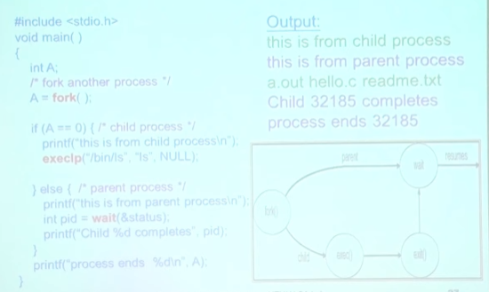
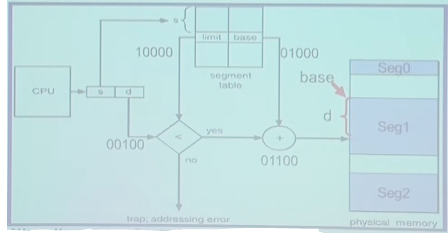
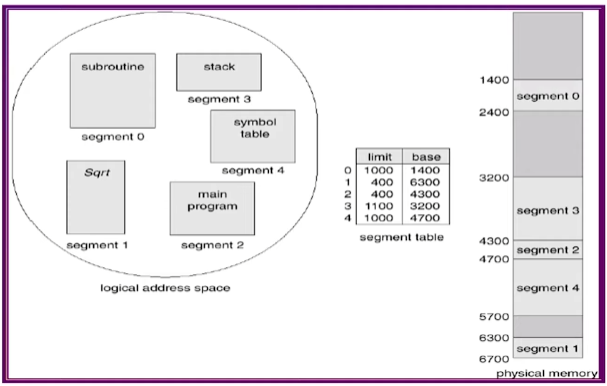

```Text
Author: Antony_Weng <weng851107@gmail.com>

This file is only used for the record of the learning process, only used by myself and the file has never been leaked out.
If there is related infringement or violation of related regulations, please contact me and the related files will be deleted immediately. Thank you!
```


- [Note](#0)
- [清大資工 周志遠 - 作業系統](#1)
  - [Chapter0: Historical Prospective](#1.1)
    - [Mainframe Systems](#1.1.1)
    - [Computer-system Architecture](#1.1.2)
    - [Special-purpose Systems](#1.1.3)
  - [Chapter1: Introduction](#1.2)
    - [What is an Operating System](#1.2.1)
    - [Computer-System Organization](#1.2.2)
    - [Hardware Protection](#1.2.3)
  - [Chapter2: OS Structure](#1.3)
    - [Nachos Explanation](#1.3.1)
    - [OS Service](#1.3.2)
    - [OS Application Interface](#1.3.3)
    - [OS System Structure](#1.3.4)
  - [Chapter3: Processes Concept](#1.4)
    - [Process Concept](#1.4.1)
    - [Process Scheduling](#1.4.2)
    - [Operations on Processes](#1.4.3)
    - [Interprocess Communication (IPC)](#1.4.4)
  - [Chapter8: Memory Management](#1.5)
    - [Background](#1.5.1)
    - [Address Binding](#1.5.2)
    - [Static/Dynamic Loading and Linking](#1.5.3)
    - [Swapping](#1.5.4)
    - [Contiguous Allocation](#1.5.5)
    - [Paging (Non-Contiguous Memory Allocation)](#1.5.6)
    - [Segmentation (Non-Contiguous Memory Allocation)](#1.5.7)
    - [Segmentation with Paging](#1.5.8)
  - [Chapter9: Virtual Memory Management](#1.6)
    - [Background](#1.6.1)
    - [Demand Paging](#1.6.2)
    - [Process Creation](#1.6.3)
    - [Page Replacement](#1.6.4)
    - [Allocation of Frames](#1.6.5)
    - [Thrashing](#1.6.6)
  - [Chapter4: Multithreaded Programming](#1.7)
    - [Thread Introduction](#1.7.1)
    - [Multithreading Models](#1.7.2)
    - [Threaded Case Study](#1.7.3)
    - [Threading Issue](#1.7.4)


<h1 id="0">Note</h1>


<h1 id="1">清大資工 周志遠 - 作業系統</h1>

https://ocw.nthu.edu.tw/ocw/index.php?page=course&cid=141

<h2 id="1.1">Chapter0: Historical Prospective</h2>


Nachos MP: 教育使用的模擬OS軟體

- C++
- Linux
- Code tracing

練習作業四個題目：

- system call
- memory manager
- process scheduler
- file system

課程內容: 


- PART ONE: OVERVIEW
  - Chapter1    Introduction
  - Chapter2    System Structures
- PART TWO: PROCESS MANAGEMENT
  - Chapter3    Process Concept
  - Chapter4    Multithreaded Programming
  - Chapter5    Process Scheduling
- PART THREE: PROCESS COORDINATION
  - Chapter6    Synchronization
  - Chapter7    Deadlocks
- PART FOUR: MEMORY MANAGEMENT
  - Chapter8    Memory-Management Strategies
  - Chapter9    Virtual-Memory Management
- PART FIVE: STORAGE MANAGEMENT
  - Chapter10   File System
  - Chapter11   Implementing File Systems
  - Chapter12   Mass Storage Structure
  - Chapter13   I/O Systems

Computer Systems


<h3 id="1.1.1">Mainframe Systems</h3>

> Batch
> Multi-programming
> Time-sharing

One of the earliest computers

Evolution:

- Batch -> Multi-programming -> Time-sharing

Still exists in today's world

- For *critical application* with better **reliability** & **security**
- Bulk data processing
- Widely used in hospital, banks....

**Mainframe - Batch Systems**

- 透過一堆打洞的卡片程序，插入系統中來執行程式
- 一次只能執行一個程序
- Memory layout只分為 operating system 與 user program area

    

- Drawbacks:
  - *One job at a time*
  - *No interaction* between users and jobs
  - *CPU is often idle*
    - I/O speed << CPU speed (at least 1:1000)

- OS doesn't need to make any decision

**Mainframe - Multi-programming System**

- *Overlaps the I/O and computation of jobs*
  - Keeps both CPU and I/O devices working at higher rates
- *Spooling* (Simultaneous Peripheral Operation On-Line)
  - *I/O is done with no CPU intervention*
  - CPU just needs to *notified* when I/O is done
- 可透過 interrupt 的機制達成Spooling

    

- OS task：
  - *Memory management* - the system must allocate the memory to several jobs
  - *CPU scheduling* - the system must choose among several jobs ready to run
  - *I/O system* - I/O routine supplied by the system, allocation of devices

**Mainframe - Time-sharing System**

- An *interactive* system provides direct communication between the users and the system
  - CPU switches among jobs so frequently that users may interact with programs
  - Users can see results immediately (response time < 1s)
  - Usually, keyboard/screen are used
- *Multiple users* can share the computer simultaneously
- Switch job when
  - finish
  - waiting I/O
  - *a short period of time*

- OS task：
  - *Virtual Memory*(簡單說把disk當作memory來用) - jobs swap in and out of memory to obtain reasonable response time
  - *File System* and *Disk Management* - manage files and disk storage for user data
  - *Process synchronization* and *deadlock* - support concurrent execution of programs


<h3 id="1.1.2">Computer-system Architecture</h3>
 
> Desktop Systems: single processor
> Parallel Systems: tightly coupled
> Distributed Systems: loosely coupled

**Desktop Systems - Personal Computers**

- Personal Computers(PC) - computer system dedicated to a *single user*
- User *convenuence* and *responsiveness* - GUI
- I/O devices - keyboards, *mice*, screens, printers
- Several different tupes of operating systems
  - Windows, MacOS, Unix, Linux
- Lack of file and OS protection from users
  - Worm, Virus

**Parallel Systems**

- a.k.a. *Multiprocessor* or *tightly coupled system*
  - More than one CPU/core in close communication
  - Usually communicate through *shared memory*
- Purposes：
  - Throughpu, Economical, Reliability

    

Symmetric Multiprocessor System (SMP)

- Each processor runs the same OS
- Most popular multiple-processor architecture
- Require *extensive synchronization* to protect data integrity

Asymmetric Multiprocessor System (AMP)

- Each processor is assigned a specific task
- One Master CPU & multiple slave CPUs
- More common in extremely large systems

Multi-Core Processor


Many-Core Processor


Memory Access Architecture


**Distributed Systems**

- A.K.A. *loosely coupled system*
  - Each processor has its own local memory
  - Processors communicate with one another thrrough various communication lines (I/O bus or network)
  - Easy to *scale to large number of nodes* (hundreds of thousands, e.g. Internet)

- Purpose
  - Resource sharing
  - Load sharing
  - Reliabilit

- Architecture: 
  - *client-server*： FTP......

    

  - *peer-to-peer*

    

Clustered Systems

- Definition: 
  - Cluster computers *share storage* and are closely *linked via a local area network(LAN)* or a *faster interconnect*, such as InfiniBand(up to 300Gb/s)
- *Asymmetric clustering*: one server runs the application while other servers standby
- *Symmetric clustering*: two or more hosts are running application and are monitoring each other

---

System Architecture Summary


<h3 id="1.1.3">Special-purpose Systems</h3>

> Real-Time Systems
> Multimedia Systems
> Handheld Sysytems

**Real-Time Operation Systems (RTOS)**

- Well-defined *fixed-time constraints*
  - `Real-time` doesn't mean speed, but *keeping deadline*
- Guaranteed response and reaction times
- Often used as a control device in a dedicated application:
  - Scientific experiments, medical imaging systems, industrial control systems, weapon systems, etc
- Real-time requirement: *hard* or *soft*

    

**Multimedia Systems**

- A wide range of applications including audio and video files(e.g. ppstream, online TV)
- Issues:
  - *Timing constraints*: 24~30 frames per second
  - *On-demand/live streaming*: media file is only played but not stored
  - *Compression*: due to the size and rate of multimedia systems

**Handheld/Embedded Systems**

- Personal Digital Assistants (PDAs)
- Cellular telephones
- *HW specialized OS*
- Issues:
  - Limited memory
  - Slow processors
  - Battery consumption
  - Small display screens

<h2 id="1.2">Chapter1: Introduction</h2>

<h3 id="1.2.1">What is an Operating System</h3>

Four components in Computer System： Hardware, OS, Application, User


What is an Operating System?

- An operating system is the `"permanent"` software that *controls/abstracts hardware resources* for user application

    

Multi-tasking Operating Systems

- Manages resources and processes to support different user applications
- Provides Applications Programming Interface (API) for user applications

    

General-Purpose Operating Systems


Definition of an Operating System

- **Resource allocator** - *manages* and *allocates resources* to insure efficiency and fairness
- **Control program** - *controls* the execution of *user programs* and operations of *I/O devices* to prevent errors and improper use of computer
- **Kernel**(會作為作業系統的別名，核心) - the one program running at all times (all else being system/application programs)

Goals of an Operating System

- **Convenience**
  - make computer system easy to use and compute
  - In particular for small PC
- **Efficiency**
  - use computer hardware in an efficient manner
  - Especially for large, shared, multiuser systems

    --> Two goals are sometimes *contradictory*
    --> In the past, efficiency is more important

Importance of an Operating System

- System API are the *only* interface between user application and hardware
  - API are designed for general-purpose, not performance driven
- OS code cannot allow any bug
  - Any break (e.g. invalid access) cause reboot
- The owner of OS technology *controls* the software & hardware industry
- Operating systems and computer architecture influence each other

Modern Operating Systems


<h3 id="1.2.2">Computer-System Organization</h3>

- One or more CPUs, device controllers connect through *common bus* providing access to *shared memory*

- Goal： *Concurrent* execution of CPUs and devices competing for memory cycles

    

Computer-System Operations

- Each device controller is in charge of a particular device type
- Each device controller has a local buffer. 
    --> I/O device 運作相對於CPU太慢，若沒有buffer，CPU會一直在idle
    --> Status reg: 設置相關設定
    --> Data reg: 先儲存資料，再放入buffer
- *I/O is from the device to controller's local buffer*
- *CPU moves data* from/to *memory* to/from *local buffers* in device controllers
- Device 與 Memory 之間會有一個 Device Controller 作為傳輸的橋樑，Device Controller的好壞會影響到I/O的速度，CPU會下指令操作Device Controller的register，進而操作到Device

    

---

Busy/wait output

- Simplest way to program device
  - Use instruction to test when device is ready
  - 每次寫入都去 `peek` 寫入字元動作是否已完成再繼續寫下一個字元
  - 此方式來讀寫I/O device會造成一直霸佔CPU，無法實現 "Overlaps the I/O and computation of jobs"，因此要使用 `interrupt I/O` 的方式

    

Interrupt I/O

- Busy/wait is very inefficient
  - CPU can't do other work while testing device
  - Hard to do simultaneous I/O
- *Interrupts* allow a device to *change the flow of control in the CPU*
  - Causes subroutine call to handle device

Interrupt I/O Timeline

- Interrupt time line for I/O on a single process
  - `CPU = high`：CPU原本在處理目前的 user process executing
  - `I/O device = high`：idle
  - I/O device拉low，傳遞資料到buffer中，完成後會拉high，進而對CPU產生中斷

    

Interrupt-Driven I/O

- 初始化I/O後，當Controller準備好時會發出interrupt，CPU才需處理相關事務，處理完後CPU會再返回目前行程
- 軟體的interrupt通常為主動產生，而硬體的interrupt為被動產生 

    

Interrupt

- *Modern OS are interrupt driven*
- The occurrence of an event is signaled by an interrupt from either hardwrae or software
  - *Hardware* may trigger an interrupt at any time by sending a *signal* to CPU
    - signal是專門用於硬體中斷使用的詞語
  - *Software* may trigger an interrupt either by 
    - an *error*(division by zero or invalid memory access) --> 非預期(被動?)
    - or by a user request for an *operating system service* (*system call*) --> 預期的(主動?)
    - Software interrupt also called *trap*

HW Interrupt

- CPU原先在執行 user program，但hardware device被觸發產生一個interrupt signal(CPU被動被中斷)
- 接著CPU會去 `interrupt vector` 中搜索該signal相對應(硬體設計出來的，某個硬體插到某個Port，會有對應的signal number(由硬體設計固定的))的function pointer
- function pointer會引導到所要執行的function code去作處理
- 執行對應siganl的function code又稱為 `Service Routine`
- OS執行完後會返回CPU原先執行的 user program

    

SW Interrupt

- CPU原先在執行某一個program，主動產生一個 `system call` 來中斷CPU
- 由於SW Interrupt的數量是unbounded的，不採用和HW Interrupt一個由interrup vector來處理，而是使用 `switch case` 的方式來設計，流程上與HW Interrup是相似的，只是實現方式不同

    

Common Functions of Interrupts

- Interrupt transfers control to the interrupt service routine generally, through the *interrupt vector*, which contains the *addresses* (function pointer) of all the *service (i.e. interrupt handler) routunes*
- Interrupt architecture must save the *address* of the *interrupted instruction*
- Incoming interrupts are *disabled* while another interrupt is being processed to prevent a lost interrupt 
    --> 確保OS為低延遲
    --> 有時候中斷沒有反應是因為發生中斷時卡在某個service routine中，所以其它中斷會被disable

---

Storage-Device Hierarchy

- Storage systems organized in hierarchy
  - *Speed*, Cost, Volatility
  - 越上層速度越快，但容量較低
- Main memory - only large storage media that the CPU can access directly
  - RAM: Random Access Memory
- Secondary storage - extension of main memory that provides `large nonvolatile storage` capacity
  - Magnetic disk

    

RAM: Random-Access Memory --> Access speed (訪問速度) 每次都保持一致

- DRAM(Dynamic RAM)：
  - Need only *one transistor*
  - Consume *less power*
  - Values must be periodically *refreshed*
  - Access Speed: *>= 30ns*
- SRAM(Static RAM)：
  - Need only *six transistor*
  - Consume *more power*
  - Access Speed: *10ns ~ 30ns*
  - Usage: *cache memory*

Disk Mechanism

- Speed of magnetic disk
  - $Transfer time = data size / transfer rate$
  - Positioning time = seek time(cylinder) + rotational latency(sector)  
  -->  random access time，訪問時間是隨機的，因為是由機構來完成的
  -->  當今天是連續讀取的時候時，HDD不一定會輸給SSD

Performance of Various Levels of Storage


Caching

- Information in use *copied* from *slower* to *faster* storage temporarily
- Faster storage (cache) checked first to determine if information is there
  - If it is, <u>information used directly from the cache (fast)</u>
  - If not, <u>data copied to cache and used there</u>

    

- 並不是總是需要cache，當今天讀取的資料過多，讀取一次就佔滿，就沒有讀取到cache的意義了
- cache只是複製常用數據，避免過度重memory取得，用來加速

Coherency(連貫性) and Consistency(一致性) Issue 

- The same data may appear in different levels
  - Issue: <u>Change the *copy in register* make it inconsistent with other copies</u>
  - 有時候register或cache的值已經修改了，但Ram或是disk上尚未更新
- Single task accessing:
  - No problem, always use the *Highest level* cpoy
  - 由於單一程序且CPU總是存取最高等級的記憶體，所以不影響
- Muti-task accessing:
  - Need to obtain the most recent value
  - 當多個程序有共享記憶體時，沒有即時更新到時，會有錯誤的數據

    

- Distributed system:
  - Difficult because copies are on different computers
  - Ex. Google雲端系統如此龐大，為何還是可以使用 --> 放棄Coherency，對不同使用者看到的網頁有可能都不完全一致，但對使用上沒有影響

<h3 id="1.2.3">Hardware Protection</h3>

- 非指 Security
- 一個作業系統有很多層，共用某資源但卻不會影響到對方，如某程序死掉，並不會造成其他程序死掉
- 不能不透過作業系統就訪問其他程序正在執行程序的記憶體
- CPU只是吃指令去執行，如何分辨誰是OS誰是User Program
  - 但程式在執行時，利用interrupt來進行區分，達到 Dual-Mode Operation

> *Dual-Mode Operation*
> I/O Protection
> Memory Protection
> CPU Protection

**Dual-Mode Operation**

- What to protect?
  - Sharing system resources requires OS to ensoure that an incorrect program cannot cause *other programs* to execute incorrectly.
- Provide <font color='red'>hardware support</font> to differentiate between at least two modes of operations
  1. <font color='red'>User mode</font> - execution done on behalf pf a user
  2. <font color='red'>Monitor mode</font> (also <font color='red'>kernel mode</font> or <font color='red'>system mode</font>) - execution done on behalf of <font color='red'>operation system</font>
- <font color='red'>*Mode bit*</font> added to computer hardware to indicate the current mode
  - kernel mode = 0
  - user mode = 1
- When an <font color='red'>interrupt/trap</font> or <font color='red'>fault</font> occurs, hardware switches to monitor mode

    

- <font color='red'>Privileged instructions</font> 
  - Executed only in <font color='red'>monitor mode</font> 
  - Requested by users (system calls)
  - 電腦上運作做任何事情時，都必須透過給CPU instruction
  - 在設計CPU的指令集時已經寫死了
  - 根據是否會危害到電腦運作來區分是否為Privileged instructions

**I/O Protection**

- <font color='red'>All I/O instructions are privileged instructions</font> 
  - any I/O device is shared between users
- Must ensure that a user program could never gain control of the computer in monitor mode (i.e. a user program that, as part of its execution, stores a new address(a new user code) in the interrupt vector)
  - 駭客無法繞過OS，因此只能鑽記憶體的漏洞

    

**Memory Protection**

- Protect
  - Interrupt vector and the interrupt service routines
  - <u>Data access and over-write from other programs</u>
- HW support: two registers for legal address determination
  - <font color='red'>Base register</font> - holds the smallest legal physical memory address
  - <font color='red'>Limit register</font> - contains the size of the range
  - 修改指令為 privileged instruction

    

- Memory outside the defined range is protected

    

**CPU Protection**

- Prevent user program from not returning control
  - getting stuck in an infinite loop
  - not calling system services
- HW support: <font color='red'>Timer</font> - interrupts computer after specified period
  - Timer is decremented every clock tick
  - When timer reaches the value 0, an interrupt occurs
  - CPU的scheduler會決定CPU的schedule
- Timer commonly used to implement <font color='red'>time sharing</font>
- <font color='red'>Load-timer</font> is a privileged instruction

<h2 id="1.3">Chapter2: OS Structure</h2>

<h3 id="1.3.1">Nachos Explanation</h3>

https://homes.cs.washington.edu/~tom/nachos/

[[作業系統] Nachos 安裝](https://jeffprogrammer.wordpress.com/2016/10/31/%E4%BD%9C%E6%A5%AD%E7%B3%BB%E7%B5%B1-nachos-%E7%B0%A1%E4%BB%8B/)

Introduction

- understand how to work on Linux machine
- understand how system call are done by OS
- understand the difference of user space and kernel space memory

NachOS

- a process runs on top of another OS
- a kernel(OS) and MIPS code machine simulator

    

- Virtual Machine的作用就是instruction的轉換

Nacho Directory Structure

- `lib/`
  - Utilities used by the rest of the Nachos code
- `machine/`
  - The <font color='red'>machine simulation</font>
  - 修改Hardware相關設定，如增加一個signal
- `threads/`
  - Nachos is a multi-threaded program. Thread support is found here.
  - This directory also contains the main() routine of the nachos program, in `main.cc`
- `test/`
  - <font color='red'>User test programs</font> to run on the simulated machine.
  - As indicated earlier, these are separate from the source for the Nachos operating system and workstation simulation.
  - This directory contains its own Makefile.
  - The test programs are very simple and are written in C rather than C++
- `userprog/`
  - <font color='red'>Nachos operating system code</font> to support the creation of address spaces, loading of user (test) programs, and execution of test programs on the simulated machine. The exception handling code is here, in `exception.cc`
- `network/`
  - Nachos operating system support for networking, which implements a simple "post office" facility.
  - Several independent simulated Nachos machines can talk to each other through a simulated network.
  - Unix sockets are used to <font color='red'>simulate network connections among the machines</font>
- `filesys/`
  - Two different file system implementations are here.
  - <font color='red'>The "real" file system</font> uses the simulated workstation's simulated disk to hold files.
  - <font color='red'>A "stub" file system</font> translates Nachos file system calls into UNIX file system calls makefile.

Installation of Nachos

- Install

    ```bash
    #download NachOS-4.0_MP1

    $ cd NachOS-4.0_MP1/code/build.linux

    $ make clean

    $ make
    ```

- Rebuild
  - You should <font color='red'>rebuild NachOS</font> every time after you modify anything in NachOS, otherwise you won't change the execution results.

    ```bash
    $ cd NachOS-4.0_MP1/code/build.linux

    $ make clean

    $ make
    ```

- Test your nachos
  - 須透過 `nachos -e` 來執行 user program

    ```bash
    $ cd NachOS-4.0_MP1/code/test

    $ make clean

    $ make halt

    $ ../build.linux/nachos -e halt
    ```

    

- Test nachos with test cases

    ```bash
    # this will generate the binary of all test cases
    $ make

    # generate test case
    $ make consoleIO_test1

    # run nachos with test case
    $ ../build.linux/nachos -e consoleIO_test1
    ```

MP - System call

- Part1: console I/O system call
  - Implement `PrintInt(int number)` system call

    

    

    

- Part2: File I/O system call
  - 新增 `Open(), Close()`

    

    

    

    

    

<h3 id="1.3.2">OS Service</h3>

User program 透過OS使用system call

interrupt routine = service routine


**User Interface**

- CLI (Command Line Interface)
  - Fetches a command from user and executes it
  - <font color='red'>Shell: Command-line interpreter</font> (CSHELL, BASH, ...)
    - Adjusted according to user behavior and preference
    - 使用者透過Shell這個程序下指令給OS
- GUI (Graphic User Interface)
  - Usually mouse, keyboard, and monitor
  - Icons represent files, programs, actions, etc
  - Various mouse buttons over objects in the interface cause various actions
- Most systems have both <font color='red'>CLI</font> and <font color='red'>GUI</font>

**Communication Models**

- Communication may take place using either <font color='red'>message passing</font>(with systemcall(OS) because "Protect") or <font color='red'>share memory</font>(with systemcall(OS) to create memory because "Protect").

    

- Multi-thread programming時，會OS會有預設創建共同擁有的記憶體空間

<h3 id="1.3.3">OS Application Interface</h3>

> System calls
> API

- System calls 與 API 的差別

**System Calls**

- Request OS services
  - <font color='red'>Process control</font> - abort, create, terminate process and allocate/free memory
  - <font color='red'>File management</font> - create, delete, open, close file
  - <font color='red'>Device management</font> - read, write, reposition device
  - <font color='red'>Information maintenance</font> - get time or date
  - <font color='red'>Communications</font> - send receive message

**System Calls & API**


- System calls
  - The <font color='red'>OS interface</font> to a running program
  - An explicit request to the <font color='red'>kernel</font> made via a <font color='red'>software interrupt</font>
  - Generally available as <font color='red'>assembly-language</font> instructions

- API: Application Program Interface
  - <font color='red'>Users mostly program against API instead of system call</font>
  - 為了方便撰寫程式所建立的一層，而不會直接接觸到System call
  - Commonly implemented by language libraries, e.g. <font color='red'>C Library</font>
  - An API call could involve <font color='red'>zero or multiple system call</font>
    - Both `malloc()` and `free()` use system call `brk()`
    - Math CPI function, such as `abs()`, don't need to incolve system call

Interface vs. Library

- User program:

    ```C
    printf("%d", exp2(int x, int y));
    ```

- Interface:

    ```C
    int exp2(int x, int y);
    ```
    i.e. return the value of $X*2^{y}$

- Library:

  - imp1

    ```C
    int exp2(int x, int y)
    {
        for (int i = 0;i < y;i++) {
            x = x*2;
        }
        return x;
    }
    ```

  - imp2

    ```C
    int exp2(int x, int y)
    {
        x = x<<y;
        return x;
    }
    ```

  - imp3: hardware device 支援的 instruction

    ```C
    int exp2(int x, int y)
    {
        return HW_EXP(x, y);
    }
    ```

API: Application Program Interface

- Three most common APIs:
  - <font color='red'>Win32</font> API for <font color='red'>Windows</font>
  - <font color='red'>POSIX API</font> for POSIX-based systems (including virtually all versions of UNIX, Linux, and Mac OS X)
    - POSIX -> "Portable Operating System Interface for Unix"
    - Ex. pthread: 前面的p表示由POSIX建立的API
  - <font color='red'>Java API</font> for the Java virtual machine
    - 需要從vitual machine轉換code到x86 machine

API - System Call - OS Relationship

- user program 在執行時會先呼叫API，會根據API內需不需要OS的幫助來看是否呼叫System Call，才會進入OS進行其他操作

    

Standard C Library Example


Why use API?

- Simplicity
  - API is designed for applications
- Portability
  - API is an unified defined interface
- Efficiency
  - Not all functions require OS services or involve kernel

System Calls: Passing Parameters

- Three general methods are used to pass parameters between a running program and the operating system
  - Pass parameters in <font color='red'>registers</font> --> 直接存放到暫存器，CPU就可以讀取到 
  - Store the parameters in a <font color='red'>table in memory</font>, and the table address is passed as a parameter in a register --> 利用 pointer
  - Push(store) the parameters onto the <font color='red'>stack</font> by the program, and pop off the stack by operating system --> 每個process都會有stack空間可以存放

<h3 id="1.3.4">OS System Structure</h3>

> Simple OS Architecture
> Layer OS Architecture
> Microkernel OS
> Modular OS Structure
> Virtual Machine
> Java Virtual Machine

User goals and System goals

- User goals - operating system should be <font color='red'>easy to use</font> and <font color='red'>learn</font>, as well as <font color='red'>reliable</font>, <font color='red'>safe</font>, and <font color='red'>fast</font>

- System goals - operating system should be <font color='red'>easy to design, implement</font> and <font color='red'>maintain</font>, as well as <font color='red'>reliable</font>, <font color='red'>error-free</font>, and <font color='red'>efficient</font>

**Simple OS Architecture**


**Layered OS Architecture**


**Microkernel OS**

- Kernel module負責為各個sub-system作溝通 --> 有module的概念
- 將非必須module的實現於user space
- 效率更慢，溝通(message passing)都需要經過kernel


**Modular OS Structure**

- 當今使用的OS，如Linux

- sub-system以module的形式存在，且都在kernel space中

- 可以insert/remove module


- https://courses.linuxchix.org/kernel-hacking-2002.html
- https://en.wikibooks.org/wiki/The_Linux_Kernel/Modules

**Virtual Machine**


- virtual machine中的kernel是建立在原先OS上的user space，因此virtual machine中的kernel若執行privileged instructions(產生interrupt)，會跳出一個exception，回到原先OS，原先OS再幫virtual machine執行一次privileged instructions

    

- CPU若有hardware support，則除了可以分辨是kernel space或是user space之外，還能分辨是否為virtual machine spcae

- critical instruction: 在user space與kernel space都可以執行，但在不同的space執行的結果不一樣
  - 因此如果沒有hardware支持virtual machine的話，在virtual machine中的user space或是kernel space執行的critical instruction對原先OS來說都是在user space執行的，因次結果可能會錯誤

Usage of Virtual Machine

- Provides complete protection of system resources
- A means to solve system compatibility problems，如某軟體只能執行於Ubuntu14.04...
- A perfect vehicle for operatin-systems reseach and development
- A mean to increase resources utilization in <font color='red'>cloud computing</font>
  - cloud computing 也有其他實現方式

Vmware (Full Virtualization)

- Guest Operation System 完全不需要修改
- 且不需要靠到Hardware的幫忙

    

Parallel-virtualization: Xen


**Java Virtual Machine**

- 注重於code translation
- 使用的記憶體於Java Virtual Machine中，並不會影響到Host System


<h2 id="1.4">Chapter3: Processes Concept</h2>

<h3 id="1.4.1">Process Concept</h3>

An operating system concurrently executes a variety of programs(e.g Web browser, text editor, etc)
- *Program* - passive entity:<font color='red'>binary stored in disk</font>
- *Process* - active entity: <font color='red'>a program in execution in memory</font>

A process includes：

- <font color='red'>Code</font> segment(text section)
- <font color='red'>Data section</font> - global variables
- <font color='red'>Stack</font> - temporary local variables and functions
- <font color='red'>Heap</font> - dynamic allocated variables or classes
- Current activity(<font color='red'>program counter</font>, register contents)
- A set of associated <font color='red'>resources</font>(e.g. open file handlers)

Process in Memory


Threads

- a.k.a <font color='red'>lightweight process</font>
  - basic unit of CPU utilization
- All threads <font color='red'>belonging to the same process</font> share
  - <font color='red'>code</font>  section, <font color='red'>data</font>  section and <font color='red'>OS resources</font>  (e.g. open files and signals)
- But each thread has its own
  - <font color='red'>thread ID</font>, <font color='red'>program counter</font>, <font color='red'>register set</font>, and a <font color='red'>stack</font>
- 不同的threads可以利用全域變數來進行溝通

  

Process(Thread) State：

- 以Linux來說，OS並沒有Process的概念，把大家都當作Thread，只是區分哪些Threads有共用的Memory

- States：
  - <font color='red'>New</font>: the precess is being created --> 載入到Memory中
  - <font color='red'>Ready</font>: the process is in the memory waiting to be assigned to a processor --> process在等待競爭CPU core的資源，排程
  - <font color='red'>Runnung</font>: instructions are being executed by CPU --> 可以送instruction給CPU進行運算
  - <font color='red'>Waiting</font>: the process is waiting for events to occur --> 等待I/O處理完事件
  - <font color='red'>Terminated</font>: the process has finished execution --> 把佔用的資源釋放掉

Diagram of Process State

- Only one process is <font color='red'>running</font> on any processor at any instant
- However, many process may be <font color='red'>ready</font> or <font color='red'>waiting</font>

    

Process Control Block (PBC)

- 當一個Process被創建時，會建立其PCB
- Information associated with each process --> 存於OS的Memory裡面，其Kernel的Memory
  - <font color='red'>Process state</font>
  - <font color='red'>Program counter</font>
  - <font color='red'>CPU registers</font>
  - CPU scheduling information (e.g. priority)
  - Memory-management information (e.g. base/limit register)
  - Accounting information

  

**Context Switch**: 

- 將原本在CPU上執行的Process轉換成另一個時的專有名詞
- 系統倚靠這個行為來共享CPU的資源
- <font color='red'>Context Switch</font>: Kernel saves the state of the old process and loads the saved state for the new process
- Context-switch time is purely <font color='red'>overhead</font>
- Switch time (about 1~1000ms) depends on
  - memory speed
  - number of registers
  - existence of special instructions
    - a single intruction to save/load all registers
  - hardware support
    - <font color='red'>multiple sets of register</font> (Sun UltraSPARC - a context switch means changing register file pointer)

  

<h3 id="1.4.2">Process Scheduling</h3>

Process Scheduling

- *Multiprogramming*： CPU runs process at all times to <font color='red'>maximize CPU utilization</font>
- *Time sharing*： switch CPU frequently such that <font color='red'>users</font> can <font color='red'>interact</font> with each program while it is running
- Processes will have to wait until the CPU is free and can be re-shceduled

Process Scheduling Queues

- Processes migrate between the various queues (i.e. switch among states)
- *Job queue* (New State) - set of <font color='red'>all processes</font> in the system
- *Ready queue* (Ready State) - set of all processes residing in main memory, <font color='red'>ready and waiting to execute</font>
- *Device queue* (Wait State) - set of processes <font color='red'>waiting for an I/O device</font>

  

Process Scheduling Diagram


Schedulers


- *Short-term* scheduler (<font color='red'>CPU scheduler</font>) - selects which process should be executed and <font color='red'>allocated CPU (Ready state -> Run state)</font>
- *Long-term* scheduler (<font color='red'>Job scheduler</font>) - selects which processes should be <font color='red'>loaded into memory</font> and brought into the ready queue <font color='red'>(New state -> Ready state)</font>
- *Medium-term* scheduler - selects which processes should be <font color='red'>swapped in/out memory (Ready state -> Wait state)</font>
  - 與virtual memory相似，因為memory有限，所以將部分disk作為memory來使用
  - 一個process的base/limit register可以很大，但並不是立即使用到，因此可以將部分未使用到的轉換到disk建構的memory

Long-Term Scheduler

- Control <font color='red'>degree of multiprogramming</font> --> 即控制目前有多少個程序在記憶體中
- Execute less frequently (e.g. invoked only when a process leaves the system or <font color='red'>once several minutes</font>) -> 造成CPU idle
- Select a <font color='red'>good mix of CPU-bound & I/O-bound </font>processes to increase system overall performance -> CPU 和 I/O device 有被平衡地使用，不會造成誰被idle
- UNIX/NT: no long-term scheduler
  - 記憶體足夠大，Process會直接放至記憶體，搭配medium-term scheduler
  - Created process placed in memory for short-term scheduler
  - Multiprogramming degree is bounded by hardware limitation (e.g., # of terminals) or on the self-adjusting nature of users

Short-Term Scheduler

- Execute quite frequently (e.g. <font color='red'>once per 100ms</font>)
- Must be efficient:
  - if 10ms for picking a job, 100ms for such a pick,
    -> $overhead = 10/110 = 9%$，表示CPU有9%的時間是沒有在做事的，re-schedule的時間

  

Medium-Term Scheduler

- <font color='red'>swap out</font>: *removing processes from memory* to reduce the degree of multiprogramming
- <font color='red'>swap in</font>: reintroducing swap-out processes into memory
- Purpose: <u>improve process mix, free up memory</u>
- Most modern OS doesn't have medium-term scheduler because having sufficient physical memory or using virtual memory

    

<h3 id="1.4.3">Operations on Processes</h3>

Tree of Processes

- Each process is identified by a <font color='red'>unique</font> processor identifier (<font color='red'>pid</font>)
  - 有parent-child的關係

  

Process Creation

- Resource sharing
  - Parent and child processes share <font color='red'>all</font> resources
  - Child process shares <font color='red'>subset</font> of parent's resources
  - Parent and child share <font color='red'>no</font> resources

- Two possibilities of execution
  - Parent and children <font color='red'>execute concurrently</font>
  - Parent <font color='red'>waits until children terminate</font>

- Two possibilities of address space
  - <font color='red'>Child duplicate of parent</font>, communication via sharing variables
  - <font color='red'>Child has a program loaded into it</font>, communication via message passing

UNIX/Linux Process Creation

- <font color='red'>fork</font> system call
  - Create a new (child) process
  - The new process <font color='red'>duplicates the address space</font> of its parent
  - Child & Parent <font color='red'>execute concurrently</font> after fork
  - Child: return value of fork is 0
  - Parent: return value of fork is PID of the child process
- <font color='red'>execlp</font> system call
  - <font color='red'>Load a new binary file</font> (即另一個程式的程式碼) into memory - <font color='red'>destorying the old code</font>
- <font color='red'>wait</font> system call
  - The parent waits for <font color='red'>one of its child processes</font> to complete

- Memory space of fork()：
  - Old implementation: A's child is an <font color='red'>exact copy</font> of parent
  - Current implementation: use <font color='red'>copy-on-write</font> technique to store <font color='red'>differences in A's child address space</font>

  

UNIX/Linux Example




Process Termination

- Terminate when the last statement is executed or <font color='red'>exit()</font> is called
  - All resources of the process, including physical & virtual memory, open files, I/O buffers, are <font color='red'>deallocated by the OS</font>
- Parent may terminate execution of children processes by specifying its PID (<font color='red'>abort</font>)
  - Child has exceeded allocated resources
  - Task assigned to child is no longer required
- Cascading termination:
  - killing (exiting) parent -> killing (exiting) all its children

<h3 id="1.4.4">Interprocess Communication (IPC)</h3>

Interprocess Communication

- <font color='red'>IPC</font>：a set of methods for the exchange of data among multiple threads in one or more processes
- <font color='red'>Independent process</font>：cannot affect or be affected by other processes
- <font color='red'>Cooperating process</font>：otherwise
- Purposes
  - information sharing
  - computation speedup (not always true ...)
  - convenience (performs several tasks at one time)
  - modularity

Communication Methods

- *Shared memory*：
  - Require more careful <font color='red'>user synchronization</font>
  - Implemented by memory access：faster speed
  - <font color='red'>Use memory address to access data</font>, (使用pointer的方式)
  - 通常用於人數少時
- *Message passing*：
  - No conflict：<font color='red'>more efficient for small data</font>
  - <font color='red'>Use send/recv message</font>
  - Implemented by <font color='red'>system call</font>：slower speed
  - 通常用於人數多時，如網路

  

- Sockets：
  - A network connection identified by <font color='red'>IP & Port</font>, (Port就是Process，不同的Port代表不同的Process)
  - Exchange <font color='red'>unstructured stream of bytes</font>

  

- Remote Procedure Calls：
  - Cause a <font color='red'>procedure</font> to execute in another address space
  - Pareameters and return values are passed by message
  - 即可以呼叫別個process的function code

  

Shared Memory

- Processes are responsible for ...
  - Establishing a region of shared memory
    - Typically, a shared-memory region resides in the address space of the process creating the shared-memory segment
    - Participating processes <font color='red'>must agree to remove memory access constraint</font> from OS
  - Deteninating the form of the data and the location (OS只幫忙創建此區塊，裡面內容要什麼是由user program來決定)
  - Ensuring data are not written simutaneously by processes

Consumer & Producer Problem

- <font color='red'>Producer</font> process produces information that is consumed by a <font color='red'>Consumer</font> process

- Buffer as a circular array with size B
  - next free: <font color='red'>in</font>
  - first available: <font color='red'>out</font>
  - empty: <font color='red'>in = out</font>
  - full: <font color='red'>(in+1)%B = out</font> --> 事先停住，會有一個儲存空間被浪費掉，否則不知道 $in = out$ 時，是什麼情況

  

  

 - Consumer & Producer 在compiler與linker時也是被使用的，如source code直接被編譯成execution file時，即compiler編譯後就給linker

Message-Passing System

- Mechanism for processes to <font color='red'>communicate</font> and <font color='red'>synchronize</font> their actions --> 不必再額外對同步作其他處理，本身就是一種同步的溝通
- IPC facility provide two operations：
  - <font color='red'>Send</font>(message) - message size fixed or vaiable
  - <font color='red'>Receive</font>(message)
- Message system - processes communicate <font color='red'>without resorting to shared variables</font> --> 無須共享變數(記憶體)
- To communicate, processes need to
  - Establish a <font color='red'>communication link</font>
  - Exchange a message via <font color='red'>send/receive</font>
- Implementation of communication link
  - physical (e.g. shared memory, HW bus, or network)
  - logical (e.g. <font color='red'>logical properties</font>)
    - <font color='red'>Direct or indirect communication</font>
    - Symmetric or asymmetric communication
    - <font color='red'>Blocking or non-blocking</font>
    - Automatic or expicit buffering
    - Send by copy or send by reference
    - Fixed-sized or variable-sized messages

Direct communication (如打電話?)

- Processes must <font color='red'>name each other explicitly</font>
  - *Send(P, message)* - send a message to process P
  - *Receive(Q, message)* - receive a message from process Q
- Properties of communication link
  - Links are <font color='red'>established automatically</font>
  - <font color='red'>One-to-One</font> relationship between links and processes
  - The link may be unidirectional, but is usually bi-directional

  

  - <font color='red'>limited modularity</font>：if the <font color='red'>name</font> of a process is <font color='red'>changed</font>, all old names should be found

Indirect communication (如寄信?)

- Messages are directed and received from <font color='red'>mailboxes</font> (also referred to as ports)
  - <font color='red'>Each mailbox has a unique ID</font>
  - Processes can communicate if they share a mailbox
  - *Send(A, message)* - send a message to mailbox A
  - *Receive(A, message)* - receive a message from mailbox A
- Properties of communication link
  - Link established only <font color='red'>if processes share a common mailbox</font>
  - <font color='red'>Many-to-Many</font> relationship between links and processes
  - Link may be unidirectional or bi-directional
  - Mailbox can be owned either by OS or processes
- Mailbox sharing

    

- Solutions
  - Allow a link to be associated with at most two --> 即direct communication
  - Allow only one process at a time to execute a receive operation --> 透過locking來解決
  - <font color='red'>Allow the system to select arbitrarily a single receiver. Sender is notified who the receiver was</font>

Synchronization

- Message passing may be either <font color='red'>blocking</font>(synchronous) or <font color='red'>non-blocking</font>(asynchronous)
  - *Blocking send*: sender is blocked until the message is receive by receiver or by the mailbox
  - *Nonblocking send*: sender sends the message and resumes operation
  - *Blocking receive*: receiver is blocked until the message is available
  - *Nonblocking receive*: receiver receives a valid message or a null
- Buffer implementation
  - <font color='red'>Zero</font> capacity: blocking send/receive
  - <font color='red'>Bounded</font> capacity: if full, sender will be blocked
  - <font color='red'>Unbounded</font> capacity: sender never blocks

  

Sockets

- connect後，會創建新的thread，多個連線即多個thread在執行，因此不互相影響

  

  

Remote Procedure Calls


<h2 id="1.5">Chapter8: Memory Management</h2>

<h3 id="1.5.1">Background</h3>

- Main memory and registers are the only storage CPU can access directly
- Collection of <font color='red'>processes</font> are waiting on disk to be <font color='red'>brought into memory and be executed</font>
- <font color='red'>Multiple programs are brought into memory</font> to improve resource utilization and response time to users
- A process may be <font color='red'>moved between disk and memory</font> during its execution

Outline

- How to refer memory in a program?
    > address binding 
- How to load a program into memory?
    > static/dynamic loading and linking
- How to move a program between memory and disk?
    > swap
- How to allocate memory?
    > paging, segment

<h3 id="1.5.2">Address Binding</h3>

Multistep Processing of a User Program


Address Binding in Compile Time

- Program is written as symbolic code
- Compiler translates symbolic code into <font color='red'>*absolute code*</font>
- 在Compile Time時，即決定Process中variables的address
- If starting location changes -> <font color='red'>recompile</font>
- 在多人使用時，很不方便，容易衝突要重新編譯，無法達成Virtual Memory想達成的事
- Example: MS-DOS .COM format binary

    

Address Binding in Load Time

- Compiler translates symbolic code into <font color='red'>*relocatable code*</font>
- <font color='red'>Relocatable code</font>：
  - Machine language that can be run from any memory location
- 在Compile時，Base register還是變數，等到Load Time時根據記憶體哪邊有空間而設置於哪
- If starting location changes -> <font color='red'>reload the code</font>

    

Address Binding in Execution(Run) Time

- To virtual memory and dynamic usage.
- Compiler translates symbolic code into <font color='red'>*logical-address(i.e. virtual-address) code*</font>
- Special <font color='red'>hardware(i.e. MMU, Memory Management Unit)</font> is needed for this scheme
- Most general-purpose OS use this method
- 在Compile Time時，一樣只有設置limit register的數值; Load Time將Process載入Memory時，仍然只有limit register，並沒有將base register與實際載入記憶體的address一樣，等到Run Time時才會確定 --> 即CPU是使用Virtual Address去記憶體讀取，中間會被Hardware(MMU)轉換成physical address來讀取，此時才確定Process的Base register
- 可以在run time修改程序記憶體位置，不像load time必須重新載入程序才能修改記憶體位置

    

Memory-Management Unit (MMU)

- Hardware device that <font color='red'>maps virtual to physical address</font>
- The value in the <font color='red'>relocation register is added to every address</font> generated by a user process at the time it is sent to memory

    

Logical vs. Physical Address

- <font color='red'>Logical address</font> - generated by *CPU*
  - a.k.a. virtual address
- <font color='red'>Physical address</font> - seen by the *memory module*
- compile-imte & load-time address binding
  - logical address = physical address
- Execution-time address binding
  - <font color='red'>logical address != physical address</font>
- <font color='red'>The user program deals with logical address; it never sees the real physical address</font>
  - 即每個Process只需關注自己的address即可，不必在意其他Processes

<h3 id="1.5.3">Static/Dynamic Loading and Linking</h3>

Dynamic Loading

- The entire program must be in memory for it to execute? --> Static Loading
- No, we can use <font color='red'>dynamic-loading</font>
  - *A routine(function code) is loaded into memory when it is called*
- <font color='red'>Better memory-space utilization</font>
  - unused routine(function code) is never loaded
  - Particularly useful when large amounts of code are infrequently used (e.g., *error handling code*)
- <font color='red'>No special support from OS</font> is required implemented through program (library, API calls)

Dynamic Loading Example in C

- `dlopen()`: opens a library and prepares it for use
- `desym()`: looks up the value of a symbol in a given (opened) library
- `dlclose()`: closes a DL library
- 當printf()中實際呼叫到 `cosine` 時才會dynamic load到記憶體中

    

    

Static Linking

- *Static linking*: libraries are combined by the <font color='red'>loader</font> into the program in-memory image
  - Waste memory: <font color='red'>duplicated code</font>
  - Faaster during execution time
- <font color='red'>Static limking + Dynamic loading</font>
    > Still can't prevent duplicated code

  

  

Dynamic Linking

- *Dynamic linking*：Linking postponed <font color='red'>until execution time</font>
  - <font color='red'>Only one code copy</font> in memory and <font color='red'>shared by everyone</font>
  - A stub is included in the program in-memory image for each lib reference
  - Stub call -> check if the referred lib is in memory -> if not, load the lib -> execute the lib
  - .dll (Dynamic link library) on Windows
  - .so (dynamically linked shared object libraries，簡稱為shared objects) on Linux
  - 執行時，需要stub去尋找lib，因此run time時間較static linking長，但節省記憶體空間

  

<h3 id="1.5.4">Swapping</h3>

Swapping

- A process can be swapped out of memory to a <font color='red'>backing store</font>(swap space), and later brought back into memory for continuous execution
  - Also used by <font color='red'>midterm scheduling</font>, different from context switch
- <font color='red'>Backing store</font> - a chunk of **disk**, *separated from file system*, to provide direct access to these memory images
- Why Swap a process:
  - *Free up memory*
  - *Roll out, roll in*: swap lower-priority process with a higher one
- Swap back memory location
  - If binding is done at compile/load time
    > swap back memory address must be the <font color='red'>same</font>
  - If binding is done at execution time
    > swap back memory address can be <font color='red'>different</font>
- A process to be swapped == <font color='red'>must be idle</font> --> CPU和I/O都必須閒置時才可
  - Imagine a process that is waiting for I/O is swapped
  - Solution:
    - Never swap a process with pending I/O
    - I/O operations are done through OS buffers(i.e. a memory space not belongs tp any user processes)

Process Swapping to Backing Store

- Major part of swap time is transfer time; <font color='red'>total transfer time is directly proportional to the amount of memory swapped</font>

    

<h3 id="1.5.5">Contiguous Allocation</h3>

Memory Allocation

- <font color='red'>Fixed-size partition allocation</font>：
  - Each process loads into one partition of fixed-size
  - *Degree of multi-programming* is bounded by the number of partitions --> 有幾個partition代表有幾個processes
- <font color='red'>Variable-size partition allocation</font>：
  - Hole: block of contiguous free memory
  - Holes of various size are scattered in memory

Multiple Partition (Variable-Size) Method

- When a process arrive, it is allocated a hole large enough to accommodate it
- The OS maintains information on each <font color='red'>in-use</font> and <font color='red'>free hole</font>
- A freed hole can be merged with another hole to form a large hole

    

Dynamic Storage Allocation Problem

- How to satisfy a request of size n from a list of free holes
  - *First-fit* - allocate the 1st hole that fits
  - *Best-fit* - allocate the smallest hole that fits
  - *Worst-fit* - allocate the largest hole
- First-fit and best-fit better than worst-fit in terms of speed and storage utilization

Fragmentation (碎片化)

- *External fragmentation*
  - Total free memory space is big enough to satisfy a request, but is not contiguous
  - Occur in <font color='red'>variable-size allocation</font>
- *Internal fragmentation*
  - Memory that is internal to a partition but is not being used
  - Occur in <font color='red'>fixed-partition allocation</font>
- Solution: *compaction*
  - Shuffle the memory contents to place all free memory together in one large block <font color='red'>at execution time</font>
  - Only if binding is done at execution time

  

<h3 id="1.5.6">Paging (Non-Contiguous Memory Allocation)</h3>

- Non-Contiguous Memory Allocation with Fixed-partition allocation

Paging Concept

- Method：
  - Divide *physical memory* into fixed-sized blocks called <font color='red'>frames</font>
  - Divide *logical address space* into blocks of the same size called <font color='red'>pages</font>
  - To run a program of *n* pages, need to find *n* free frames and load the program
  - <font color='red'>keep track of free frames</font>
  - Set up a <font color='red'>page table</font> to translate logical to physical addresses
- Benefit：
  - Allow the *physical-address space* of a process to be <font color='red'>noncontiguous</font>
  - Avoid external fragmentation
  - Limited internal fragmentation
  - Provide <font color='red'>shared memory/pages</font> --> 將page所存的logical address指向相同的physical address即可共用dynamically linked shared object libraries

Paging Example

- Page table：
  - Each entry maps to the <font color='red'>base address of a page</font> in physical memory
  - A structure maintained by OS <font color='red'>for each process</font>
    - Page table includes only pages owned by a process
    - A process cannot access memory outside its space

  

Address Translation Scheme

- Logical address is divided into two parts：
  - <font color='red'>Page number (p)</font>
    - used as an *index into a page table* which contains *base address of each page* in physical memory
    - N ibts means <font color='red'>a process</font> can allocate <font color='red'>at most $2^{N}$ pages -> $2^{N}*(page size)$ memory size</font>
  - <font color='red'>Page offset (d)</font>
    - combined with base address to define the physical memory address that is sent to the memory unit
    - N bits means the <font color='red'>page size is $2^{N}$</font>
- $Address_{Physical}  = Address_{PageBase} + Offset_{page}$

Address Translation Architecture

- If Page size is 1KB($2^{10}$) & Page2 maps to frame5
- Given 13 bits logical address:(p=2, d=20), what is physical address?
  - $5*(1KB)+20=1,0100,0000,0000 + 00,0001,0100 \\ = 1,0100,0001,0100$

    

Address Translation

- Total number of pages does not need to be the same as the total number of frames
  - Toatl #page determines the logical memory size of a process
  - Total #frames depending on the size of physical memory
- e.g. Given 32 bits logical address, 36 bits physical address and 4KB page size, what does it mean?
  - #bit of logical address 沒有一定要和 #bit of physical address 一樣多，每個程序有自己的logical address，但physical address是大家一起用的
  - Page table size: $2^{32}/2^{12} = 2^{20}$ entries
  - Max program memory: $2^{32} = 4GB$
  - Total physical memory size: $2^{36} = 64GB$
  - Number of bits for page number: $2^{20}$ pages -> 20bits
  - Number of bits for frame number: $2^{24}$ frames -> 24bits

Free Frames

- 一個free-frame list由OS來管理，當今天有一個process要放入記憶體執行，OS將會透過free-frame list來分配空間給process
- 一個process要釋放資源時，也是將空間歸還給free-frame list

    

Page / Frame Size

- Page size is the <font color='red'>same</font> with frame size
- The page (frame) size is defined by hardware
  - <font color='red'>Typically a power of 2</font>
  - Ranging from 512 bytes to 16MB every page
  - <font color='red'>4KB</font> and 8KB page is commonly used
- Larger page size -> More space waste -> Internal fragmentation
- But <font color='red'>page size have grown over time</font>
  - memory, process. data sets have become larger
  - better I/O performance (during page fault)
  - <font color='red'>page table is smaller</font>

Implementation of Page Table

- Page table is kept <font color='red'>in memory</font>
- <font color='red'>Page-table base register (PTBR)</font>
  - 為了將page-table載入MMU的暫存器，才能達成在硬體上的轉換
  - The <font color='red'>physical memory address</font> of the page table
  - The PTBR value is store in <font color='red'>PCB</font>(Process Control Block)
  - *Changing the value of PTBR during* <font color='red'>Context-switch</font>
- With PTBR, each memory reference results in <font color='red'>2 memory reads</font>
  - One for the page table and another for the real address
- The 2-access problem can be solved by
  - <font color='red'>Translation Look-aside Buffers (TLB)</font> (HW) which is implemented by <font color='red'>Associative memory</font> (HW)(即cache)

Associative Memory

- All memory entries can be accessed at the same time
  - parallel search (rather than random search) -> 時間複雜度O(1)
  - Each entry corresponds to an associative register
- But number of <font color='red'>entries are limited</font>
  - Typical number of entries: 64 ~ 1024

  

Translation Look-aside Buffer (TLB)

- TLB為MMU的cache
- <font color='red'>A cache for page table shared by all processes</font>
- TLB must <font color='red'>be flushed</font> after a context switch
  - Otherwise, TLB entry must has a PID field (address-space identifiers (ASIDs)) -> 但浪費昂貴的cache空間

    

Effective Memory-Access Time

- 20ns for TLB search
- 100ns for memory accesss
- Effective Memory-Access Time (EMAT)
  - 70% TLB hit-ratio:

    $
    EMAT = 0.70*(20+100)+(1-0.7)*(20+100+100) \\ = 150ns
    $

  - 98% TLB hit-ratio

    $
    EMAT = 0.98*(20+100)+(1-0.98)*(20+100+100) \\ = 122ns
    $

Memory Protection

- Each page is associated with a set of <font color='red'>protection bit</font> in the page table
  - e.g. a bit to define read/write/execution permission
- Common use: <font color='red'>valid-invalid bit</font>
  - Valid: the page/frame is <font color='red'>in the process' logical address space</font>, and is thus a legal page
  - Invalid: the page/frame is not in the process' logical address space

Valid-Invalid Bit Example

- Potential issues：
  - Un-used page entry cause memory waste -> use <font color='red'>page table length register (PTLR)</font>
    - 不必在page table中創建尚未使用的page，若訪問的地址長度大於此暫存器所存的長度值即是invalid
    - 但仍然需要Valid-Invalid Bit，如作Swap時，會變invalid bit
  - Process memory may NOT be on the boundary of a page -> memory limit register is still needed

  

Shared Pages

- Paging allows processes *share common code*, which must be *reentrant*(可重入性)
- <font color='red'>Reentrant code</font> (pure code)
  - It never change during execution
  - text editors, compilers, web servers, etc
- <font color='red'>Only one copy</font> of the shared code needs to be kept in physical memory
- <font color='red'>Two (several) virtual addresses</font> are mapped to one physical address
- Process keeps a copy of its own private data and code

Shared Pages by Page Table

- Shared code must appear in the same location in the logical address space of all processes

    

Page Table Memory Structure

- Page table could be huge and difficult to be loaded
  - 4GB ($2^{32}$) logical address space with 4KB ($2^{12}$) page
    - 1 million ($2^{20}$) page table entry
  - Assume each entry need 4 bytes (32bits)
    - Total size = <font color='red'>4MB</font> --> MMU 要存 4MB 連續的記憶體
  - <font color='red'>Need to break it into several smaller page tables, better within a single page size (i.e. 4KB)</font>
  - <font color='red'>Or reduce the total size of page table</font>
- Solutions：
  - Hierarchical Paging
  - Hash Page Tables
  - Inverted Page Table

Hierarchical Paging

- Break up the *logical address space* into <font color='red'>multiple page tables</font>
  - Paged the page table
  - i.e. n-level page table
- Two-level paging (32-bit address with 4KB ($2^{12}$) page size) --> 降低單一page所需Fixed-size partition allocation的大小，不過會增加entries的數量
  - 12-bit offset (d) -> <font color='red'>4KB ($2^{12}$) page size</font>
  - 10-bit outer(第一層) page number -> <font color='red'>1K ($2^{10}$) page table entries</font>
  - 10-bit inner(第二層) page number -> <font color='red'>1K ($2^{10}$) page table entries</font>
  - <font color='red'>3 memory accesses</font> -> 訪問的時間更長了，因此TLB的功用又更重要了

  

Two-Level Page Table Example


Two-Level Address Translation


64-bit Address

- How about 64-bit address? (assume each entry needs 4 Bytes)
  - 42(p1) + 10(p2) + 12(offset)
    - outer table requires <font color='red'>$2^{42}*4Byte=16TB$ contiguous memory!!</font> 
  - 12(p1) + 10(p2) + 10(p3) + 10(p4) + 10(p5) + 12(offset)
    - outer table requires $2^{12}*4Byte=16KB$ contiguous memory
    - <font color='red'>6 memory accesses</font> 
- Examples:
  - SPARC(32-bit) and Linux use 3-level paging
  - Motorola 68030 (32-bit) use 4-level paging

Hashed Page Table

- Commonly-used for address > 32 bits
- Virtual page number is hashed into a *hash table*
- The size of the hash table varies -> 不必像Hierarchical Paging要將可以用的空間都建立起來，而可以只建立有使用到的page，存在自行設定的buckets
  - Large hash table -> smaller chains in each entry
- Each entry in the hashed table contains
  - (Virtual Page Number, Frame Number, Next Pointer)
  - Pointers waste memory
  - Traverse linked list waste time & cause additional memory references

  

Hashed Page Table Address Translation


Improved Hashed Page Table Implementation

- 避免chain的linklist是非連續記憶體，比對時會浪費太多時間，可將其用成連續的記憶體，可以一次比對，不必一直找尋

    

Inverted Page Table

- *Maintains number of page table* for each process
- Maintains a <font color='red'>frame table</font> for the whole memory
  - One entry for each real frame of memory
  - 固定的大小，硬體記憶體大小
- Each entry in the frame table has
  - <font color='red'>(PID, Page Number)</font>
- Eliminate the memory needed for page tables but increase memory access time
  - Each access needs to search the whole frame table
  - Solution: use <font color='red'>hashing</font> for the frame table
- Hard to support <font color='red'>shared page/memory</font>

Inverted Page Table Address Translation

- 可以有效節省空間，但share page/memory會難以支援，因此不常使用

    

<h3 id="1.5.7">Segmentation (Non-Contiguous Memory Allocation)</h3>

- <font color='red'>Non-Contiguous Memory Allocation</font> with <font color='red'>Variable-partition allocation</font>
- Memory-management scheme that supports <font color='red'>user view of memory</font>
- A program is a collection of segments. A segment is a logical unit such as:
  - main program
  - function, object
  - local/global variables,
  - stack, symbol table
  - arrays, etc...

- 真實在寫program時是透過segmentation

  

Logical View of Segmentation

- External fragmentation

    

Segmentation Table

- Logical address：(seg#, offset)
  - Offset has the SAME lemgth as physical address
- <font color='red'>Segmentation table</font> - maps two-dimensional physical addresses; each table entry has：
  - *Base(4 bytes)*: the start physical address
  - *Limit(4 bytes)*: the length of the segment
- Segment-table base register (STBR)：
  - the <font color='red'>physical address</font> of the segmentation table
- Segment-table length register (STLR)：
  - the # of segments

Segmentation Hardware

- Limit register is used to check offset length
- MMU allocate memory by assigning an appropriate <font color='red'>base address for each segment</font>
  - Physical address cannot overlap between segments
  - share memory時，會設置某個segment給多個process使用，但不同的segments是不能重疊的

  

Address Translation Comparison

- Segment
  - Table entry: (segment base address, limt)
  - Segment base address can be arbitrary
  - The length of "offset" is the same as the physical memory size
- Page
  - Table entry: (frame base address)
  - Frame base address = frame number * page size
  - The length of "offset" is the same as page size

Example of Segmentation



Sharing of Segments


Protection & Sharing

- *Protection bits* associated with segments
  - Read-only segment (code)
  - Read-write segments (data, heap, stack)
- Code sharing occurs at <font color='red'>segment level</font>
  - <font color='red'>Shared memory communication</font>
  - <font color='red'>Shared library</font>
- Share segment by having same base in two segment tables

<h3 id="1.5.8">Segmentation with Paging</h3>

Basic Concept

- Apply <font color='red'>segmentation</font> in <font color='red'>logical</font> address space
- Apply <font color='red'>paging</font> in <font color='red'>physical</font> address space

    

Address Translation

- CPU generates logical address
  - Given to <font color='red'>segmentation unit</font>
    -> produces <font color='red'>linear addresses</font>
  - Linear address given to <font color='red'>paging unit</font>
    -> generates <font color='red'>physical address</font> in main memory
- <font color='red'>Segmentation and paging units</font> form equivalent of <font color='red'>MMU</font>

    

Example: The Intel Pentium

1.Segmentation

- <font color='red'>Logical-address space</font> is divided into 2 partitions：
  - 1st: 8K ($2^{13}$) segments (private), local descriptor table (LDT)
  - 2nd: 8K ($2^{13}$) segments (shared), global descriptor table (GDT)
- Logical address：
  - max # of segments per process = $2^{14}=16K$
  - size of a segment <= $2^{32}=4GB$

  

- Segment descriptor
  - Segment base address and length
  - Access right and privileged level

  

2.Paging (Two-Level)

- Page size can be either 4KB or 4Mb
  - Each page directory entry has a flag for indication

  

Example Question


<h2 id="1.6">Chapter9: Virtual Memory Management</h2>

<h3 id="1.6.1">Background</h3>

Why we don't want to run a program that is entirely in memory

- Many code for handling unusual errors or conditions
- Certain program routines or features are rarely used
- The same libray code used by many programs
- Arra, lists and tables allocated but not used

    > <font color='red'>We want better memory utilization</font>

**Virtual Memory** - Separation of user logical memory from physical memory

- To run a extremely <font color='red'>large process</font>
  - Logical address space can be much larger than physical address space
- To increase <font color='red'>CPU/resources utilization</font>
  - higher degree of multiprogramming degree
- To <font color='red'>simplify programming</font> tasks
  - Free programmer from memory limitation
- To run programs <font color='red'>faster</font>
  - less I/O would be needed to load or swap

- Virtual memory can be implemented via
  - Demand paging
  - Demand segmentation: more complicated due to variable sizes
  - page 對硬體上比較好管理，而segmentation對使用者上寫program比較友善

Virtual Memory vs. Physical Memory


Example


<h3 id="1.6.2">Demand Paging</h3>

A page rather than the whole process is brought into memory only when it is needed

- Less I/O needed --> Faster response
- Less memory needed --> More users

Page is needed when there is a reference to the page

- Invalid reference --> abort
- Not-in-memory --> bring to memory via paging

Pure demand paging

- Start a process with no page
- Never bring a page into memory until it is required

A <font color='red'>swapper</font> (midterm scheduler) manipulates the entire process, whereas a <font color='red'>pager</font> is concerned with the individual pages of a process

Hardware support

- <font color='red'>Page Table</font>： *a valid-invalid bit*
  - 1 --> page in memory
  - 0 --> page not in memory
  - Initially, all such bits are set to 0
- Secondary memory (swap space, backing store): Usually, a high-speed disk (swap device) is use

Example

- 載入process後，一開始memory是沒有被載入數據，等到訪問到Page Table後會產生abort，接著會把數據放進memory

    

Page Fault Handling Steps

- First reference to a page will trap to OS
  - <font color='red'>page-fault trap</font>

1. OS looks at the internal table (in PCB) to decide
   - Invalid reference -> abort
   - Just not in memory -> continue
2. Get an empty frame
3. Swap the page from disk (swap space) into the frame
4. Reset page tavle, valid-invalid bit = 1
5. <font color='red'>Restart CPU instruction</font>

    

Page Replacement

- If there is no free frame when a page fault occurs
  - Swap a frame to backing store
  - Swap a page from backing store into the frame
  - Different page *replacement algorithms* pick different frames for replacement

Demand Paging Performance

- Effective Access Time (EAT)：<font color='red'>$(1-p)*ma+p*pft$</font>
  - p:<font color='red'>page fault rate</font>, ma:mem. access time, pft:page fault time
- Example: ma = 200ns, pft = 8ms
  - EAT = 200ns + 7999800ns * p
- <font color='red'>Access time is proportional to the page fault rate</font>
  - If one access out of 1000 causes a page fault, then EAT = 8.2ms --> <font color='red'>slowdown by a factor of 40</font>
  - For degradation less then 10%: $220 > 200+7999800*p$, <font color='red'>p < 0.0000025</font> -> one access out of 399990 to page fault.
- 如上面來看，電腦有了virtual memory應該會造成訪問速度的降低，但實際上卻沒有，原因與TLB相似，如下所示
- Programs tend to have <font color='red'>locality</font> of reference
- Locality means program often accesses memory addresses that are close together
  - <font color='red'>A single page fault can bring in 4KB memory content</font>
  - Greatly reduce the occurrence of page fault
- Major component of page fault time (about 8ms)
  1. serve the page-fault interrupt
  2. <font color='red'>read in the page from disk (most expensive)</font>
  3. restart the process
  - The 1st and 3rd can be reduced to several hundred instructions
  - The page switch time is close to 8ms

<h3 id="1.6.3">Process Creation</h3>

Process & Virtual Memory

- <font color='red'>Demand Paging</font>：only bring in the page containing the first instruction
- <font color='red'>Copy-on-Write</font>：parent and the child process share the same frames initially, and frame-copy when a page is written --> fork()
- <font color='red'>Memory-Mapped File</font>：map a file into the virtual address space to bypass file system calls (e.g. read(), write())

Copy-on-Write

- Allow both the *parent* and the *child* process to <font color='red'>share the same frames</font> in memory
- If either process modifies a frame, only then a <font color='red'>frame is copied</font>
- COW allow efficient process creation (e.g. fork())
- Free frames are allocated from a pool of *zeroed-out frames* (security reson)
  - The content of a frame is erased to 0

When a child process is forked


After a page is modified


---

Memory-Mapped Files

- Approach：
  - MMF *allows file I/O* to be treated as *routine memory access* by *mapping a disk block to a memory frame*
  - A file is initially read using demand paging. Subsequent reads/writes to /from the file are treated as ordinary memory accesses
- Benefit：
  - <font color='red'>Faster file access</font> by using memory access rather than **read()** and **write()** system calls
  - Allows several processes to map the SAME file allowing the pages in memory to be *SHARED*
- Concerns：
  - Security(access control), data lost, more programming efforts

Memory-Mapped File Example


- I/O read/write
  - open後，會在user memory中創建一個buffer來存取數據，會先存取到kernel file cache，等到close後才會同步到file中

    

- MMF
  - 創建記憶體對應的file後，對記憶體進行操作，直到munmap後才會同步到file

    

<h3 id="1.6.4">Page Replacement</h3>

Page Replacement Concept

- When a page fault occurs with no free frame
  - <font color='red'>swap out a process</font>, freeing all its frames, or
  - <font color='red'>page replacement</font>: find one not currently used and free it
    - Use **<font color='red'>dirty bit</font>** to reduce overhead of page transfers - <font color='red'>only modified pages are written to disk</font>
- Solve two major problems for demand paging
  - **<font color='red'>frame-allocation algorithm</font>**:
    - Determine <font color='red'>how many frames</font> to be allocated to a process
  - **<font color='red'>page-replacement algorithm</font>**:
    - select <font color='red'>which frame</font> to be replaced

Page Replacement (Page Fault) Steps

1. Find the location of the desired page on disk
2. Find a free frame
   - If there is a free frame, use i 
   - If there is no free frame, use a page replacement algorithm to select a victim frame
3. Read the desired page into the (newly) free frame. Update the page & frame tables
4. Restart the process

    

Page Replacement Algorithms

> FIFO algorithm
> Optimal algorithm
> LRU algorithm
> Counting algorithm
> - LFU
> - MFU 

- Goal: <font color='red'>lowest page-fault rate</font>
- Evaluation: running against a string of memory references (reference string) and computing the number of page faults
- Reference string: 1, 2, 3, 4, 1, 2, 5, 1, 2, 3, 4, 5

---

First-In-First-Out (FIFO) Algorithm

- The oldest page in a FIFO queue is replaced
- Reference string: 1, 2, 3, 4, 1, 2, 5, 1, 2, 3, 4, 5
- 3 frames (available memory frames = 3) -> 上面範例有9個 page faults

    

FIFO Illustrating Belady's Anomaly

- Does more allocated frames guarantee less page fault?
  - Reference string: 1, 2, 3, 4, 1, 2, 5, 1, 2, 3, 4, 5
  - 4 frames (available memory frames = 4) -> 上面範例有10個page faults
- Belady's anomaly
  - Greater allocated frames -> 有可能會more page fault，而非較少個page fault

    

    

---

Optimal (Belady) Algorithm

- Replace the page that will not be used for the *longest period of time*
  - need future knowledge
- 4 frames: 1, 2, 3, 4, 1, 2, 5, 1, 2, 3, 4, 5  -> 6 page faults
- In practice, we don't have future knowledge
  - Only used for reference & comparison

  

---

LRU Algorithm (Least Recently Used)

- An *approximation* of optimal algorithm:
  - <font color='red'>looking backward</font>, rather than <font color='red'>forward</font>
- It replaces the page that has <font color='red'>not been used for the longest period of time</font>
- It is often used, and is considered as <font color='red'>quite good</font>

LRU Algorithm Implementations

- **<font color='red'>Counter implementation</font>**
  - page referenced: <font color='red'>time stamp</font> is copied into the counter
  - replacement: remove the one with oldest counter
    - <font color='red'>linear search is required...</font>
- **<font color='red'>Stack implementation</font>** -> Hash table + double-linked list
  - page reference: move to top of the double-linked list
  - replacement: remove the page at the bottom
  - 4 frames: 1, 2, 3, 4, 1, 2, 5, 1, 2, 3, 4, 5

  

Stack Algorithm

- A <font color='red'>property</font> of algorithms
- **<font color='red'>Stack algorithm</font>**: the set of pages in memory for <font color='red'>n frames</font> is always <font color='red'>a subset</font> of the set of pages that would be in memory with <font color='red'>n+1 frames</font>
- <font color='red'>Stack algorithms do not suffers from Belady's anomaly</font>
- Both <font color='red'>optimal</font> algorithm and <font color='red'>LRU</font> algorithm are stack algorithm

Counting Algorithms

- LFU Algorithm (least frequently used)
  - keep a counter for each page
  - idea: An actively used page should have a large reference count
- MFU Algorithm (most frequently used)
  - idea: The page with the smallest count was probably just brought in and has yet to be used
- Both counting algorithm are not common
  - <font color='red'>implementation is expensive</font>
  - do not approximate OPT algorithm very well

<h3 id="1.6.5">Allocation of Frames</h3>

Introduction

- Each process needs <font color='red'>minimum</font> number of frames


Frame Allocation

- **<font color='red'>Fixed allocation</font>**
  - <font color='red'>Equal allocation</font> - 100 frames, 5 processes -> 20 frames/process
  - <font color='red'>Proportional allocation</font> - Allocate according to the size of the process
- **<font color='red'>Priority allocation</font>**
  - using <font color='red'>proportional allocation based on priority</font>, instead of size
  - if process P generates a page fault
    - select for replacement one of its frames
    - select for replacement <font color='red'>from a process with lower priority</font>

- **<font color='red'>Local allocation</font>**：each process <font color='red'>select from its own</font> set of <font color='red'>allocated frames</font>
- **<font color='red'>Global allocation</font>**：process <font color='red'>selects</font> a replacement frame <font color='red'>from the set of all frames</font>
  - <font color='red'>one process can take away a frame of another process</font>
  - e.g. allow a high-priority process to take frames from a low-priority process
  - good system performance and thus is <font color='red'>common used</font>
  - A minimum number of frames must be maintained for each process to prevent <font color='red'>trashing</font>

- 一般都是使用 "Global allocation" + Priority"

<h3 id="1.6.6">Thrashing</h3>

Definition of Thrashing

- If a process does not have "enough" <font color='red'>frames</font>
  - the process does not have # frames it needs to support pages in active use
    --> Very <font color='red'>high paging activity</font>
  - CPU在等I/O處理完，處於Idle
- A process is **thrashing** if it is <font color='red'>spending more time paging than executing</font>

    

Thrashing

- Performance problem aused by thrashing (Assume global replacement is used)
  - processes <font color='red'>queued for I/O</font> to swap(page fault)
    -> <font color='red'>low CPU utilization</font>
    -> <font color='red'>OS increases the degree of multiprogramming</font>
    -> new processes take frames from old processes
    -> more page faults and thus more I/O
    -> CPU utilization drops even further
- To prevent thrashing, must provide enough frames for each process:
  - **Working-set model**, **Page-fault frequency**

Working-Set Model

- **Locality**：<u>a set of pages</u> that are <font color='red'>actively used together</font>
- Locality model：as a process executes, it <font color='red'>moves from locality to locality</font>
  - program structure (subroutine, loop, stack)
  - data structure (array, table)
- <font color='red'>Working-set model</font> (based on locality model)
  - working-set <font color='red'>window</font>: a paremeter △(delta)
  - working set: set of pages in most recent △ page references <font color='red'>(an approximation locality)</font>

- Prevent thrashing using the working-set size
  - $WSS_{i}$：working-set size for process i
  - $D=\sum WSS_{i}$ (total demand frames)
  - <font color='red'>If D > m (available frames) -> thrashing</font>
  - The <font color='red'>OS monitors the $WSS_{i}$</font> of each process and <font color='red'>allocates to the process enough frames</font>
    - if D << m, increase degree of Multiprogramming
    - if D > m, <font color='red'>suspend a process</font>

- 優點：
  1. prevent thrashing while keeping the degree of multiprogramming as high as possible
  2. optimize CPU utilization

- 缺點：<font color='red'>too expensive for tracking</font>

Working-Set Example

- Working-Set Size(t1) = 5
- Working-Set Size(t2) = 2

    

Page Fault Frequency Scheme

- **Page fault frequency** directly <font color='red'>measures and controls the page-fault rate</font> to prevent thrashing
  - Establish <font color='red'>upper and lower bounds</font> on the desired page-fault rate of a process
  - If page fault rate exceeds the upper limit
    - <font color='red'>allocate another frame to the process</font>
  - If page fault rate falls below the lower limit
    - <font color='red'>remove a frame from the process</font>

  

Working Sets and Page Fault Rates


<h2 id="1.7">Chapter4: Multithreaded Programming</h2>

<h3 id="1.7.1">Thread Introduction</h3>

Threads

- a.k.a <font color='red'>lightweight process</font>：basic unit of CPU utilization
- All threads <font color='red'>belonging to the same process</font> share
  - <font color='red'>code</font> section, <font color='red'>data</font> section, <font color='red'>heap</font> , and <font color='red'>OS resources</font> (e.g. open file and signals)
- But each thread has its own (thread control block)
  - <font color='red'>thread ID</font>, <font color='red'>program counter</font>, <font color='red'>register set</font>, and a <font color='red'>stack</font>

  

Motivation


Benefits of Mltithreading


Why Thread?


Multithcore Programming

- **Multithreaded programming** provides a mechanism for <font color='red'>more efficient use of multiple cores</font> and <font color='red'>improved concurrency</font> (threads can run in parallel)
- **Multicore system** putting pressure on <font color='red'>system designers</font> and <font color='red'>application programmers</font>
  - OS designers: scheduling algorithms use cores to allow the parallel execution

  

Challenges in Multicore Programming


<h3 id="1.7.2">Multithreading Models</h3>

User vs. Kernel Threads

- **User thread** - thread management donw by <font color='red'>user-level threads library</font>
  - PSIX Pthreads
  - Win32 threads
  - Java threads
- **Kernel threads** - supported by the <font color='red'>kernel (OS)</font> directly
  - Windows 2000 (NT)
  - Solaris
  - Linux
  - Tru64 UNIX

**User threads**

- <font color='red'>Thread library</font> provides support for thread creation, scheduling, and deletion
- Generally <font color='red'>fast</font> to create and manage
- <font color='red'>If the kernel is single-threaded, a user-thread blocks -> entire process blocks</font> even if other threads are ready to run

**Kernel threads**

- The <font color='red'>kernel</font> performs thread creation, scheduling, etc.
- Generally <font color='red'>slower</font> to create and manage
- If a thread is blocked, the kernel can schedule another thread for execution

User Threads 與 Kernel Threads 的對應關係


Many-to-One

- Many user-level threads mapped to single kernel thread
- Used on systems that do not support kernel
- threads
- <font color='red'>Thread management is done in user space, so it is efficient</font>
- 缺點：
  - The entire process will block if a thread makes a blocking system call
  - Only one thread can access the kernel at atime, <font color='red'>multiple threads are unable to run in parallel on multiprocessors</font>

One-to-One

- Each user-level thread maps to a kernel thread
  - There could be a <font color='red'>limit on number of kernel threads</font>
- 優點：<font color='red'>More concurrency</font>
- 缺點：Overhead -> <font color='red'>Creating a thread requires creating the corresponding kernel thread</font>
- Examples
  - Windows XP/NT/2000
  - Linux
  - Solaris 9 and later

Many-to-Many

- <font color='red'>Multiplexes</font>many user-level threads to a smaller or equal number kernel threads
- <font color='red'>Allows the developer to create as many user threads as wished</font>
- 優點：
  - The corresponding kernel threads can run in parallel on a multiprocessor
  - <font color='red'>When a thread performs a blocking call, the kernel can schedule another thread for execution</font>
- 缺點：系統較為複雜，且花費時間較長


<h3 id="1.7.3">Threaded Case Study</h3>


<h3 id="1.7.4">Threading Issue</h3>


