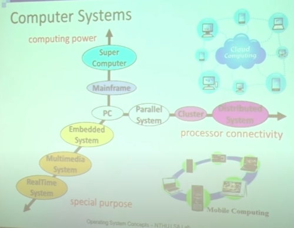
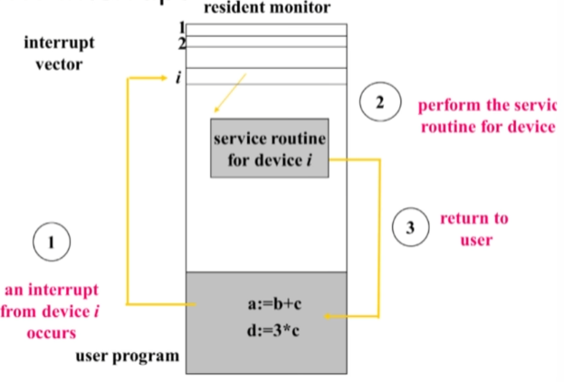

```Text
Author: Antony_Weng <weng851107@gmail.com>

This file is only used for the record of the learning process, only used by myself and the file has never been leaked out.
If there is related infringement or violation of related regulations, please contact me and the related files will be deleted immediately. Thank you!
```


- [Note](#0)
- [清大資工 周志遠 - 作業系統](#1)
  - [Chapter0: Historical Prospective](#1.1)
    - [Mainframe Systems](#1.1.1)
    - [Computer-system Architecture](#1.1.2)
    - [Special-purpose Systems](#1.1.3)
  - [Chapter1: Introduction](#1.2)
    - [What is an Operating System](#1.2.1)
    - [Computer-System Organization](#1.2.2)
    - [Hardware Protection](#1.2.3)
  - [Chapter2: OS Structure](#1.3)
    - [Nachos Explanation](#1.3.1)
    - [OS Service](#1.3.2)
    - [OS Application Interface](#1.3.3)
    - [OS System Structure](#1.3.4)


<h1 id="0">Note</h1>


<h1 id="1">清大資工 周志遠 - 作業系統</h1>

https://ocw.nthu.edu.tw/ocw/index.php?page=course&cid=141

<h2 id="1.1">Chapter0: Historical Prospective</h2>


Nachos MP: 教育使用的模擬OS軟體

- C++
- Linux
- Code tracing

練習作業四個題目：

- system call
- memory manager
- process scheduler
- file system

課程內容: 


- PART ONE: OVERVIEW
  - Chapter1    Introduction
  - Chapter2    System Structures
- PART TWO: PROCESS MANAGEMENT
  - Chapter3    Process Concept
  - Chapter4    Multithreaded Programming
  - Chapter5    Process Scheduling
- PART THREE: PROCESS COORDINATION
  - Chapter6    Synchronization
  - Chapter7    Deadlocks
- PART FOUR: MEMORY MANAGEMENT
  - Chapter8    Memory-Management Strategies
  - Chapter9    Virtual-Memory Management
- PART FIVE: STORAGE MANAGEMENT
  - Chapter10   File System
  - Chapter11   Implementing File Systems
  - Chapter12   Mass Storage Structure
  - Chapter13   I/O Systems

Computer Systems



<h3 id="1.1.1">Mainframe Systems</h3>

> Batch
> Multi-programming
> Time-sharing

One of the earliest computers

Evolution:

- Batch -> Multi-programming -> Time-sharing

Still exists in today's world

- For *critical application* with better **reliability** & **security**
- Bulk data processing
- Widely used in hospital, banks....

**Mainframe - Batch Systems**

- 透過一堆打洞的卡片程序，插入系統中來執行程式
- 一次只能執行一個程序
- Memory layout只分為 operating system 與 user program area

    

- Drawbacks:
  - *One job at a time*
  - *No interaction* between users and jobs
  - *CPU is often idle*
    - I/O speed << CPU speed (at least 1:1000)

- OS doesn't need to make any decision

**Mainframe - Multi-programming System**

- *Overlaps the I/O and computation of jobs*
  - Keeps both CPU and I/O devices working at higher rates
- *Spooling* (Simultaneous Peripheral Operation On-Line)
  - *I/O is done with no CPU intervention*
  - CPU just needs to *notified* when I/O is done
- 可透過 interrupt 的機制達成Spooling

    

- OS task：
  - *Memory management* - the system must allocate the memory to several jobs
  - *CPU scheduling* - the system must choose among several jobs ready to run
  - *I/O system* - I/O routine supplied by the system, allocation of devices

**Mainframe - Time-sharing System**

- An *interactive* system provides direct communication between the users and the system
  - CPU switches among jobs so frequently that users may interact with programs
  - Users can see results immediately (response time < 1s)
  - Usually, keyboard/screen are used
- *Multiple users* can share the computer simultaneously
- Switch job when
  - finish
  - waiting I/O
  - *a short period of time*

- OS task：
  - *Virtual Memory*(簡單說把disk當作memory來用) - jobs swap in and out of memory to obtain reasonable response time
  - *File System* and *Disk Management* - manage files and disk storage for user data
  - *Process synchronization* and *deadlock* - support concurrent execution of programs


<h3 id="1.1.2">Computer-system Architecture</h3>
 
> Desktop Systems: single processor
> Parallel Systems: tightly coupled
> Distributed Systems: loosely coupled

**Desktop Systems - Personal Computers**

- Personal Computers(PC) - computer system dedicated to a *single user*
- User *convenuence* and *responsiveness* - GUI
- I/O devices - keyboards, *mice*, screens, printers
- Several different tupes of operating systems
  - Windows, MacOS, Unix, Linux
- Lack of file and OS protection from users
  - Worm, Virus

**Parallel Systems**

- a.k.a. *Multiprocessor* or *tightly coupled system*
  - More than one CPU/core in close communication
  - Usually communicate through *shared memory*
- Purposes：
  - Throughpu, Economical, Reliability

    

Symmetric Multiprocessor System (SMP)

- Each processor runs the same OS
- Most popular multiple-processor architecture
- Require *extensive synchronization* to protect data integrity

Asymmetric Multiprocessor System (AMP)

- Each processor is assigned a specific task
- One Master CPU & multiple slave CPUs
- More common in extremely large systems

Multi-Core Processor


Many-Core Processor


Memory Access Architecture


**Distributed Systems**

- A.K.A. *loosely coupled system*
  - Each processor has its own local memory
  - Processors communicate with one another thrrough various communication lines (I/O bus or network)
  - Easy to *scale to large number of nodes* (hundreds of thousands, e.g. Internet)

- Purpose
  - Resource sharing
  - Load sharing
  - Reliabilit

- Architecture: 
  - *client-server*： FTP......

    

  - *peer-to-peer*

    

Clustered Systems

- Definition: 
  - Cluster computers *share storage* and are closely *linked via a local area network(LAN)* or a *faster interconnect*, such as InfiniBand(up to 300Gb/s)
- *Asymmetric clustering*: one server runs the application while other servers standby
- *Symmetric clustering*: two or more hosts are running application and are monitoring each other

---

System Architecture Summary


<h3 id="1.1.3">Special-purpose Systems</h3>

> Real-Time Systems
> Multimedia Systems
> Handheld Sysytems

**Real-Time Operation Systems (RTOS)**

- Well-defined *fixed-time constraints*
  - `Real-time` doesn't mean speed, but *keeping deadline*
- Guaranteed response and reaction times
- Often used as a control device in a dedicated application:
  - Scientific experiments, medical imaging systems, industrial control systems, weapon systems, etc
- Real-time requirement: *hard* or *soft*

    

**Multimedia Systems**

- A wide range of applications including audio and video files(e.g. ppstream, online TV)
- Issues:
  - *Timing constraints*: 24~30 frames per second
  - *On-demand/live streaming*: media file is only played but not stored
  - *Compression*: due to the size and rate of multimedia systems

**Handheld/Embedded Systems**

- Personal Digital Assistants (PDAs)
- Cellular telephones
- *HW specialized OS*
- Issues:
  - Limited memory
  - Slow processors
  - Battery consumption
  - Small display screens

<h2 id="1.2">Chapter1: Introduction</h2>

<h3 id="1.2.1">What is an Operating System</h3>

Four components in Computer System： Hardware, OS, Application, User


What is an Operating System?

- An operating system is the `"permanent"` software that *controls/abstracts hardware resources* for user application

    

Multi-tasking Operating Systems

- Manages resources and processes to support different user applications
- Provides Applications Programming Interface (API) for user applications

    

General-Purpose Operating Systems


Definition of an Operating System

- **Resource allocator** - *manages* and *allocates resources* to insure efficiency and fairness
- **Control program** - *controls* the execution of *user programs* and operations of *I/O devices* to prevent errors and improper use of computer
- **Kernel**(會作為作業系統的別名，核心) - the one program running at all times (all else being system/application programs)

Goals of an Operating System

- **Convenience**
  - make computer system easy to use and compute
  - In particular for small PC
- **Efficiency**
  - use computer hardware in an efficient manner
  - Especially for large, shared, multiuser systems

    --> Two goals are sometimes *contradictory*
    --> In the past, efficiency is more important

Importance of an Operating System

- System API are the *only* interface between user application and hardware
  - API are designed for general-purpose, not performance driven
- OS code cannot allow any bug
  - Any break (e.g. invalid access) cause reboot
- The owner of OS technology *controls* the software & hardware industry
- Operating systems and computer architecture influence each other

Modern Operating Systems


<h3 id="1.2.2">Computer-System Organization</h3>

- One or more CPUs, device controllers connect through *common bus* providing access to *shared memory*

- Goal： *Concurrent* execution of CPUs and devices competing for memory cycles

    

Computer-System Operations

- Each device controller is in charge of a particular device type
- Each device controller has a local buffer. 
    --> I/O device 運作相對於CPU太慢，若沒有buffer，CPU會一直在idle
    --> Status reg: 設置相關設定
    --> Data reg: 先儲存資料，再放入buffer
- *I/O is from the device to controller's local buffer*
- *CPU moves data* from/to *memory* to/from *local buffers* in device controllers
- Device 與 Memory 之間會有一個 Device Controller 作為傳輸的橋樑，Device Controller的好壞會影響到I/O的速度，CPU會下指令操作Device Controller的register，進而操作到Device

    

---

Busy/wait output

- Simplest way to program device
  - Use instruction to test when device is ready
  - 每次寫入都去 `peek` 寫入字元動作是否已完成再繼續寫下一個字元
  - 此方式來讀寫I/O device會造成一直霸佔CPU，無法實現 "Overlaps the I/O and computation of jobs"，因此要使用 `interrupt I/O` 的方式

    

Interrupt I/O

- Busy/wait is very inefficient
  - CPU can't do other work while testing device
  - Hard to do simultaneous I/O
- *Interrupts* allow a device to *change the flow of control in the CPU*
  - Causes subroutine call to handle device

Interrupt I/O Timeline

- Interrupt time line for I/O on a single process
  - `CPU = high`：CPU原本在處理目前的 user process executing
  - `I/O device = high`：idle
  - I/O device拉low，傳遞資料到buffer中，完成後會拉high，進而對CPU產生中斷

    

Interrupt-Driven I/O

- 初始化I/O後，當Controller準備好時會發出interrupt，CPU才需處理相關事務，處理完後CPU會再返回目前行程
- 軟體的interrupt通常為主動產生，而硬體的interrupt為被動產生 

    

Interrupt

- *Modern OS are interrupt driven*
- The occurrence of an event is signaled by an interrupt from either hardwrae or software
  - *Hardware* may trigger an interrupt at any time by sending a *signal* to CPU
    - signal是專門用於硬體中斷使用的詞語
  - *Software* may trigger an interrupt either by 
    - an *error*(division by zero or invalid memory access) --> 非預期(被動?)
    - or by a user request for an *operating system service* (*system call*) --> 預期的(主動?)
    - Software interrupt also called *trap*

HW Interrupt

- CPU原先在執行 user program，但hardware device被觸發產生一個interrupt signal(CPU被動被中斷)
- 接著CPU會去 `interrupt vector` 中搜索該signal相對應(硬體設計出來的，某個硬體插到某個Port，會有對應的signal number(由硬體設計固定的))的function pointer
- function pointer會引導到所要執行的function code去作處理
- 執行對應siganl的function code又稱為 `Service Routine`
- OS執行完後會返回CPU原先執行的 user program

    

SW Interrupt

- CPU原先在執行某一個program，主動產生一個 `system call` 來中斷CPU
- 由於SW Interrupt的數量是unbounded的，不採用和HW Interrupt一個由interrup vector來處理，而是使用 `switch case` 的方式來設計，流程上與HW Interrup是相似的，只是實現方式不同

    

Common Functions of Interrupts

- Interrupt transfers control to the interrupt service routine generally, through the *interrupt vector*, which contains the *addresses* (function pointer) of all the *service (i.e. interrupt handler) routunes*
- Interrupt architecture must save the *address* of the *interrupted instruction*
- Incoming interrupts are *disabled* while another interrupt is being processed to prevent a lost interrupt 
    --> 確保OS為低延遲
    --> 有時候中斷沒有反應是因為發生中斷時卡在某個service routine中，所以其它中斷會被disable

---

Storage-Device Hierarchy

- Storage systems organized in hierarchy
  - *Speed*, Cost, Volatility
  - 越上層速度越快，但容量較低
- Main memory - only large storage media that the CPU can access directly
  - RAM: Random Access Memory
- Secondary storage - extension of main memory that provides `large nonvolatile storage` capacity
  - Magnetic disk

    

RAM: Random-Access Memory --> Access speed (訪問速度) 每次都保持一致

- DRAM(Dynamic RAM)：
  - Need only *one transistor*
  - Consume *less power*
  - Values must be periodically *refreshed*
  - Access Speed: *>= 30ns*
- SRAM(Static RAM)：
  - Need only *six transistor*
  - Consume *more power*
  - Access Speed: *10ns ~ 30ns*
  - Usage: *cache memory*

Disk Mechanism

- Speed of magnetic disk
  - $Transfer time = data size / transfer rate$
  - Positioning time = seek time(cylinder) + rotational latency(sector)  
  -->  random access time，訪問時間是隨機的，因為是由機構來完成的
  -->  當今天是連續讀取的時候時，HDD不一定會輸給SSD

Performance of Various Levels of Storage


Caching

- Information in use *copied* from *slower* to *faster* storage temporarily
- Faster storage (cache) checked first to determine if information is there
  - If it is, <u>information used directly from the cache (fast)</u>
  - If not, <u>data copied to cache and used there</u>

    

- 並不是總是需要cache，當今天讀取的資料過多，讀取一次就佔滿，就沒有讀取到cache的意義了
- cache只是複製常用數據，避免過度重memory取得，用來加速

Coherency(連貫性) and Consistency(一致性) Issue 

- The same data may appear in different levels
  - Issue: <u>Change the *copy in register* make it inconsistent with other copies</u>
  - 有時候register或cache的值已經修改了，但Ram或是disk上尚未更新
- Single task accessing:
  - No problem, always use the *Highest level* cpoy
  - 由於單一程序且CPU總是存取最高等級的記憶體，所以不影響
- Muti-task accessing:
  - Need to obtain the most recent value
  - 當多個程序有共享記憶體時，沒有即時更新到時，會有錯誤的數據

    

- Distributed system:
  - Difficult because copies are on different computers
  - Ex. Google雲端系統如此龐大，為何還是可以使用 --> 放棄Coherency，對不同使用者看到的網頁有可能都不完全一致，但對使用上沒有影響

<h3 id="1.2.3">Hardware Protection</h3>

- 非指 Security
- 一個作業系統有很多層，共用某資源但卻不會影響到對方，如某程序死掉，並不會造成其他程序死掉
- 不能不透過作業系統就訪問其他程序正在執行程序的記憶體
- CPU只是吃指令去執行，如何分辨誰是OS誰是User Program
  - 但程式在執行時，利用interrupt來進行區分，達到 Dual-Mode Operation

> *Dual-Mode Operation*
> I/O Protection
> Memory Protection
> CPU Protection

**Dual-Mode Operation**

- What to protect?
  - Sharing system resources requires OS to ensoure that an incorrect program cannot cause *other programs* to execute incorrectly.
- Provide <font color='red'>hardware support</font> to differentiate between at least two modes of operations
  1. <font color='red'>User mode</font> - execution done on behalf pf a user
  2. <font color='red'>Monitor mode</font> (also <font color='red'>kernel mode</font> or <font color='red'>system mode</font>) - execution done on behalf of <font color='red'>operation system</font>
- <font color='red'>*Mode bit*</font> added to computer hardware to indicate the current mode
  - kernel mode = 0
  - user mode = 1
- When an <font color='red'>interrupt/trap</font> or <font color='red'>fault</font> occurs, hardware switches to monitor mode

    

- <font color='red'>Privileged instructions</font> 
  - Executed only in <font color='red'>monitor mode</font> 
  - Requested by users (system calls)
  - 電腦上運作做任何事情時，都必須透過給CPU instruction
  - 在設計CPU的指令集時已經寫死了
  - 根據是否會危害到電腦運作來區分是否為Privileged instructions

**I/O Protection**

- <font color='red'>All I/O instructions are privileged instructions</font> 
  - any I/O device is shared between users
- Must ensure that a user program could never gain control of the computer in monitor mode (i.e. a user program that, as part of its execution, stores a new address(a new user code) in the interrupt vector)
  - 駭客無法繞過OS，因此只能鑽記憶體的漏洞

    

**Memory Protection**

- Protect
  - Interrupt vector and the interrupt service routines
  - <u>Data access and over-write from other programs</u>
- HW support: two registers for legal address determination
  - <font color='red'>Base register</font> - holds the smallest legal physical memory address
  - <font color='red'>Limit register</font> - contains the size of the range
  - 修改指令為 privileged instruction

    

- Memory outside the defined range is protected

    

**CPU Protection**

- Prevent user program from not returning control
  - getting stuck in an infinite loop
  - not calling system services
- HW support: <font color='red'>Timer</font> - interrupts computer after specified period
  - Timer is decremented every clock tick
  - When timer reaches the value 0, an interrupt occurs
  - CPU的scheduler會決定CPU的schedule
- Timer commonly used to implement <font color='red'>time sharing</font>
- <font color='red'>Load-timer</font> is a privileged instruction

<h2 id="1.3">Chapter2: OS Structure</h2>

<h3 id="1.3.1">Nachos Explanation</h3>

https://homes.cs.washington.edu/~tom/nachos/

Introduction

- understand how to work on Linux machine
- understand how system call are done by OS
- understand the difference of user space and kernel space memory

NachOS

- a process runs on top of another OS
- a kernel(OS) and MIPS code machine simulator

    

- Virtual Machine的作用就是instruction的轉換

Nacho Directory Structure

- `lib/`
  - Utilities used by the rest of the Nachos code
- `machine/`
  - The <font color='red'>machine simulation</font>
  - 修改Hardware相關設定，如增加一個signal
- `threads/`
  - Nachos is a multi-threaded program. Thread support is found here.
  - This directory also contains the main() routine of the nachos program, in `main.cc`
- `test/`
  - <font color='red'>User test programs</font> to run on the simulated machine.
  - As indicated earlier, these are separate from the source for the Nachos operating system and workstation simulation.
  - This directory contains its own Makefile.
  - The test programs are very simple and are written in C rather than C++
- `userprog/`
  - <font color='red'>Nachos operating system code</font> to support the creation of address spaces, loading of user (test) programs, and execution of test programs on the simulated machine. The exception handling code is here, in `exception.cc`
- `network/`
  - Nachos operating system support for networking, which implements a simple "post office" facility.
  - Several independent simulated Nachos machines can talk to each other through a simulated network.
  - Unix sockets are used to <font color='red'>simulate network connections among the machines</font>
- `filesys/`
  - Two different file system implementations are here.
  - <font color='red'>The "real" file system</font> uses the simulated workstation's simulated disk to hold files.
  - <font color='red'>A "stub" file system</font> translates Nachos file system calls into UNIX file system calls makefile.

Installation of Nachos

- Install

    ```bash
    #download NachOS-4.0_MP1

    $ cd NachOS-4.0_MP1/code/build.linux

    $ make clean

    $ make
    ```

- Rebuild
  - You should <font color='red'>rebuild NachOS</font> every time after you modify anything in NachOS, otherwise you won't change the execution results.

    ```bash
    $ cd NachOS-4.0_MP1/code/build.linux

    $ make clean

    $ make
    ```

- Test your nachos
  - 須透過 `nachos -e` 來執行 user program

    ```bash
    $ cd NachOS-4.0_MP1/code/test

    $ make clean

    $ make halt

    $ ../build.linux/nachos -e halt
    ```

    

- Test nachos with test cases

    ```bash
    # this will generate the binary of all test cases
    $ make

    # generate test case
    $ make consoleIO_test1

    # run nachos with test case
    $ ../build.linux/nachos -e consoleIO_test1
    ```

MP - System call

- Part1: console I/O system call
  - Implement `PrintInt(int number)` system call

    

    

    

- Part2: File I/O system call
  - 新增 `Open(), Close()`

    

    

    

    

    

<h3 id="1.3.2">OS Service</h3>

User program 透過OS使用system call

interrupt routine = service routine


**User Interface**

- CLI (Command Line Interface)
  - Fetches a command from user and executes it
  - <font color='red'>Shell: Command-line interpreter</font> (CSHELL, BASH, ...)
    - Adjusted according to user behavior and preference
    - 使用者透過Shell這個程序下指令給OS
- GUI (Graphic User Interface)
  - Usually mouse, keyboard, and monitor
  - Icons represent files, programs, actions, etc
  - Various mouse buttons over objects in the interface cause various actions
- Most systems have both <font color='red'>CLI</font> and <font color='red'>GUI</font>

**Communication Models**

- Communication may take place using either <font color='red'>message passing</font>(with systemcall(OS) because "Protect") or <font color='red'>share memory</font>(with systemcall(OS) to create memory because "Protect").

    

- Multi-thread programming時，會OS會有預設創建共同擁有的記憶體空間

<h3 id="1.3.3">OS Application Interface</h3>

> System calls
> API

- System calls 與 API 的差別

**System Calls**

- Request OS services
  - <font color='red'>Process control</font> - abort, create, terminate process and allocate/free memory
  - <font color='red'>File management</font> - create, delete, open, close file
  - <font color='red'>Device management</font> - read, write, reposition device
  - <font color='red'>Information maintenance</font> - get time or date
  - <font color='red'>Communications</font> - send receive message

**System Calls & API**


- System calls
  - The <font color='red'>OS interface</font> to a running program
  - An explicit request to the <font color='red'>kernel</font> made via a <font color='red'>software interrupt</font>
  - Generally available as <font color='red'>assembly-language</font> instructions

- API: Application Program Interface
  - <font color='red'>Users mostly program against API instead of system call</font>
  - 為了方便撰寫程式所建立的一層，而不會直接接觸到System call
  - Commonly implemented by language libraries, e.g. <font color='red'>C Library</font>
  - An API call could involve <font color='red'>zero or multiple system call</font>
    - Both `malloc()` and `free()` use system call `brk()`
    - Math CPI function, such as `abs()`, don't need to incolve system call

Interface vs. Library

- User program:

    ```C
    printf("%d", exp2(int x, int y));
    ```

- Interface:

    ```C
    int exp2(int x, int y);
    ```
    i.e. return the value of $X*2^{y}$

- Library:

  - imp1

    ```C
    int exp2(int x, int y)
    {
        for (int i = 0;i < y;i++) {
            x = x*2;
        }
        return x;
    }
    ```

  - imp2

    ```C
    int exp2(int x, int y)
    {
        x = x<<y;
        return x;
    }
    ```

  - imp3: hardware device 支援的 instruction

    ```C
    int exp2(int x, int y)
    {
        return HW_EXP(x, y);
    }
    ```

API: Application Program Interface

- Three most common APIs:
  - <font color='red'>Win32</font> API for <font color='red'>Windows</font>
  - <font color='red'>POSIX API</font> for POSIX-based systems (including virtually all versions of UNIX, Linux, and Mac OS X)
    - POSIX -> "Portable Operating System Interface for Unix"
    - Ex. pthread: 前面的p表示由POSIX建立的API
  - <font color='red'>Java API</font> for the Java virtual machine
    - 需要從vitual machine轉換code到x86 machine

API - System Call - OS Relationship

- user program 在執行時會先呼叫API，會根據API內需不需要OS的幫助來看是否呼叫System Call，才會進入OS進行其他操作

    

Standard C Library Example


Why use API?

- Simplicity
  - API is designed for applications
- Portability
  - API is an unified defined interface
- Efficiency
  - Not all functions require OS services or involve kernel

System Calls: Passing Parameters

- Three general methods are used to pass parameters between a running program and the operating system
  - Pass parameters in <font color='red'>registers</font> --> 直接存放到暫存器，CPU就可以讀取到 
  - Store the parameters in a <font color='red'>table in memory</font>, and the table address is passed as a parameter in a register --> 利用 pointer
  - Push(store) the parameters onto the <font color='red'>stack</font> by the program, and pop off the stack by operating system --> 每個process都會有stack空間可以存放

<h3 id="1.3.4">OS System Structure</h3>

> Simple OS Architecture
> Layer OS Architecture
> Microkernel OS
> Modular OS Structure
> Virtual Machine
> Java Virtual Machine


